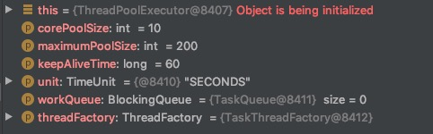

# 关于TCP和HTTP的简单介绍

我们都了解过网络传输协议，我们最常见的HTTP协议，本质上属于应用层的协议。而TCP协议是属于IP层的协议。

简单点说，HTTP请求，其实是在TCP连接的基础上，将数据按照HTTP协议规范进行数传。

对web服务器而言，其实和处理其它协议的服务器类似：

1. 启动JVM，监听某个端口（Tomcat默认是8080）
2. 处理客户端发送的TCP连接请求，成功接受以后，等待客户端发送数据。
3. 客户端发送HTTP协议封装好的数据包，服务器按HTTP协议进行解码，封装成HttpServletRequest对象，交给业务端进行处理
4. 业务端处理好数据以后，把返回结果设置到HttpServletResponse中，然后返回给客户端

所以根据这个流程，我们提出以下问题：

1. Tomcat的NIO网络编程模型，是在哪个类中实现的？（网络编程模型用于处理TCP连接的接入、以及数据的读写）
2. Tomcat是在哪个类中根据HTTP协议解码TCP数据包，然后封装成HttpServletRequest对象的？具体实现是怎样的？
3. Tomcat是在哪个类中把数据交给业务端的，具体实现是怎样的？？
4. Tomcat是在哪个类中根据HTTP协议将HttpServletResponse中的数据编码成TCP数据包，然后返回给客户端的？具体实现是怎样的？

# Tomcat 实现Nio网络编程模型的核心类—NioEndpoint

玩过Nio和Netty的话，其实对Nio网络编程模型是有一个大致了解的。仔细去看NioEndpoint类的话，会发现其实和Netty有很多相似的地方，但略有不同。

## startInternal()方法

```java
public class NioEndpoint extends AbstractJsseEndpoint<NioChannel,SocketChannel> {
  @Override
    public void startInternal() throws Exception {

        if (!running) {
            running = true;
            paused = false;

            //....其它代码

            // Create worker collection
            if (getExecutor() == null) {
                createExecutor();
            }

            initializeConnectionLatch();

            // Start poller thread
            poller = new Poller();
            Thread pollerThread = new Thread(poller, getName() + "-ClientPoller");
            pollerThread.setPriority(threadPriority);
            pollerThread.setDaemon(true);
            pollerThread.start();

            startAcceptorThread();
        }
    }
}
```

这个过程中做了四件比较重要的事情：

1. 创建线程池
2. 创建LimitLatch
3. 创建Poller，并启动
4. 创建Acceptor，并启动

我们根据重要性一个个来解析

## Acceptor

这个类就是用来处理TCP连接的接入请求的

```java
public class Acceptor<U> implements Runnable {
  @Override
    public void run() {

        while (endpoint.isRunning()) {


            try {

                U socket = null;
                try {
                    //最关键的一句：
                    socket = endpoint.serverSocketAccept();
                } catch (Exception ioe) {
                    //一些异常处理
                }
                
                if (endpoint.isRunning() && !endpoint.isPaused()) {
                    
                    //把接受到的socket，保存到endpoint里，用于后续的读写
                    if (!endpoint.setSocketOptions(socket)) {
                        endpoint.closeSocket(socket);
                    }
                } else {
                    endpoint.destroySocket(socket);
                }
            } catch (Throwable t) {
                //一些异常处理
            }
        }
    }
}
```

为了便于阅读，只把重点的部分留下了，然后加了一些注释。Tomcat在处理连接请求的时候，并没有使用Selector，而是直接使用了
ServerSocket的accept方法。

然后把获取到的SocketChannel放到了NioEndpoint里

```java
public class NioEndpoint extends AbstractJsseEndpoint<NioChannel,SocketChannel> {
    @Override
    protected boolean setSocketOptions(SocketChannel socket) {
        NioSocketWrapper socketWrapper = null;
        try {
            // Allocate channel and wrapper
            NioChannel channel = null;
            if (nioChannels != null) {
                channel = nioChannels.pop();
            }
            if (channel == null) {
                SocketBufferHandler bufhandler = new SocketBufferHandler(
                        socketProperties.getAppReadBufSize(),
                        socketProperties.getAppWriteBufSize(),
                        socketProperties.getDirectBuffer());
                if (isSSLEnabled()) {
                    channel = new SecureNioChannel(bufhandler, selectorPool, this);
                } else {
                    channel = new NioChannel(bufhandler);
                }
            }
            NioSocketWrapper newWrapper = new NioSocketWrapper(channel, this);
            channel.reset(socket, newWrapper);
            
            //关键步骤一：把SocketChannel保存到了一个名为connections的Map中，它是一个ConcurrentHashMap
            connections.put(socket, newWrapper);
            socketWrapper = newWrapper;
					
          	//设置非阻塞
            socket.configureBlocking(false);
            socketProperties.setProperties(socket.socket());

            socketWrapper.setReadTimeout(getConnectionTimeout());
            socketWrapper.setWriteTimeout(getConnectionTimeout());
            socketWrapper.setKeepAliveLeft(NioEndpoint.this.getMaxKeepAliveRequests());
            socketWrapper.setSecure(isSSLEnabled());
            
            //关键步骤二：最终目的其实是要把SocketChannel注册到Poller的Selector里
            poller.register(channel, socketWrapper);
            return true;
        } catch (Throwable t) {
            //异常处理
        }
        return false;
    }
}
```

我们可以看到，这里有两个关键步骤：

关键步骤一：把SocketChannel保存到了一个名为connections的Map中，它是一个ConcurrentHashMap
关键步骤二：最终目的其实是要把SocketChannel注册到Poller的Selector里

这个关键步骤二的注册，后面

## Poller

前面Acceptor用来处理客户端TCP连接的接入，接入后注册到Poller的Selector里，等待Poller处理其读写事件。

所以，Poller是用来处理TCP连接的读写事件的。

处理连接和处理读写分属不同的线程，从这个角度上讲，几乎所有的Nio编程模型都是如此，Netty和Tomcat都是如此。

### run()

```java
public class Poller implements Runnable {
  private Selector selector;
  
  public Poller() throws IOException {
      this.selector = Selector.open();
  }
  
  @Override
  public void run() {

    while (true) {

      boolean hasEvents = false;

      try {
        if (!close) {
          //关键！处理任务
          hasEvents = events();
          if (wakeupCounter.getAndSet(-1) > 0) {
            keyCount = selector.selectNow();
          } else {
            keyCount = selector.select(selectorTimeout);
          }
          wakeupCounter.set(0);
        }
        if (close) {
          //关闭处理
          break;
        }
      } catch (Throwable x) {
        //异常处理
      }

      Iterator<SelectionKey> iterator = eyCount > 0 ? selector.selectedKeys().iterator() : null;

      while (iterator != null && iterator.hasNext()) {
        SelectionKey sk = iterator.next();
        NioSocketWrapper socketWrapper = (NioSocketWrapper) sk.attachment();
        
        if (socketWrapper == null) {
          iterator.remove();
        } else {
          iterator.remove();
          //关键！处理SelectionKey
          processKey(sk, socketWrapper);
        }
      }

      // Process timeouts
      timeout(keyCount,hasEvents);
    }

    getStopLatch().countDown();
  }
  
}
```

run方法是Poller的核心方法，和Netty的WorkerGroup里的NioEventLoop的run方法非常相似，只不过，除了第一次运行先处理任务外，后面每次Selector被唤醒时，首先都处理SelectionKey，最后才处理任务。

这与Netty稍稍有所不同（Netty可以设置一个阀门，来控制IO事件和用户任务之间的处理次数占比），当然这是因为Netty只是框架，而Tomcat已经是产品。
作为框架，Netty要考虑通用性和全面性。
作为产品，Tomcat对于自身应用场景做到最优即可

另外，Netty的任务队列是一个纯粹的自定义任务，队列里存放的就是一个Runnable，run方法如何实现，可以自定义。
而Tomcat的events队列，其存放的PollerEvent对象，实际上一个固定任务，Tomcat已经明确了run方法执行的任务内容。

下面我们看下events如何处理任务以及PollerEvent对象

### PollerEvent & events()

```java
public class Poller implements Runnable {
  
  private final SynchronizedQueue<PollerEvent> events = new SynchronizedQueue<>();
  
  public boolean events() {
    boolean result = false;

    PollerEvent pe = null;
    for (int i = 0, size = events.size(); i < size && (pe = events.poll()) != null; i++ ) {
      result = true;
      try {
        pe.run();//运行事件
        pe.reset();
        if (running && !paused && eventCache != null) {
          eventCache.push(pe);
        }
      } catch ( Throwable x ) {
        log.error(sm.getString("endpoint.nio.pollerEventError"), x);
      }
    }

    return result;
  }
}
```

```java
public static class PollerEvent implements Runnable {

    private NioChannel socket;
    private int interestOps;

    public PollerEvent(NioChannel ch, int intOps) {
        reset(ch, intOps);
    }

    public void reset(NioChannel ch, int intOps) {
        socket = ch;
        interestOps = intOps;
    }

    public void reset() {
        reset(null, 0);
    }

    @Override
    public void run() {
        if (interestOps == OP_REGISTER) {
            try {
                socket.getIOChannel().register(socket.getSocketWrapper().getPoller().getSelector(), SelectionKey.OP_READ, socket.getSocketWrapper());
            } catch (Exception x) {
                log.error(sm.getString("endpoint.nio.registerFail"), x);
            }
        } else {
            final SelectionKey key = socket.getIOChannel().keyFor(socket.getSocketWrapper().getPoller().getSelector());
            try {
                if (key == null) {
                    // The key was cancelled (e.g. due to socket closure)
                    // and removed from the selector while it was being
                    // processed. Count down the connections at this point
                    // since it won't have been counted down when the socket
                    // closed.
                    try {
                        socket.socketWrapper.close();
                    } catch (Exception ignore) {
                    }
                } else {
                    final NioSocketWrapper socketWrapper = (NioSocketWrapper) key.attachment();
                    if (socketWrapper != null) {
                        // We are registering the key to start with, reset the fairness counter.
                        int ops = key.interestOps() | interestOps;
                        socketWrapper.interestOps(ops);
                        key.interestOps(ops);
                    } else {
                        socket.getSocketWrapper().getPoller().cancelledKey(key, socket.getSocketWrapper());
                    }
                }
            } catch (CancelledKeyException ckx) {
                try {
                    socket.getSocketWrapper().getPoller().cancelledKey(key, socket.getSocketWrapper());
                } catch (Exception ignore) {}
            }
        }
    }

}
```

我们，可以看到，PollerEvent它执行两种任务，一种是注册到Poller里的Selector，一种是切换读写等监听事件，或者调用key.cancel()删除Selector中的key。

此时，我们再回头看register方法

### register()

```java
public class Poller implements Runnable {
  
  private final SynchronizedQueue<PollerEvent> events = new SynchronizedQueue<>();
  
  public void register(final NioChannel socket, final NioSocketWrapper socketWrapper) {
      socketWrapper.interestOps(SelectionKey.OP_READ);//this is what OP_REGISTER turns into.
      PollerEvent r = null;
      if (eventCache != null) {
          r = eventCache.pop();
      }
      if (r == null) {
          r = new PollerEvent(socket, OP_REGISTER);
      } else {
          r.reset(socket, OP_REGISTER);
      }
      addEvent(r);//把PollerEvent加入到
  }
  private void addEvent(PollerEvent event) {
    events.offer(event);
    if (wakeupCounter.incrementAndGet() == 0) {
      selector.wakeup();
    }
  }
}
```

我们会看到，它其实并不是直接注册到Poller的Selector里，而是封装成一个事件，扔到队列里，然后唤醒Selector.select()，去执行队列的PollerEvent，然后注册到Selector。

这个套路，和Netty一模一样，应该说，使用Nio的Selector多路复用器，就必须要这样做，而这样做的原因就在于异步线程，A线程中的Selector.select()处于阻塞住的时候，B线程你无法执行Selector.register()。这点在学习Nio的时候其实已经明确提到过。

### processKey() -> processSocket()

```java
public class Poller implements Runnable {
  
	protected void processKey(SelectionKey sk, NioSocketWrapper socketWrapper) {
      try {
        if (close) {
          cancelledKey(sk, socketWrapper);
        } else if (sk.isValid() && socketWrapper != null) {
          if (sk.isReadable() || sk.isWritable()) {
            if (socketWrapper.getSendfileData() != null) {
              processSendfile(sk, socketWrapper, false);
            } else {
              unreg(sk, socketWrapper, sk.readyOps());
              boolean closeSocket = false;
              // Read goes before write
              if (sk.isReadable()) {
                if (socketWrapper.readOperation != null) {
                  if (!socketWrapper.readOperation.process()) {
                    closeSocket = true;
                  }
                } else if (socketWrapper.readBlocking) {
                  synchronized (socketWrapper.readLock) {
                    socketWrapper.readBlocking = false;
                    socketWrapper.readLock.notify();
                  }
                } else if (!processSocket(socketWrapper, SocketEvent.OPEN_READ, true)) {
                  closeSocket = true;
                }
              }
              if (!closeSocket && sk.isWritable()) {
                if (socketWrapper.writeOperation != null) {
                  if (!socketWrapper.writeOperation.process()) {
                    closeSocket = true;
                  }
                } else if (socketWrapper.writeBlocking) {
                  synchronized (socketWrapper.writeLock) {
                    socketWrapper.writeBlocking = false;
                    socketWrapper.writeLock.notify();
                  }
                } else if (!processSocket(socketWrapper, SocketEvent.OPEN_WRITE, true)) {
                  closeSocket = true;
                }
              }
              if (closeSocket) {
                cancelledKey(sk, socketWrapper);
              }
            }
          }
        } else {
          // Invalid key
          cancelledKey(sk, socketWrapper);
        }
      } catch (CancelledKeyException ckx) {
        cancelledKey(sk, socketWrapper);
      } catch (Throwable t) {
        ExceptionUtils.handleThrowable(t);
        log.error(sm.getString("endpoint.nio.keyProcessingError"), t);
      }
    }
}
```

processKey()根据key的不同事件，做不同的处理，最终无论读写，都将调用processSocket()方法

```java
public abstract class AbstractEndpoint<S,U> {
	public boolean processSocket(SocketWrapperBase<S> socketWrapper,SocketEvent event, boolean dispatch) {
        try {
            if (socketWrapper == null) {
                return false;
            }
            SocketProcessorBase<S> sc = null;
            if (processorCache != null) {
                sc = processorCache.pop();
            }
            if (sc == null) {
                sc = createSocketProcessor(socketWrapper, event);//创建SocketProcessorBase
            } else {
                sc.reset(socketWrapper, event);
            }
            Executor executor = getExecutor();
            if (dispatch && executor != null) {
                executor.execute(sc);//使用线程池处理
            } else {
                sc.run();
            }
        } catch (RejectedExecutionException ree) {
            //处理异常
            return false;
        } catch (Throwable t) {
            //处理异常
            return false;
        }
        return true;
    }
}
```

到这一步，Tomcat的Nio网络编程模型已经大致清晰，我们来和Netty做一个对比：

1. Netty的模型是，启动N个Selector，一个Selector一个线程，包装成一个NioEventLoop，所有的NioEventLoop都存在于workGroup中的一个数组里。当客户端连接上来时，会根据轮询规则选一个NioEventLoop，把SocketChannel绑定到对应的Selector里。实际运行的时候，每个Selector可能持有若干个连接，其所在的线程，单线程处理这若干个连接的读写事件。
2. Tomcat的模型是，启动一个Selector，封装到Poller里，所有的SocketChannel都绑定到这个Selector上，处理读写事件时，启动线程池来处理。这也是为什么startInternal()需要创建线程池的原因。

至于SocketProcessorBase，后面就是具体处理数据的读写、按照HTTP协议解码TCP包之类的操作了。

## ThreadPoolExecutor

Tomcat的线程池依然使用ThreadPoolExecutor这个名字，并且继承了ThreadPoolExecutor，然后稍稍做了一些改进。这个线程池，就是用于数据读写处理的

### Tomcat默认的线程池参数



### Tomcat的线程池使用的策略和JDK线程池一样吗

Tomcat的线程池默认仍然使用JDK线程池的execute方法，即：

1. 先判断运行线程数是否<核心线程数，是就启动一个worker去工作
2. 如果>=核心线程数，扔到队列
3. 扔队列失败，再启动worker，直到最大线程数。

JDK默认的线程池有个问题，就是无界队列的问题，那样会造成任务堆积。

所以tomcat取巧了，它自定义了一个TaskQueue，它的offer方法，并不是扔到capacity满为止才返回false。而是有如下的策略：

```java
public class TaskQueue extends LinkedBlockingQueue<Runnable> {
    @Override
    public boolean offer(Runnable o) {
      //we can't do any checks
        if (parent==null) return super.offer(o);
        //we are maxed out on threads, simply queue the object
        if (parent.getPoolSize() == parent.getMaximumPoolSize()) return super.offer(o);
        //we have idle threads, just add it to the queue
        if (parent.getSubmittedCount()<=(parent.getPoolSize())) return super.offer(o);
        //if we have less threads than maximum force creation of a new thread
        if (parent.getPoolSize()<parent.getMaximumPoolSize()) return false;
        //if we reached here, we need to add it to the queue
        return super.offer(o);
    }
}
```

它有这样三个值：

1. parent.getPoolSize() = 线程池中已经存在的线程数
2. parent.getSubmittedCount() = 提交的请求数
3. parent.getMaximumPoolSize() = 设置的最大线程数

它虽然有这么几个if，但实际运行时，他们的先后顺序是：

1. 第二个if，SubmittedCount < PoolSize，扔队列
2. 第三个if，PoolSize < MaximumPoolSize，返回false
3. 第一个if，PoolSize = MaximumPoolSize，扔队列

Tomcat的线程池，在初始化的时候，会预启动核心线程池，所以，一开始PoolSize = corePoolSize。（默认为10）

1. 一开始有请求过来时，第二个if是满足的，所以直接扔队列，交给这个10个线程去消费。
2. 当10个线程都在运行的时候，如果还有请求过来，则第二个if不满足，进入第三个if，返回false，而扔队列失败，则意味着继续启动线程！！！所以这是它真正的不同的地方。
3. 而运行线程数达到最大线程数时，如果还有请求过来，满足第一个条件，继续扔队列，直到扔满为止。

所以由此可见，Tomcat的实际策略，是改了的。改成了上面说的策略

而关于SubmittedCount的变更，也是在execute中完成的

```java
public class ThreadPoolExecutor extends java.util.concurrent.ThreadPoolExecutor {
		public void execute(Runnable command, long timeout, TimeUnit unit) {
        submittedCount.incrementAndGet();
        try {
            super.execute(command);
        } catch (RejectedExecutionException rx) {
            if (super.getQueue() instanceof TaskQueue) {
                final TaskQueue queue = (TaskQueue)super.getQueue();
                try {
                    if (!queue.force(command, timeout, unit)) {
                        submittedCount.decrementAndGet();
                        throw new RejectedExecutionException(sm.getString("threadPoolExecutor.queueFull"));
                    }
                } catch (InterruptedException x) {
                    submittedCount.decrementAndGet();
                    throw new RejectedExecutionException(x);
                }
            } else {
                submittedCount.decrementAndGet();
                throw rx;
            }

        }
    }
}
```

# Tomcat解析HTTP请求——Http11Processor

AbstractProcessorLight的process方法，根据不同的状态处理channel的各种事件，包括disconnect、write，read，connect_fail等等。

其中read状态就是读取客户端发送的TCP数据包了，而Tomcat处理HTTP请求，用的是Http11Processor

```java
public class Http11Processor extends AbstractProcessor {
		private final Http11InputBuffer inputBuffer;
  	private final Http11OutputBuffer outputBuffer;
  
  	private final HttpParser httpParser;
  	protected final Request request;
    protected final Response response;
  
  	@Override
    public SocketState service(SocketWrapperBase<?> socketWrapper)
        throws IOException {
        RequestInfo rp = request.getRequestProcessor();
        rp.setStage(org.apache.coyote.Constants.STAGE_PARSE);


        setSocketWrapper(socketWrapper);


        keepAlive = true;
        openSocket = false;
        readComplete = true;
        boolean keptAlive = false;
        SendfileState sendfileState = SendfileState.DONE;

        while (!getErrorState().isError() && keepAlive && !isAsync() && upgradeToken == null &&
                sendfileState == SendfileState.DONE && !protocol.isPaused()) {

            // 解析request head
            try {
                if (!inputBuffer.parseRequestLine(keptAlive, protocol.getConnectionTimeout(),
                        protocol.getKeepAliveTimeout())) {
                    if (inputBuffer.getParsingRequestLinePhase() == -1) {
                        return SocketState.UPGRADING;
                    } else if (handleIncompleteRequestLineRead()) {
                        break;
                    }
                }

                if (protocol.isPaused()) {
                    response.setStatus(503);
                    setErrorState(ErrorState.CLOSE_CLEAN, null);
                } else {
                    keptAlive = true;

                    request.getMimeHeaders().setLimit(protocol.getMaxHeaderCount());
                    if (!inputBuffer.parseHeaders()) {
                        openSocket = true;
                        readComplete = false;
                        break;
                    }
                    if (!protocol.getDisableUploadTimeout()) {
                        socketWrapper.setReadTimeout(protocol.getConnectionUploadTimeout());
                    }
                }
            } catch (IOException e) {
                if (log.isDebugEnabled()) {
                    log.debug(sm.getString("http11processor.header.parse"), e);
                }
                setErrorState(ErrorState.CLOSE_CONNECTION_NOW, e);
                break;
            } catch (Throwable t) {
                //其它异常处理

                response.setStatus(400);
                setErrorState(ErrorState.CLOSE_CLEAN, t);
            }


            if (isConnectionToken(request.getMimeHeaders(), "upgrade")) {
                //处理upgrade
            }

            if (getErrorState().isIoAllowed()) {

                rp.setStage(org.apache.coyote.Constants.STAGE_PREPARE);
                try {
                    prepareRequest();
                } catch (Throwable t) {
                    ExceptionUtils.handleThrowable(t);
                    if (log.isDebugEnabled()) {
                        log.debug(sm.getString("http11processor.request.prepare"), t);
                    }

                    response.setStatus(500);
                    setErrorState(ErrorState.CLOSE_CLEAN, t);
                }
            }

            int maxKeepAliveRequests = protocol.getMaxKeepAliveRequests();
            if (maxKeepAliveRequests == 1) {
                keepAlive = false;
            } else if (maxKeepAliveRequests > 0 &&
                    socketWrapper.decrementKeepAlive() <= 0) {
                keepAlive = false;
            }


            if (getErrorState().isIoAllowed()) {
                try {
                    rp.setStage(org.apache.coyote.Constants.STAGE_SERVICE);
                  	//关键，这一步进入后，调用filter，进而调用servlet
                    getAdapter().service(request, response);
                    
                    if(keepAlive && !getErrorState().isError() && !isAsync() &&
                            statusDropsConnection(response.getStatus())) {
                        setErrorState(ErrorState.CLOSE_CLEAN, null);
                    }
                } catch (InterruptedIOException e) {
                    setErrorState(ErrorState.CLOSE_CONNECTION_NOW, e);
                } catch (HeadersTooLargeException e) {
                    log.error(sm.getString("http11processor.request.process"), e);
                    
                    if (response.isCommitted()) {
                        setErrorState(ErrorState.CLOSE_NOW, e);
                    } else {
                        response.reset();
                        response.setStatus(500);
                        setErrorState(ErrorState.CLOSE_CLEAN, e);
                        response.setHeader("Connection", "close"); 
                    }
                } catch (Throwable t) {
                    ExceptionUtils.handleThrowable(t);
                    log.error(sm.getString("http11processor.request.process"), t);

                    response.setStatus(500);
                    setErrorState(ErrorState.CLOSE_CLEAN, t);
                    getAdapter().log(request, response, 0);
                }
            }


            rp.setStage(org.apache.coyote.Constants.STAGE_ENDINPUT);
            if (!isAsync()) {
                endRequest();
            }
            rp.setStage(org.apache.coyote.Constants.STAGE_ENDOUTPUT);

            if (getErrorState().isError()) {
                response.setStatus(500);
            }

            if (!isAsync() || getErrorState().isError()) {
                request.updateCounters();
                if (getErrorState().isIoAllowed()) {
                    inputBuffer.nextRequest();
                    outputBuffer.nextRequest();
                }
            }

            if (!protocol.getDisableUploadTimeout()) {
                int connectionTimeout = protocol.getConnectionTimeout();
                if(connectionTimeout > 0) {
                    socketWrapper.setReadTimeout(connectionTimeout);
                } else {
                    socketWrapper.setReadTimeout(0);
                }
            }

            rp.setStage(org.apache.coyote.Constants.STAGE_KEEPALIVE);

            sendfileState = processSendfile(socketWrapper);
        }

        rp.setStage(org.apache.coyote.Constants.STAGE_ENDED);

        if (getErrorState().isError() || protocol.isPaused()) {
            return SocketState.CLOSED;
        } else if (isAsync()) {
            return SocketState.LONG;
        } else if (isUpgrade()) {
            return SocketState.UPGRADING;
        } else {
            if (sendfileState == SendfileState.PENDING) {
                return SocketState.SENDFILE;
            } else {
                if (openSocket) {
                    if (readComplete) {
                        return SocketState.OPEN;
                    } else {
                        return SocketState.LONG;
                    }
                } else {
                    return SocketState.CLOSED;
                }
            }
        }
    }
}
```

代码有点多，稍微处理了一下，这里主要就是按照HTTP协议解析TCP代码包。然后这里最关键的主线，就是：
getAdapter().service(request, response)这一行代码，这一行代码，后面会调用filter，调用servlet

# Tomcat创建Request、Response

实际上，在解析的时候，Tomcat就已经创建了Request、Response。但解析时创建的Request和Response，所属包org.apache.coyote，这两个类，并不是HttpServletRequest和HttpServletResponse的实现类，不能传递给业务端使用。他们会转换成传递给业务端使用的Request和Response，所属包org.apache.catalina.connector：
org.apache.catalina.connector.Request
org.apache.catalina.connector.Response
这两个类，实现了HttpServletRequest和HttpServletResponse

具体可以看下CoyoteAdapter的service方法

```java
public class CoyoteAdapter implements Adapter {
	@Override
    public void service(org.apache.coyote.Request req, org.apache.coyote.Response res)
            throws Exception {

        Request request = (Request) req.getNote(ADAPTER_NOTES);
        Response response = (Response) res.getNote(ADAPTER_NOTES);

        if (request == null) {
						//创建Request
            request = connector.createRequest();
            request.setCoyoteRequest(req);
          
            //创建Response
            response = connector.createResponse();
            response.setCoyoteResponse(res);

            request.setResponse(response);
            response.setRequest(request);

            req.setNote(ADAPTER_NOTES, request);
            res.setNote(ADAPTER_NOTES, response);

            req.getParameters().setQueryStringCharset(connector.getURICharset());
        }

        if (connector.getXpoweredBy()) {
            response.addHeader("X-Powered-By", POWERED_BY);
        }

        boolean async = false;
        boolean postParseSuccess = false;

        req.getRequestProcessor().setWorkerThreadName(THREAD_NAME.get());

        try {
           
            postParseSuccess = postParseRequest(req, request, res, response);
            if (postParseSuccess) {

                request.setAsyncSupported(
                        connector.getService().getContainer().getPipeline().isAsyncSupported());
								
                //关键步骤，调用filter，servlet的入口
                connector.getService().getContainer().getPipeline().getFirst().invoke(
                        request, response);
            }
            if (request.isAsync()) {
                async = true;
                ReadListener readListener = req.getReadListener();
                if (readListener != null && request.isFinished()) {

                    ClassLoader oldCL = null;
                    try {
                        oldCL = request.getContext().bind(false, null);
                        if (req.sendAllDataReadEvent()) {
                            req.getReadListener().onAllDataRead();
                        }
                    } finally {
                        request.getContext().unbind(false, oldCL);
                    }
                }

                Throwable throwable =
                        (Throwable) request.getAttribute(RequestDispatcher.ERROR_EXCEPTION);

                if (!request.isAsyncCompleting() && throwable != null) {
                    request.getAsyncContextInternal().setErrorState(throwable, true);
                }
            } else {
                request.finishRequest();
                response.finishResponse();
            }

        } catch (IOException e) {
            // Ignore
        } finally {
            AtomicBoolean error = new AtomicBoolean(false);
            res.action(ActionCode.IS_ERROR, error);

            if (request.isAsyncCompleting() && error.get()) {
                
                res.action(ActionCode.ASYNC_POST_PROCESS,  null);
                async = false;
            }

           
            if (!async && postParseSuccess) {
                
                Context context = request.getContext();
                Host host = request.getHost();
                
                long time = System.currentTimeMillis() - req.getStartTime();
                if (context != null) {
                    context.logAccess(request, response, time, false);
                } else if (response.isError()) {
                    if (host != null) {
                        host.logAccess(request, response, time, false);
                    } else {
                        connector.getService().getContainer().logAccess(
                                request, response, time, false);
                    }
                }
            }

            req.getRequestProcessor().setWorkerThreadName(null);

            if (!async) {
                updateWrapperErrorCount(request, response);
                request.recycle();
                response.recycle();
            }
        }
    }
}
```

# Tomcat 调用Filter

```java
final class StandardWrapperValve extends ValveBase {
		@Override
    public final void invoke(Request request, Response response)
        throws IOException, ServletException {

        boolean unavailable = false;
        Throwable throwable = null;

        long t1=System.currentTimeMillis();
        requestCount.incrementAndGet();
        StandardWrapper wrapper = (StandardWrapper) getContainer();
        Servlet servlet = null;
        Context context = (Context) wrapper.getParent();

        if (!context.getState().isAvailable()) {
            response.sendError(HttpServletResponse.SC_SERVICE_UNAVAILABLE,
                           sm.getString("standardContext.isUnavailable"));
            unavailable = true;
        }

        if (!unavailable && wrapper.isUnavailable()) {
            container.getLogger().info(sm.getString("standardWrapper.isUnavailable",
                    wrapper.getName()));
            long available = wrapper.getAvailable();
            if ((available > 0L) && (available < Long.MAX_VALUE)) {
                response.setDateHeader("Retry-After", available);
                response.sendError(HttpServletResponse.SC_SERVICE_UNAVAILABLE,
                        sm.getString("standardWrapper.isUnavailable",
                                wrapper.getName()));
            } else if (available == Long.MAX_VALUE) {
                response.sendError(HttpServletResponse.SC_NOT_FOUND,
                        sm.getString("standardWrapper.notFound",
                                wrapper.getName()));
            }
            unavailable = true;
        }

        try {
            if (!unavailable) {
              	//创建Servlet对象
                servlet = wrapper.allocate();
            }
        } catch (UnavailableException e) {
            container.getLogger().error(
                    sm.getString("standardWrapper.allocateException",
                            wrapper.getName()), e);
            long available = wrapper.getAvailable();
            if ((available > 0L) && (available < Long.MAX_VALUE)) {
                response.setDateHeader("Retry-After", available);
                response.sendError(HttpServletResponse.SC_SERVICE_UNAVAILABLE,
                           sm.getString("standardWrapper.isUnavailable",
                                        wrapper.getName()));
            } else if (available == Long.MAX_VALUE) {
                response.sendError(HttpServletResponse.SC_NOT_FOUND,
                           sm.getString("standardWrapper.notFound",
                                        wrapper.getName()));
            }
        } catch (ServletException e) {
            //异常处理
        } catch (Throwable e) {
            //异常处理
        }

        MessageBytes requestPathMB = request.getRequestPathMB();
        DispatcherType dispatcherType = DispatcherType.REQUEST;
        if (request.getDispatcherType()==DispatcherType.ASYNC) dispatcherType = DispatcherType.ASYNC;
        request.setAttribute(Globals.DISPATCHER_TYPE_ATTR,dispatcherType);
        request.setAttribute(Globals.DISPATCHER_REQUEST_PATH_ATTR,
                requestPathMB);
        ApplicationFilterChain filterChain =
                ApplicationFilterFactory.createFilterChain(request, wrapper, servlet);

       
        Container container = this.container;
        try {
            if ((servlet != null) && (filterChain != null)) {
                if (context.getSwallowOutput()) {
                    try {
                        SystemLogHandler.startCapture();
                        if (request.isAsyncDispatching()) {
                            request.getAsyncContextInternal().doInternalDispatch();
                        } else {
                            //关键，进入filter链的调用
                            filterChain.doFilter(request.getRequest(),
                                    response.getResponse());
                        }
                    } finally {
                        String log = SystemLogHandler.stopCapture();
                        if (log != null && log.length() > 0) {
                            context.getLogger().info(log);
                        }
                    }
                } else {
                    if (request.isAsyncDispatching()) {
                        request.getAsyncContextInternal().doInternalDispatch();
                    } else {
                        filterChain.doFilter
                            (request.getRequest(), response.getResponse());
                    }
                }

            }
        } catch (ClientAbortException | CloseNowException e) {
            //异常处理
        } catch (IOException e) {
            //异常处理
        } catch (UnavailableException e) {
            //异常处理
        } catch (ServletException e) {
            //异常处理
        } catch (Throwable e) {
            //异常处理
        } finally {
           //释放资源
            long t2=System.currentTimeMillis();

            long time=t2-t1;
            processingTime += time;
            if( time > maxTime) maxTime=time;
            if( time < minTime) minTime=time;
        }
    }
}
```

# Tomcat使用的是堆内内存还是堆外内存

