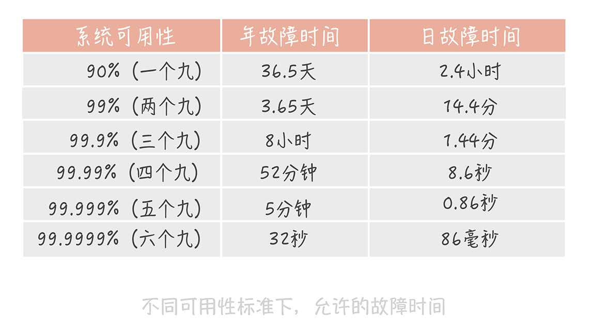

##### 1.什么是高可用？

通常而言，非核心系统至少要做到3个9，核心系统至少要做到4个9

##### 2.高可用系统的设计思路

###### 2.1 故障转移

1. 对等节点之间做故障转移：例如，nginx集群3个tomcat，当某一个tomcat出现大于500的请求的时候，重试请求另一个tomcat节点。
2. 不对等节点之间的故障转移：例如：主备切换，常见的有zk集群，redis主从。当主节点挂掉的时候，会采用某一种分布式一致性算法，比如Paxos，Raft来完成选举。

PS：对等节点一般指的就是无状态的节点。各个节点的功能完全一致。

###### 2.2 超时控制

复杂高并发系统，往往有很多系统和模块，模块在互相之间调用，最怕出现的是延迟而并非失败。
因为延迟会导致占用的资源无法释放，当有大量这种阻塞请求的时候，调用方就会因为资源用尽而挂掉。

在系统开发的初期，超时控制通常不被重视，或者是没有设置合理的超时时间。
如果超时时间设置过小，那么出现大量的超时失败请求。
如果超时时间设置过大，那么就会出现上述的延迟的问题。

如何设置一个合理的超时时间？
一个比较合理的方式是收集系统间的调用日志，然后统计99%的响应时间大概是多少，根据这个时间来定一个合理的超时时间。
如果没有的话，只能凭经验来设置。

###### 2.3 降级

降级的目的：为了保证核心服务，而牺牲非核心服务。

举例：微博系统，对于我们发送的微博，往往会先做一个反垃圾服务检测，检测内容中有没有广告之类的，然后才完成诸如写入数据库的逻辑。这个检测是一个比较耗时的操作，在平常时间，往往不影响，但并发量比较高的情况下，它往往会成为系统瓶颈，这个时候，可以考虑暂时关闭反垃圾服务检测。这就是降级。

###### 2.4 限流

限流的目的：控制并发请求的速度来保护系统。

举例：我的web系统单机只能处理1000个请求每秒。1秒内，超出的请求直接返回错误给客户端。这种做法虽然会损害用户体验，但在极端并发下，还可以接受的。

###### 2.5 灰度发布

事实上，在业务平稳运行的过程中，系统是很少发生故障的，90%的故障是发生在上线变更阶段的。举个例子，因为你上线了一个新的功能，导致数据库的慢请求数，翻了一倍，导致系统请求被拖慢而产生故障。

基于这种情况，重视变更管理非常重要，除了快速回滚以外。另外一个方案就是灰度发布

**灰度发布指的是，系统的变更不是一次性地推到线上的，而是按照一定比例逐步推进的。**

比方说，我们先在10%的机器上进行变更，然后观察系统的性能指标以及错误日志。当系统平稳运行，且没有大量错误日志时，再推动全力变更。

###### 2.6 故障演练

故障演练指的是对系统做一些破坏性的手段，观察在出现局部故障时，系统的整体的表现是怎样的。进而发现系统中的潜在问题。

相关工具：Netfix在2010年推出的ChaosMonkey就是一款比较好的故障演练工具。

通常情况下，建议另外搭建一套和线上部署结构一模一样的线下系统，然后在这个上面做演练。

