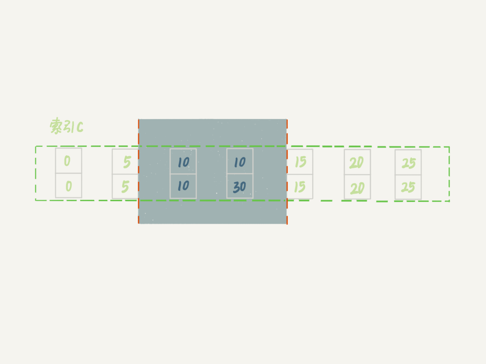
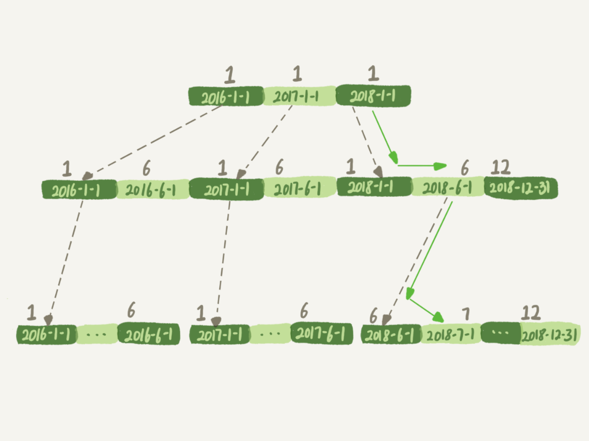
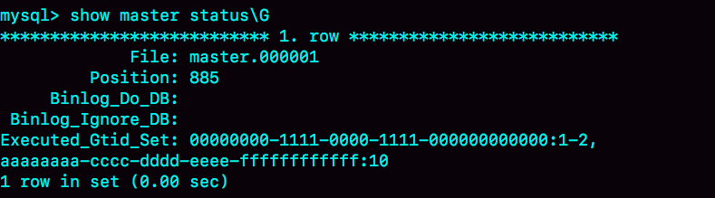

# 一条SQL语句查询是如何执行的？

## MySQL基本架构示意图


从架构图上可以看出，大体来说，MySQL 可以分为两部分：

1. Server层
2. 存储引擎层

Server 层包括连接器、查询缓存、分析器、优化器、执行器等，涵盖 MySQL 的大多数核心服务功能，以及所有的内置函数（如日期、时间、数学和加密函数等），所有跨存储引擎的功能都在这一层实现，比如存储过程、触发器、视图等。

存储引擎层负责数据的存储和提取。其架构模式是插件式的，支持 InnoDB、MyISAM、Memory 等多个存储引擎。现在最常用的存储引擎是 InnoDB，它从 MySQL 5.5.5 版本开始成为了默认存储引擎。

## Server层

### 连接器

连接器负责跟客户端建立连接、获取权限、维持和管理连接。连接命令一般是这么写的：

```mysql
mysql> mysql -h$ip -P$port -u$user -p
```

虽然密码也可以直接跟在 -p 后面写在命令行中，但这样可能会导致你的密码泄露。如果你连的是生产服务器，**强烈建议你不要这么做**。

连接命令中的 mysql 是客户端工具，用来跟服务端建立连接。在完成经典的 TCP 握手后，连接器就要开始认证你的身份，这个时候用的就是你输入的用户名和密码。这里需要特别注意一点：

1. 如果用户名密码认证通过，连接器会到权限表里面查出你拥有的权限。**之后，这个连接里面的权限判断逻辑，都将依赖于此时读到的权限。**


关于数据库长连接：
		建立连接的过程通常是比较复杂的，所以建议在使用中要尽量减少建立连接的动作，也就是尽量使用长连接。
		但是全部使用长连接后，你可能会发现，有些时候 MySQL 占用内存涨得特别快，这是因为 MySQL 在执行过程中临时使用的内存是管理在连接对象里面的。这些资源会在连接断开的时候才释放。所以如果长连接累积下来，可能导致内存占用太大，被系统强行杀掉（OOM），从现象看就是 MySQL 异常重启了

怎么解决这个问题呢？你可以考虑以下两种方案：

1. 定期断开长连接。使用一段时间，或者程序里面判断执行过一个占用内存的大查询后，断开连接，之后要查询再重连。
2. 如果你用的是 MySQL 5.7 或更新版本，可以在每次执行一个比较大的操作后，通过执行 mysql_reset_connection 来重新初始化连接资源。这个过程不需要重连和重新做权限验证，但是会将连接恢复到刚刚创建完时的状态。

### 缓存

大多数情况下我会建议你不要使用查询缓存，为什么呢？因为查询缓存往往弊大于利。

查询缓存的失效非常频繁，只要有对一个表的更新，这个表上所有的查询缓存都会被清空。因此很可能你费劲地把结果存起来，还没使用呢，就被一个更新全清空了

需要注意的是，MySQL 8.0 版本直接将查询缓存的整块功能删掉了，也就是说 8.0 开始彻底没有这个功能了。

### 分析器

这个就是解析语法用的

### 优化器

经过了分析器，MySQL 就知道你要做什么了。在开始执行之前，还要先经过优化器的处理

举例：

```mysql
mysql> select * from t1 join t2 using(ID)  where t1.c=10 and t2.d=20;
```

+ 既可以先从表 t1 里面取出 c=10 的记录的 ID 值，再根据 ID 值关联到表 t2，再判断 t2 里面 d 的值是否等于 20。
+ 也可以先从表 t2 里面取出 d=20 的记录的 ID 值，再根据 ID 值关联到 t1，再判断 t1 里面 c 的值是否等于 10。

这两种执行方法的逻辑结果是一样的，但是执行的效率会有不同，而优化器的作用就是决定选择使用哪一个方案。

### 执行器

MySQL 通过分析器知道了你要做什么，通过优化器知道了该怎么做，于是就进入了执行器阶段，开始执行语句。开始执行的时候，要先判断一下你对这个表 T 有没有执行查询的权限，如果没有，就会返回没有权限的错误

举例：

```mysql
mysql> select * from T where ID=10;

ERROR 1142 (42000): SELECT command denied to user 'b'@'localhost' for table 'T'
```

当没有权限时，就会抛出如上的错误。
如果有权限的话，则会这样执行：

1. 调用 InnoDB 引擎接口取这个表的第一行，判断 ID 值是不是 10，如果不是则跳过，如果是则将这行存在结果集中；
2. 调用引擎接口取“下一行”，重复相同的判断逻辑，直到取到这个表的最后一行。
3. 执行器将上述遍历过程中所有满足条件的行组成的记录集作为结果集返回给客户端。

至此，这个语句就执行完成了。对于有索引的表，执行的逻辑也差不多。第一次调用的是“取满足条件的第一行”这个接口，之后循环取“满足条件的下一行”这个接口，这些接口都是引擎中已经定义好的。

### 小问题

如果表 T 中没有字段 k，而你执行了这个语句 select * from T where k=1, 那肯定是会报“不存在这个列”的错误： “Unknown column ‘k’ in ‘where clause’”。那这个错误是在我们上面提到的哪个阶段报出来的呢？

答：分析器。MySQL 从你输入的"select"这个关键字识别出来，这是一个查询语句。它也要把字符串“T”识别成“表名 T”，把字符串“ID”识别成“列 ID”。如果字段k不存在，在分析的时候，就会出错。

# 一条SQL更新语句是如何执行的

## 大致描述

更新与查询不同，更新操作，对数据发生了改变，最后需要把数据落地，即写入到磁盘里。

那是不是我每次update一下，就要把数据写入到磁盘里呢？显然这样是不可取的。

所以这里就需要有一些方案来解决这个问题。

## undo log

InnoDB 里面每个事务有一个唯一的事务 ID，叫作 transaction id。它是在事务开始的时候向 InnoDB 的事务系统申请的，是按申请顺序严格递增的

而每行数据也都是有多个版本的。每次事务更新数据的时候，都会生成一个新的数据版本，并且把 transaction id 赋值给这个数据版本的事务 ID，记为 row trx_id。同时，旧的数据版本要保留，并且在新的数据版本中，能够有信息可以直接拿到它。

也就是说，数据表中的一行记录，其实可能有多个版本 (row)，每个版本有自己的 row trx_id


图中虚线框里是同一行数据的 4 个版本，当前最新版本是 V4，k 的值是 22，它是被 transaction id 为 25 的事务更新的，因此它的 row trx_id 也是 25

**图中的三个虚线箭头，就是 undo log**；而 V1、V2、V3 并不是物理上真实存在的，而是每次需要的时候根据当前版本和 undo log 计算出来的。比如，需要 V2 的时候，就是通过 V4 依次执行 U3、U2 算出来

## redo log

上面提到，MySQL 存在这样一个问题，如果每一次的更新操作都需要写进磁盘，然后磁盘也要找到对应的那条记录，然后再更新，整个过程 IO 成本、查找成本都很高。为了解决这个问题，MySQL 使用了WAL 技术

WAL 的全称是 Write-Ahead Logging，它的关键点就是**先写日志，再写磁盘**

而这里提到的这个日志，就是redo log

redo log是InnoDB 独有的东西，它的大致原理图如下：


redo log可以配置为一组 4 个文件，每个文件的大小是 1GB，那么这块“粉板”总共就可以记录 4GB 的操作。从头开始写，写到末尾就又回到开头循环写

write pos 是当前记录的位置，一边写一边后移，写到第 3 号文件末尾后就回到 0 号文件开头。checkpoint 是当前要擦除的位置，也是往后推移并且循环的，擦除记录前要把记录更新到数据文件。write pos 和 checkpoint 之间的是“粉板”上还空着的部分，可以用来记录新的操作。如果 write pos 追上 checkpoint，表示“粉板”满了，这时候不能再执行新的更新，得停下来先擦掉一些记录，把 checkpoint 推进一下

这里很关键，当redo log满了，会发生什么事情？


如图所示，redo log 写满了。这时候系统会停止所有更新操作，把 checkpoint 往前推进，checkpoint 可不是随便往前修改一下位置就可以的。比上图所示，把 checkpoint 位置从 CP 推进到 CP’，**就需要将两个点之间的日志（浅绿色部分），对应的所有脏页都 flush 到磁盘上**。之后，图中从 write pos 到 CP’之间就是可以再写入的 redo log 的区域

也就是说，redo log满了的情况下，就会发生刷盘的行为。当然，反过来讲，刷盘行为发生时，redo log不一定是满的。

我们再总结一下：redo log的存在，本质上相当于一个小型记账本，记账本上的东西，表示的是没有写入磁盘的数据。这样做有两个好处：

1. 有记账本redo log，MySQL在执行更新的时候，就可以先把数据写到内存里，然后在redo log里做个记录就行，等积攒到一定量的时候，再一并刷到磁盘上。而不需要每执行一次，就写一次磁盘。这样性能就大大提高。
2. 有记账本redo log的存在，即使中途断电或者宕机，重启后也能根据redo log来恢复那些没有刷到磁盘上的数据。这个能力称为 crash-safe

**但是这里有一个问题：当脏页被刷新时，redo log中的部分数据被写到磁盘上了，那就说明这部分数据已经落地了，那么按照redo log的设计的初衷，这部分数据应该被清除或者标记掉，请问实际redo log是怎么处理这个环节的呢？**

这个问题，在下面的redo log两阶段提相关问题里会解答。

**redo log 一般设置多大？**

回答：redo log 太小的话，会导致很快就被写满，然后不得不强行刷 redo log，这样 WAL 机制的能力就发挥不出来了。所以，如果是现在常见的几个 TB 的磁盘的话，就不要太小气了，直接将 redo log 设置为 4 个文件、每个文件 1GB 吧

## binlog

### binlog的三种模式

redo log 是 InnoDB 引擎特有的日志，而 Server 层也有自己的日志，称为 binlog（归档日志）

binlog主要有两种模式：statement、row。另外还有一种是这两种模式的混合型，即mixed

设置binlog的方式就是在my.cnf文件里，设置binlog_format

1. 当binlog_format = statement，记录的是原生SQL
2. 当binlog_format = row，记录的是行的数据改动
3. 当binlog_format = mixed，MySQL会自动判断。

那么binlog为什么要引入第三种模式mixed呢？

1. 因为使用statement 格式的 binlog ，在某些场景下可能会导致主备不一致，所以要使用 row 格式
2. 但 row 格式的缺点是，很占空间。比如你用一个 delete 语句删掉 10 万行数据，用 statement 的话就是一个 SQL 语句被记录到 binlog 中，占用几十个字节的空间。但如果用 row 格式的 binlog，就要把这 10 万条记录都写到 binlog 中。这样做，不仅会占用更大的空间，同时写 binlog 也要耗费 IO 资源，影响执行速度

基于上述两点，MySQL 就取了个折中方案，也就是有了 mixed 格式的 binlog。mixed 格式的意思是，MySQL 自己会判断这条 SQL 语句是否可能引起主备不一致，如果有可能，就用 row 格式，否则就用 statement 格式。

也就是说，mixed 格式可以利用 statment 格式的优点，同时又避免了数据不一致的风险。因此，如果你的线上 MySQL 设置的 binlog 格式是 statement 的话，那基本上就可以认为这是一个不合理的设置。你至少应该把 binlog 的格式设置为 mixed

**但实际大多数公司的场景需求是，要把binlog设置成row，而这样做的理由是：数据恢复**

### row格式与数据恢复

1. 如果我执行的是 delete 语句，row 格式的 binlog 也会把被删掉的行的整行信息保存起来。所以，如果你在执行完一条 delete 语句以后，发现删错数据了，可以直接把 binlog 中记录的 delete 语句转成 insert，把被错删的数据插入回去就可以恢复了。
2. 如果你是执行错了 insert 语句呢？那就更直接了。row 格式下，insert 语句的 binlog 里会记录所有的字段信息，这些信息可以用来精确定位刚刚被插入的那一行。这时，你直接把 insert 语句转成 delete 语句，删除掉这被误插入的一行数据就可以了。
3. 如果执行的是 update 语句的话，binlog 里面会记录修改前整行的数据和修改后的整行数据。所以，如果你误执行了 update 语句的话，只需要把这个 event 前后的两行信息对调一下，再去数据库里面执行，就能恢复这个更新操作了。

其实，由 delete、insert 或者 update 语句导致的数据操作错误，需要恢复到操作之前状态的情况，也时有发生。MariaDB 的**Flashback**工具就是基于上面介绍的原理来回滚数据的。

### statement的问题案例

### binlog的查看

语法：

```
SHOW BINLOG EVENTS [IN 'log_name'] [FROM pos] [LIMIT [offset,] row_count]
```

示例：

```mysql
show binlog events in 'mysql-bin.000224' limit 3,5 ; #从第三行开始列出5行；
```


## update执行流程


最后三步看上去有点“绕”，将 redo log 的写入拆成了两个步骤：prepare 和 commit，这就是"两阶段提交"。

## redo log两阶段提交相关问题

### 两阶段提交的目的是什么？

两阶段提交，其目的是为了保证redo log和binlog的一致性。

### 两阶段提交如何保证redo log和binlog的一致性？

这个问题，可以转化为：在两阶段提交的不同时刻，MySQL 异常重启会出现什么现象？目前来说主要存在以下两种情况比较特别：

1. redo log 处于 prepare 阶段之后、写 binlog 之前，发生了崩溃（crash）。
2.  redo log 处于 prepare 阶段之后，binlog也写完，但redo log 还没 commit 前发生 crash。

对于情况一：此时 binlog 还没写，redo log 也还没提交，所以崩溃恢复的时候，这个事务会回滚。

对于情况二：实际会有以下几种可能：

1. 如果 redo log 里面的事务是完整的，也就是已经有了 commit 标识，则直接提交。

2. 如果 redo log 里面的事务只有完整的 prepare，则判断对应的事务 binlog 是否存在并完整：

   a.如果是，则提交事务；

   b.否则，回滚事务。

情况二提到的binlog写完，如果是完整的写入，那么就应该2-a的情况，即：提交事务。

那么MySQL如何判断binlog是完整的呢？

### MySQL 怎么知道 binlog 是完整的?

一个事务的 binlog 是有完整格式的：

1. statement 格式的 binlog，最后会有 COMMIT；
2. row 格式的 binlog，最后会有一个 XID event。

在 MySQL 5.6.2 版本以后，还引入了 binlog-checksum 参数，用来验证 binlog 内容的正确性。对于 binlog 日志由于磁盘原因，可能会在日志中间出错的情况，MySQL 可以通过校验 checksum 的结果来发现。所以，MySQL 还是有办法验证事务 binlog 的完整性的。

### redo log 和 binlog 是怎么关联起来的?

它们有一个共同的数据字段，叫 XID。崩溃恢复的时候，会按顺序扫描 redo log：

1. 如果碰到既有 prepare、又有 commit 的 redo log，就直接提交；
2. 如果碰到只有 parepare、而没有 commit 的 redo log，就拿着 XID 去 binlog 找对应的事务

###  redo log是否可以直接提交，而不用两阶段提交？

对于 InnoDB 引擎来说，如果 redo log 提交完成了，事务就不能回滚（如果这还允许回滚，就可能覆盖掉别的事务的更新）。而如果 redo log 直接提交，然后 binlog 写入的时候失败，InnoDB 又回滚不了，数据和 binlog 日志又不一致了。

由此可见，如果不使用两阶段提交，无法保证 redo log和binlog的一致性。

事实上，两阶段提交是经典的分布式系统问题，并不是 MySQL 独有的。

### 能否只用binlog 来支持崩溃恢复？

答：不可以。先看下面的图


如图所示，binlog2在commit前crash。

在这个点，binlog1和binlog2对应的数据，已经写入内存中，但可能还没有刷盘（写入到磁盘），此时crash，binlog1和binlog2对应的数据都会丢失。

上面提到， binlog的完整格式，如果没有commit，必然是不完整的。binlog2没有commit，被视为不完整的，所以系统认为binlog2的数据丢失了，会恢复。但binlog1已经commit了，系统就不认为binlog1的数据丢失了，就不会恢复。

而事实上，因为没有刷盘，binlog1的数据也丢失了，而系统又认为不需要恢复，就导致这份数据真的丢失了。

这也是binlog和redo log的本质区别，binlog无法记录数据页的状态，从而导致在宕机的时候，无法知道哪些数据已经刷盘，哪些数据没有刷盘。

### 那能不能反过来，只要redo log，而不要binlog?

答：也不能。

 redo log 是循环写，写到末尾是要回到开头继续写的。这样历史日志没法保留，redo log 也就起不到归档的作用。

而binlog则能完整地记录，起到归档的作用。

此外， MySQL 系统依赖于 binlog。binlog 作为 MySQL 一开始就有的功能，被用在了很多地方。其中，MySQL 系统高可用的基础，就是 binlog 复制

还有很多公司有异构系统（比如一些数据分析系统），这些系统就靠消费 MySQL 的 binlog 来更新自己的数据。关掉 binlog 的话，这些下游系统就没法输入了。

### 内存脏页刷盘后，MySQL如何处理redo log中被刷盘的数据？

前面我们提到，设计redo log的初衷，就是为了避免每次update都刷盘。每次让数据先更新到内存，然后用redo log记下来，然后在空闲时整体刷盘。

所以这里问题就来了，刷盘后，也就意味着redo log中记录的部分数据已经被同步到磁盘了，将来即使这部分数据被擦除，就不应该再刷磁盘了，那么MySQL是如何处理这部分数据的呢？是直接删除，还是标记？还是有其它处理？

答：MySQL不会删除redo log，也不会标记什么。但是，下次当redo log写满要刷盘的时候，会判断要刷的这部分数据是不是脏页，是脏页就刷，不是就不刷。

那么MySQL是如何判断数据是否为脏页的呢？
答：LSN

### redo log buffer 是什么？是先修改内存，还是先写 redo log 文件

在一个事务的更新过程中，日志是要写多次的。比如下面这个事务：

```mysql
begin;
insert into t1 ...
insert into t2 ...
commit;
```

这个事务要往两个表中插入记录，插入数据的过程中，生成的日志都得先保存起来，但又不能在还没 commit 的时候就直接写到 redo log 文件里。所以，redo log buffer 就是一块内存，用来先存 redo 日志的。也就是说，在执行第一个 insert 的时候，数据的内存被修改了，redo log buffer 也写入了日志。但是，真正把日志写到 redo log 文件（文件名是 ib_logfile+ 数字），是在执行 commit 语句的时候做的。

### redo log中的页可能不在内存中，update可能会写入change buffer。刷盘时会强行merge吗？

后面会讲到change buffer的概念，这里简单说下，update时，要update的数据页，可能不在内存中，此时update的操作，会先写入change buffer中，当后续发生read时，会从磁盘上读取，然后在内存中merge成脏页。

所以，其实这里有一点很关键，redo log的内容实际上是有两种的：

1. 记录普通数据页的改动
2. 记录change buffer的改动

因此，这里有两个问题：

1. 如果redo log写满了，要擦除的时候，涉及了change buffer的内容，会怎样？
2. 如果内存不够，需要刷脏页到磁盘，而change buffer本身也是在内存里的某个页，如果这个要被刷的脏页，刚好就是change buffer，会怎样？

答：这两个问题，其实都是需要刷脏页到磁盘，他们的结果也是一样的，就是把change buffer的内容写入到磁盘，并不会发生任何merge的行为。merge的行为，始终发生在read的时候。

所以，虽然名字叫作 change buffer，实际上它是可以持久化的数据。也就是说，change buffer 在内存中有拷贝，也会被写入到磁盘上

## binlog和redo log的对比

1. redo log 是 InnoDB 引擎特有的；binlog 是 MySQL 的 Server 层实现的，所有引擎都可以使用。
2. redo log 是物理日志，记录的是“在某个数据页上做了什么修改”；binlog 是逻辑日志，记录的是这个语句的原始逻辑，比如“给 ID=2 这一行的 c 字段加 1 ”。
3. redo log 是循环写的，空间固定会用完；binlog 是可以追加写入的。“追加写”是指 binlog 文件写到一定大小后会切换到下一个，并不会覆盖以前的日志。

## update的一个小问题

```mysql
mysql> update t set a=2 where id=1;
```

假设id=1的记录，其a的值就是2，请问MySQL会如何处理？

1. 更新都是先读后写的，MySQL 读出数据，发现 a 的值本来就是 2，不更新，直接返回，执行结束；
2. MySQL 调用了 InnoDB 引擎提供的“修改为 (1,2)”这个接口，但是引擎发现值与原来相同，不更新，直接返回；
3. InnoDB 认真执行了“把这个值修改成 (1,2)"这个操作，该加锁的加锁，该更新的更新。

结果是哪个呢？

答案是3。

你可能会问，MySQL 怎么这么笨，就不会更新前判断一下值是不是相同吗？如果判断一下，不就不用浪费 InnoDB 操作，多去更新一次了？

事实上，MySQL是有读取值的。只是在这个语句里面，MySQL 认为读出来的值，只有一个确定的 (id=1), 而要写的是 (a=3)，只从这两个信息是看不出来“不需要修改”的。

如果把SQL改成：

```mysql
mysql> update t set a=2 where id=1 and a=2;
```

## 小结

回顾下双1设置下，整个更新事务的完整流程是怎样的？redo log和binlog是怎么一个流程的

1. 执行插入、更新语句，redo log的内容先写到redo log buffer，同时binlog的内容先写入到binlog cache中
2. 插入、更新语句的所在的事务提交。
3. redo log 进入到prepare阶段，将redo log buffer持久化到磁盘，真正写入到redo log文件中
4. 将binlog cache的内容持久化到磁盘，真正写入bin log文件中
5. redo log变成commit状态

注意，这里的第2步和第3步，事务提交，然后redo log buffer 持久化到磁盘，然后处于prepare状态。这个顺序一定没错，但不代表，必须事务提交，这个事务的redo log buffer才持久化。

比如有两个事务A和B，事务A提交，那么事务A的redo log必然遵循上面的流程。但事务A的redo log buffer也有可能在事务B提交的时候顺带持久化了，但因为事务A没提交，所以即使这部分redo log buffer持久化了，也不会处于prepare状态。持久化的redo log 要变成prepare状态，必须是事务A提交。


# 事务隔离

## 四种事务隔离级别

1. 读未提交：一个事务还没提交时，它做的变更就能被别的事务看到。
2. 读提交：一个事务提交之后，它做的变更才会被其他事务看到。
3. 可重复读：一个事务执行过程中看到的数据，总是跟这个事务在启动时看到的数据是一致的。当然在可重复读隔离级别下，未提交变更对其他事务也是不可见的。
4. 串行化：顾名思义是对于同一行记录，“写”会加“写锁”，“读”会加“读锁”。当出现读写锁冲突的时候，后访问的事务必须等前一个事务执行完成，才能继续执行。

这四种中，默认最常见是就是2和3

其中读提交又被称为不可重复读（read-committed），简称RC模式
而可重复度读（repeatable-read），简称为RR模式

MySQL默认的模式是RR模式，即：可重复读。

## 事务隔离的实现

## 长事务

你可以在 information_schema 库的 innodb_trx 这个表中查询长事务，比如下面这个语句，用于查找持续时间超过 60s 的事务。

```mysql
select * from information_schema.innodb_trx where TIME_TO_SEC(timediff(now(),trx_started))>60
```

## 查看&设置事务隔离级别的命令

查看：

1. 查看当前会话隔离级别：select @@tx_isolation;
2. 查看系统当前隔离级别：select @@global.tx_isolation;

设置：

1. 设置当前会话隔离级别：set session transaction isolation level repeatable read;
2. 设置系统当前隔离级别：set global transaction isolation level read committed;

##  事务启动的时机

这点非常关键，不同的命令，启动的时间并不相同：

1. begin/start transaction，这个命令并不是马上启动事务，在执行到它们之后的第一个操作 InnoDB 表的语句，事务才真正启动
2. start transaction with consistent snapshot，马上启动一个事务。

+ 第一种启动方式，一致性视图是在执行第一个快照读语句时创建的；
+ 第二种启动方式，一致性视图是在执行 start transaction with consistent snapshot 时创建的。

## 事务ID与数据版本

InnoDB 里面每个事务有一个唯一的事务 ID，叫作 transaction id。它是在事务开始的时候向 InnoDB 的事务系统申请的，是按申请顺序严格递增的

每行数据也都是有多个版本的。每次事务更新数据的时候，都会生成一个新的数据版本，并且把 transaction id 赋值给这个数据版本的事务 ID，记为 row trx_id。同时，旧的数据版本要保留，并且在新的数据版本中，能够有信息可以直接拿到它。也就是说，数据表中的一行记录，其实可能有多个版本 (row)，每个版本有自己的 row trx_id

举个例子，现在先开启了一个事务A，然后开启了一个事务B，事务A的 transaction id = 101，事务B的transaction id = 102
事务B率先对表T的第一行数据R进行了更新，此时R的最新数据版本，就是B的事务id =102
然后事务A也对表T的第一行数据R进行了更新，所以R的最新数据版本，就是A的事务id = 101

由此可见，并不是说数据行R的数据版本越大就是越新的。

## 当前读问题

假设有一张表t，主键为id，数据以及结构如下：

| id   | k    |
| ---- | ---- |
| 1    | 1    |
| 2    | 2    |


现在开启两个事务A和B，按如下的顺序操作：

| 事务A                                      | 事务B                                      |
| ------------------------------------------ | ------------------------------------------ |
| start transaction with consistent snapshot |                                            |
|                                            | start transaction with consistent snapshot |
|                                            | select k from t where id =1;               |
| update t set k=k+1 where id=1;             |                                            |
| commit;                                    |                                            |
|                                            | select k from t where id =1;               |
|                                            | update t set k=k+1 where id=1;             |
|                                            | select k from t where id =1;               |
|                                            | commit;                                    |

请问，事务B，3次select得到的k的值分别是多少？
答：**第一次和第二次都是1，第三次为3**。

相关代码：

事务A

```mysql
mysql> start transaction with consistent snapshot;                                               
Query OK, 0 rows affected (0.00 sec)

mysql> update t set k=k+1 where id=1;                                                            
Query OK, 1 row affected (0.00 sec)
Rows matched: 1  Changed: 1  Warnings: 0

mysql> commit;
Query OK, 0 rows affected (0.00 sec)
```

事务B：

```mysql
mysql> start transaction with consistent snapshot;
Query OK, 0 rows affected (0.00 sec)

mysql> select k from t where id =1;                                                              
+------+
| k    |
+------+
|    1 |
+------+
1 row in set (0.00 sec)

mysql> select k from t where id =1;                                                              
+------+
| k    |
+------+
|    1 |
+------+
1 row in set (0.00 sec)

mysql> update t set k=k+1 where id=1;                                                            
Query OK, 1 row affected (0.00 sec)
Rows matched: 1  Changed: 1  Warnings: 0

mysql> select k from t where id =1;                                                              
+------+
| k    |
+------+
|    3 |
+------+
1 row in set (0.00 sec)

mysql> commit;                                                                                    
Query OK, 0 rows affected (0.00 sec)
```

我们发现事务B的update语句，是基于事务A，commit的结果的，我们需要知道，update 语句都是先读后写的，**而这个读，只能读最新版本的值，这称之为当前读**。

以下，不管是哪种update，都会触发当前读，记住，只要是update ，对update语句而言，都会触发当前读。

1. update t set k=k+1 where id=1;
2. update t set k=3  where id=1;
3. update t set k=3  where id=1 and k=3 ;

我们这里仍要说明一点，在同一个事务中，虽然update触发当前读，但并不意味着，select会触发。如果update没更新的话，同一个事务下，select前后的值不会改变（可重复读的前提下）：

| 事务A                                            | 事务B                        |
| ------------------------------------------------ | ---------------------------- |
| begin;                                           |                              |
| select * from t where id =1;//结果为（1，1）     |                              |
|                                                  | update t set k=2 where id=1; |
| update t set k=2 where id=1 and k=2;（不执行）   |                              |
|                                                  |                              |
| select * from t where id =1;//结果仍然为（1，1） |                              |
| commit;                                          |                              |

关于update t set k=2 where id=1 and k=2;不执行的原因，在2.6，update的一个小问题里已经说明过了。

**最后再总结下，哪些语句会触发当前读：**

1. select .... for update;
2. select ... lock in share mode;
3. update ...set ....
4. delete from ...

## 幻读与间隙锁

### 幻读发生的场景

关于幻读的定义，要从其场景才能说清楚

1. 在RC模式下，其它事务的更新，对当前事务都是可见的。然而有些场景，要求在一个事务中，相同的查询要求保持一致。于是有了可重复读的模式RR
2. 可重复读隔离级别下，普通的查询是快照读，是不会看到别的事务插入的数据的。因此普通的select，并不会产生幻读
3. 可重复读隔离级别下，带有**for update** 或者**lock in share mode**的select，属于当前读，如果没有特别的机制进行干预，那么其它的事务插入的数据，在RR模式下，通过当前读是可以查询到的。这种情况，就称为幻读

但事实上，RR模式能有效防止幻读的。也就是说，即使是当前读的查询，也不会读到其它事务插入的数据。那么，RR模式是如何解决幻读的呢？

答案是：间隙锁。这个在下面幻读和间隙锁的章节里会说明。

需要注意的是：下面 session B 的修改结果，被 session A 之后的 select 语句用“当前读”看到，不能称为幻读。因为幻读仅专指“新插入的行”。

```mysql
CREATE TABLE `t` (  
  `id` int(11) NOT NULL,  
  `c` int(11) DEFAULT NULL,  
  `d` int(11) DEFAULT NULL,  
  PRIMARY KEY (`id`),  
  KEY `d` (`d`)) ENGINE=InnoDB;
  
insert into t values(0,0,0),(5,5,5),(10,10,10),(15,15,15),(20,20,20),(25,25,25);
```

| 事务A                                                        | 事务B                            |
| ------------------------------------------------------------ | -------------------------------- |
| begin;                                                       |                                  |
| select * from t where d=5 for update; //Q1，结果为（5，5，5） |                                  |
|                                                              | update t set d=5 where id=0;//U1 |
| select * from t where d=5 for update; //Q2，结果为（5，5，5）,(0，5，5) |                                  |
| commit;                                                      |                                  |

1. 上面这个例子，我们在RC模式下执行。
2. 表t的d字段有索引，所以事务A的Q1查询，将锁住d=5的所有行，但此时只有id=5这行，所以只有这行被锁住了。
3. 事务B，执行U1的更新，此时因为id=0这行没有行锁，所以被正确更新。
4. 事务A继续执行Q2，我们看到了，事务B的更新的结果，能被事务A的Q2看到，但这并不属于幻读，幻读专指新插入的行。
5. 事实上，在RR模式下，这个例子的事务B的update语句会被阻塞。所以这些问题，在RR模式中都不存在。

### 幻读与间隙锁

事实上，当我们在RR模式下，使用当前读时，幻读是无法发生的。

| 事务A                                                        | 事务B                                 |
| ------------------------------------------------------------ | ------------------------------------- |
| begin;                                                       |                                       |
| select * from t where d=5 for update; //Q1，结果为（5，5，5） |                                       |
|                                                              | insert into t values(7,0,5);//blocked |
| select * from t where d=5 for update; //Q2，结果为（5，5，5） |                                       |
| commit;                                                      |                                       |

上述这个例子，事务A在RR模式下，启用当前读，然后我们在事务B中试图插入一行id=7，c=0，d=5的行。我们发现是无法插入的。

这是因为有间隙锁的存在。间隙锁有一列的规则和逻辑，具体可以查看间隙锁章节。

所以解决和防止幻读的一个有效方式，就是间隙锁。InnoDB为了解决幻读问题，正是引入的间隙锁。

### 幻读带来的问题

通过上面的说明，我们已经明白幻读是怎么产生的，以及RR模式是如何解决幻读的。但是，我们似乎漏了一点，为什么要解决幻读？如果不解决幻读，会带来什么问题？

答案是，当binlog为statement时，会出现主从不一致的情况。

```mysql
CREATE TABLE `t` (  
  `id` int(11) NOT NULL,  
  `c` int(11) DEFAULT NULL,  
  `d` int(11) DEFAULT NULL,  
  PRIMARY KEY (`id`),  
  KEY `d` (`d`)) ENGINE=InnoDB;
  
insert into t values(0,0,0),(5,5,5),(10,10,10),(15,15,15),(20,20,20),(25,25,25);
```


| 事务A                                                        | 事务B                        | 事务C                        |
| ------------------------------------------------------------ | ---------------------------- | ---------------------------- |
| begin;                                                       |                              |                              |
| select * from t where d=5 for update; //Q1，结果为（5，5，5） |                              |                              |
| update t set d=100 where d=5;                                |                              |                              |
|                                                              | update t set d=5 where id=0; |                              |
| select * from t where d=5 for update;//Q2                    |                              |                              |
|                                                              |                              | insert into t values(1,1,5); |
|                                                              |                              | update t set c=5 where id=1; |
| select * from t where d=5 for update;//Q3                    |                              |                              |
| commit                                                       |                              |                              |

我们先假设，只锁定需要锁的行，比如事务A，Q1，只锁d=5的行，也就是id=5这一行。

1. 经过 T1 时刻，id=5 这一行变成 (5,5,100)，当然这个结果最终是在 T6 时刻正式提交的；
2. 经过 T2 时刻，id=0 这一行变成 (0,0,5);
3. 经过 T4 时刻，表里面多了一行 (1,5,5);

我们再来看看这时候 binlog 里面的内容。

1. T2 时刻，session B 事务提交，写入了一条语句；
2. T4 时刻，session C 事务提交，写入了两条语句；
3. T6 时刻，session A 事务提交，写入了 update t set d=100 where d=5 这条语句。

```mysql
update t set d=5 where id=0; /*(0,0,5)*/

insert into t values(1,1,5); /*(1,1,5)*/
update t set c=5 where id=1; /*(1,5,5)*/

update t set d=100 where d=5;/*所有d=5的行，d改成100*/
```

好，你应该看出问题了。这个语句序列，不论是拿到备库去执行，还是以后用 binlog 来克隆一个库，这三行的结果，都变成了 (0,5,100)、(1,5,100) 和 (5,5,100)。也就是说，id=0 和 id=1 这两行，发生了数据不一致。这个问题很严重，是不行的.

我们再假设，扫描到的所有行都锁定，由于 事务 A 把所有的行都加了写锁，所以事务B 在执行第一个 update 语句的时候就被锁住了。需要等到 T6 时刻 事务 A 提交以后，事务 B 才能继续执行。这样对于 id=0 这一行，在数据库里的最终结果还是 (0,5,5)。在 binlog 里面，执行序列是这样的：

```mysql

insert into t values(1,1,5); /*(1,1,5)*/
update t set c=5 where id=1; /*(1,5,5)*/

update t set d=100 where d=5;/*所有d=5的行，d改成100*/

update t set d=5 where id=0; /*(0,0,5)*/
update t set c=5 where id=0; /*(0,5,5)*/
```

可以看到，按照日志顺序执行，id=0 这一行的最终结果也是 (0,5,5)。所以，id=0 这一行的问题解决了。

但同时你也可以看到，id=1 这一行，在数据库里面的结果是 (1,5,5)，而根据 binlog 的执行结果是 (1,5,100)，也就是说幻读的问题还是没有解决。为什么我们已经这么“凶残”地，把所有的记录都上了锁，还是阻止不了 id=1 这一行的插入和更新呢？

原因很简单。在 T3 时刻，我们给所有行加锁的时候，id=1 这一行还不存在，不存在也就加不上锁。也就是说，即使把所有的记录都加上锁，还是阻止不了新插入的记录，这也是为什么“幻读”会被单独拿出来解决的原因。

###  间隙锁带来的问题

通过3.8.2，我们已经知道间隙锁可以解决幻读。但是间隙锁会引来另外一个问题：死锁冲突

| 事务A                                  | 事务B                                   |
| -------------------------------------- | --------------------------------------- |
| begin;                                 |                                         |
| select * from t where id=9 for update; |                                         |
|                                        | begin;                                  |
|                                        | select * from t where id=9 for update;  |
|                                        | insert into t values (9,9,9);//blocked; |
| nsert into t values (9,9,9);           |                                         |
| (ERROR：DeadLock Found)                |                                         |
|                                        |                                         |

我们按语句执行顺序来分析一下：

1. session A 执行 select … for update 语句，由于 id=9 这一行并不存在，因此会加上间隙锁 (5,10);
2. session B 执行 select … for update 语句，同样会加上间隙锁 (5,10)，间隙锁之间不会冲突，因此这个语句可以执行成功；
3. session B 试图插入一行 (9,9,9)，被 session A 的间隙锁挡住了，只好进入等待；
4. session A 试图插入一行 (9,9,9)，被 session B 的间隙锁挡住了。

至此，两个 session 进入互相等待状态，形成死锁。当然，InnoDB 的死锁检测马上就发现了这对死锁关系，让 session A 的 insert 语句报错返回了

间隙锁的引入，可能会导致同样的语句锁住更大的范围，这其实是影响了并发度的

### 解决幻读和间隙锁

至此，我们知道：

1. 因为有些场景下，需要可重复读。所以出现了可重复度级别隔离模式——RR模式
2. 而RR模式为了解决幻读带来的主从数据不一致问题，引入了间隙锁。
3. 但使用间隙锁，可能引发死锁问题

那么，我们到底该怎么做呢？

其实幻读带来的主从数据不一致问题，本质上是因为binlog=statement的缘故。所以，这一系列的关键点，首先在于要把binlog设置为row。

然后，使用RR模式，自然而然就会使用间隙锁，所以，如果业务不是特别需要RR模式，就应该使用RC模式。

所以，避免幻读和间隙锁带来的问题，我们应该尽可能这样做：

1. binlog使用row
2. 尽可能使用RC模式

**这里可能会有疑问：幻读导致的问题主要在于主从数据不一致，而主从数据不一致的主要凶手实际上是binlog=statement，那么如果binlog设置为row的话，幻读导致的问题，其实看起来并不大，那么为什么不考虑在RR模式下，关闭间隙锁，开启row格式的binlog呢？**

答：根据丁奇大佬的经验，有两个原因：

1. 一方面是很多人并不知道关闭间隙锁的参数
2. 幻读如果确认不需要，一般表示可重复读也不需要，不如直接改RC+row格式的binlog

丁奇大佬表示自己还没有遇到需要RR+关闭间隙锁+binlog=row的这种场景。（大佬经验丰富都没遇到过，那就真的不需要了）

# 索引

## 实现索引的几种方式

有3种常见的索引实现方式：

1. 哈希表
2. 有序数组
3. 搜索树

注意：索引的本质就是排序，一切的索引都是有序的。HASH索引本质上也是排序，只是用了键值的HASH值来排序。

所以如果mysql需要order by操作，最好是在order by的字段上建索引，这样该字段，天然有序。

## 主键索引（聚簇索引）和非主键索引（二级索引）

索引本身是在存储引擎中实现的，不同的存储引擎实现不同，我们这里就以InnoDB为例

假设，我们有一个主键列为 ID 的表，表中有字段 k，并且在 k 上有索引。这个表的建表语句是：

```mysql
mysql> create table T(id int primary key, k int not null, name varchar(16),index (k))engine=InnoDB;
```

表中 R1~R5 的 (ID,k) 值分别为 (100,1)、(200,2)、(300,3)、(500,5) 和 (600,6)，两棵树的示例示意图如下。


由此图可知：

1. 主键索引的叶子节点存的是整行数据。在 InnoDB 里，主键索引也被称为**聚簇索引**（clustered index）
2. 非主键索引的叶子节点内容是主键的值。在 InnoDB 里，非主键索引也被称为**二级索引**（secondary index）

由此我们也可以看出，主键索引和普通索引的查询，是不一样的

+ 如果语句是 select * from T where ID=500，即主键查询方式，则只需要搜索 ID 这棵 B+ 树；
+ 如果语句是 select * from T where k=5，即普通索引查询方式，则需要先搜索 k 索引树，得到 ID 的值为 500，再到 ID 索引树搜索一次。这个过程称为回表


**注意：聚簇索引真正的定义，指的是索引的key和数据是放在一起的。非聚簇索引是指，索引文件和数据文件是分开放的。对于 InnoDB而言，索引和数据都是同一个文件里的。而对于MyIsam，索引文件和数据文件是分开放的。**

## 索引维护相关问题

+ B+ 树为了维护索引有序性，在插入新值的时候需要做必要的维护。以上面这个图为例，如果插入新的行 ID 值为 700，则只需要在 R5 的记录后面插入一个新记录。如果新插入的 ID 值为 400，就相对麻烦了，需要逻辑上挪动后面的数据，空出位置。
+ 而更糟的情况是，如果 R5 所在的数据页已经满了，根据 B+ 树的算法，这时候需要申请一个新的数据页，然后挪动部分数据过去。这个过程称为页分裂。在这种情况下，性能自然会受影响。
+ 除了性能外，页分裂操作还影响数据页的利用率。原本放在一个页的数据，现在分到两个页中，整体空间利用率降低大约 50%。
+ 当然有分裂就有合并。当相邻两个页由于删除了数据，利用率很低之后，会将数据页做合并。合并的过程，可以认为是分裂过程的逆过程。

##  为什么尽量使用自增长主键？

这里的尽量使用，是指，只要符合业务需求，那么就尽量使用自增长主键。

我们可以从索引维护和索引空间两个方面来看问题。

1. 从索引维护的角度讲，自增主键，每次新增数据，都是追加操作，都不涉及到挪动其他记录，也不会触发叶子节点的分裂
2. 从存储空间的角度来看，假设你的表中确实有一个唯一字段，比如字符串类型的身份证号，如果你使用身份证号作为主键，那么每个二级索引的叶子节点占用约 20 个字节，而如果用整型做主键，则只要 4 个字节，如果是长整型（bigint）则是 8 个字节。显然，主键长度越小，普通索引的叶子节点就越小，普通索引占用的空间也就越小

所以，从性能和存储空间方面考量，自增主键往往是更合理的选择

## 覆盖索引与联合索引

```mysql
select * from T where k between 3 and 5
```

这个语句会怎么执行？

1. 在 k 索引树上找到 k=3 的记录，取得 ID = 300；
2. 再到 ID 索引树查到 ID=300 对应的 R3；
3. 在 k 索引树取下一个值 k=5，取得 ID=500；
4. 再回到 ID 索引树查到 ID=500 对应的 R4；
5. 在 k 索引树取下一个值 k=6，不满足条件，循环结束。

由此可见，在k索引树上进行了两次查找，然后又在主键索引树上进行了两次查找。前面提过，回到主键索引树搜索的过程，我们称为回表。所以这里回表了两次。

那有没有什么办法避免回表呢？如果不是select * ，而是select ID就不一样了

```mysql
select ID from T where k between 3 and 5
```

在这个查询里面，索引 k 已经“覆盖了”我们的查询需求，不需要再回表，所以我们称为覆盖索引

为了避免回表，我们可以建联合索引。比如，有如下的市民表

```mysql
CREATE TABLE `tuser` (
  `id` int(11) NOT NULL,
  `id_card` varchar(32) DEFAULT NULL,
  `name` varchar(32) DEFAULT NULL,
  `age` int(11) DEFAULT NULL,
  `ismale` tinyint(1) DEFAULT NULL,
  PRIMARY KEY (`id`),
  KEY `id_card` (`id_card`),
  KEY `name_age` (`name`,`age`)
) ENGINE=InnoDB
```

我们为name和age建立的联合索引，当我们通过name找age时，就不需要回表：

```mysql
SELECT t.age from tuser t where t.`name`='bob'
```

因为此时，name的索引包含了age。

但反过来，如果根据age查找name呢？这个时候就**不好使**了，因为联合索引是有顺序的，它符合最左前缀原则：

1. 当已经有了 (a,b) 这个联合索引后，一般就不需要单独在 a 上建立索引了。
2. 如果既有联合查询，又有基于 a、b 各自的查询呢？查询条件里面只有 b 的语句，是无法使用 (a,b) 这个联合索引的，这时候你不得不维护另外一个索引，也就是说你需要同时维护 (a,b)、(b) 这两个索引

所以，如果要根据age找name，就需要建立age的索引。

## 索引下推

我们还是以市民表的联合索引（name, age）为例。如果现在有一个需求：检索出表中“名字第一个字是张，而且年龄是 10 岁的所有男孩”。那么，SQL 语句是这么写的：

```mysql
mysql> select * from tuser where name like '张%' and age=10 and ismale=1;
```

你已经知道了前缀索引规则，所以这个语句在搜索索引树的时候，只能用 “张”，找到第一个满足条件的记录 ID3。当然，这还不错，总比全表扫描要好.

在 MySQL 5.6 之前，只能从 ID3 开始一个个回表。到主键索引上找出数据行，再对比字段值。

而 MySQL 5.6 引入的索引下推优化（index condition pushdown)， 可以在索引遍历过程中，对索引中包含的字段先做判断，直接过滤掉不满足条件的记录，减少回表次数


在图 3 和 4 这两个图里面，每一个虚线箭头表示回表一次。

图 3 中，在 (name,age) 索引里面我特意去掉了 age 的值，这个过程 InnoDB 并不会去看 age 的值，只是按顺序把“name 第一个字是’张’”的记录一条条取出来回表。因此，需要回表 4 次。

图 4 跟图 3 的区别是，InnoDB 在 (name,age) 索引内部就判断了 age 是否等于 10，对于不等于 10 的记录，直接判断并跳过。在我们的这个例子中，只需要对 ID4、ID5 这两条记录回表取数据判断，就只需要回表 2 次。

## 普通索引和唯一索引

这两者的区别在于，普通索引对应的值可能是重复的，唯一索引的值是唯一的。所以，在查找上：

1. 对于普通索引来说，查找到满足条件的第一个记录后，需要查找下一个记录，直到碰到第一个不满足条件的记录
2. 对于唯一索引来说，由于索引定义了唯一性，查找到第一个满足条件的记录后，就会停止继续检索

那么，这个不同带来的性能差距会有多少呢？答案是，微乎其微

在下面的change buffer中，会具体举例说明

## 联合索引的最左前缀

当我们建立了一个(name,age)的联合索引之后，需要注意：

```mysql
select * from user where name=xx and city=xx ; ／／可以命中索引
select * from user where name=xx ; // 可以命中索引
select * from user where city=xx ; // 无法命中索引
select * from user where city=xx  and name=xx; ／／可以命中索引
```

尤其要注意第4个，现在的存储引擎，会把他优化，使得他不受顺序的影响。

另外，联合索引，一旦出现范围查找，将会缩小索引的范围

比如，我们建立了一个(a,b,c)的索引

```mysql
select * from t where a=3 ; //只使用了a
select * from t where a=3 and b=5 ; //只使用了a和b
select * from t where a=3 and b=5 and c=4 ; //a、b、c都使用了索引
select * from t where b=5 ; //没有使用索引
select * from t where c=4 ; //没有使用索引
select * from t where a=3 and c=4 ; //只使用了a
select * from t where a=3 and b>5 and c=4 ; //只使用了a和b
select * from t where a=3 and b like "%git%" and c=4 ; //只使用了a和b
select * from t where a>3 and b=5 and c=4 ; //只使用了a
```


## 索引与change buffer

### change buffer的概念

当需要更新一个数据页时，如果数据页在内存中就直接更新，而如果这个数据页还没有在内存中的话，在不影响数据一致性的前提下，InnoDB 会将这些更新操作缓存在 change buffer 中，这样就不需要从磁盘中读入这个数据页了。在下次查询需要访问这个数据页的时候，将数据页读入内存，然后执行 change buffer 中与这个页有关的操作。通过这种方式就能保证这个数据逻辑的正确性

将 change buffer 中的操作应用到原数据页，得到最新结果的过程称为 merge。除了访问这个数据页会触发 merge 外，系统有后台线程会定期 merge。在数据库正常关闭（shutdown）的过程中，也会执行 merge 操作

###  change buffer 适合哪种索引使用

对于唯一索引来说，所有的更新操作都要先判断这个操作是否违反唯一性约束。比如，要插入 (4,400) 这个记录，就要先判断现在表中是否已经存在 k=4 的记录，而这必须要将数据页读入内存才能判断。如果都已经读入到内存了，那直接更新内存会更快，就没必要使用 change buffer 了。

**因此，唯一索引的更新就不能使用 change buffer，实际上也只有普通索引可以使用**

### 普通索引改唯一索引带来的性能下降

我们再一起来看看如果要在这张表中插入一个新记录 (4,400) 的话，InnoDB 的处理流程是怎样的。

第一种情况是：这个记录要更新的目标页在内存中。这时，InnoDB 的处理流程如下：

1. 对于唯一索引来说，找到 3 和 5 之间的位置，判断到没有冲突，插入这个值，语句执行结束；
2. 对于普通索引来说，找到 3 和 5 之间的位置，插入这个值，语句执行结束。这样看来，普通索引和唯一索引对更新语句性能影响的差别，只是一个判断，只会耗费微小的 CPU 时间。

这种情况来说，两者差距微乎其微。

第二种情况是，这个记录要更新的目标页不在内存中。这时，InnoDB 的处理流程如下：

1. 对于唯一索引来说，需要将数据页读入内存，判断到没有冲突，插入这个值，语句执行结束；
2. 对于普通索引来说，则是将更新记录在 change buffer，语句执行就结束了。

将数据从磁盘读入内存涉及随机 IO 的访问，是数据库里面成本最高的操作之一。change buffer 因为减少了随机磁盘访问，所以对更新性能的提升是会很明显的。

之前就有过这么一件事儿，有个 DBA ，他负责的某个业务的库内存命中率突然从 99% 降低到了 75%，整个系统处于阻塞状态，更新语句全部堵住。而探究其原因后，发现这个业务有大量插入数据的操作，而他在前一天把其中的某个普通索引改成了唯一索引。

### change buffer 的使用场景

因为 merge 的时候是真正进行数据更新的时刻，而 change buffer 的主要目的就是将记录的变更动作缓存下来，所以在一个数据页做 merge 之前，change buffer 记录的变更越多（也就是这个页面上要更新的次数越多），收益就越大。

因此，对于写多读少的业务来说，页面在写完以后马上被访问到的概率比较小，此时 change buffer 的使用效果最好。这种业务模型常见的就是账单类、日志类的系统。

反过来，假设一个业务的更新模式是写入之后马上会做查询，那么即使满足了条件，将更新先记录在 change buffer，但之后由于马上要访问这个数据页，会立即触发 merge 过程。这样随机访问 IO 的次数不会减少，反而增加了 change buffer 的维护代价。所以，对于这种业务模式来说，change buffer 反而起到了副作用

在使用机械硬盘时，change buffer 这个机制的收效是非常显著的。所以，当你有一个类似“历史数据”的库，并且出于成本考虑用的是机械硬盘时，那你应该特别关注这些表里的索引，尽量使用普通索引，然后把 change buffer 尽量开大，以确保这个“历史数据”表的数据写入速度。

### 索引选择和实践

普通索引和唯一索引应该怎么选择。其实，这两类索引**在查询能力上是没差别的，主要考虑的是对更新性能的影响**。

一个比较合理的建议是：

1. 首先确保业务，如果业务的确需要使用唯一索引，依赖唯一索引，即使性能有损耗，也要使用唯一索引
2. 如果业务能够非常肯定地避免使用唯一索引，那就尽量选择普通索引。

### redo log和change buffer的区别

redo log 是为了避免每次update都需要写磁盘才产生的。
而 change buffer 是为了避免每次update时，如果数据不在内存中，需要从磁盘读数据才产生。

所以redo log是避免每次都随机**写**磁盘
而change buffer是避免有时需要随机**读**磁盘

## 索引统计 & 扫描行数

在数据库里面，扫描行数是影响执行代价的因素之一。扫描的行数越少，意味着访问磁盘数据的次数越少，消耗的 CPU 资源越少

注：扫描行数并不是唯一的判断标准，优化器还会结合是否使用临时表、是否排序等因素进行综合判断。但从某种角度而言，扫描行数仍然算是一个非常重要的判断指标。

**那么，扫描行数是怎么判断的？**

答：MySQL 在真正开始执行语句之前，并不能精确地知道满足这个条件的记录有多少条，而只能根据统计信息来估算记录数。

这个统计信息就是索引的“区分度”。显然，一个索引上不同的值越多，这个索引的区分度就越好。而一个索引上不同的值的个数，我们称之为“基数”（cardinality）。也就是说，这个基数越大，索引的区分度越好

我们可以使用 show index 方法，看一个索引的基数。但是在实际统计信息中，各个索引的基数值并不同，而且并不一定准确

**那么，MySQL 是怎样得到索引的基数的呢？**

答：MySQL 用的是采样统计。

为什么要采样统计呢？因为把整张表取出来一行行统计，虽然可以得到精确的结果，但是代价太高了，所以只能选择“采样统计”

采样统计的时候，InnoDB 默认会选择 N 个数据页，统计这些页面上的不同值，得到一个平均值，然后乘以这个索引的页面数N，就得到了这个索引的基数

而数据表是会持续更新的，索引统计信息也不会固定不变。所以，当变更的数据行数超过 1/M 的时候，会自动触发重新做一次索引统计

在 MySQL 中，有两种存储索引统计的方式，可以通过设置参数 **innodb_stats_persistent** 的值来选择：

+ 设置为 on 的时候，表示统计信息会持久化存储。这时，默认的 N 是 20，M 是 10。
+ 设置为 off 的时候，表示统计信息只存储在内存中。这时，默认的 N 是 8，M 是 16

**那么，MySQL 有了索引基数，为什么还会出错呢？**

因为对于一个具体的语句来说，优化器还要判断，执行这个语句本身要扫描多少行。

explain中的row字段，其实就是预计扫描行数。

扫描行数的出错，是导致MySQL没有正确选择索引的原因。

至于为什么会出错，这个尚不清楚

**那么，如何解决扫描行数出错的问题呢？**

```mysql
analyze table `t` 
```

在实践中，如果你发现 explain 的结果预估的 rows 值跟实际情况差距比较大，可以采用这个方法来处理

##  前缀索引

```mysql
mysql> create table SUser(
ID bigint unsigned primary key,
email varchar(64), 
... 
)engine=innodb; 
```

```mysql
mysql> alter table SUser add index index1(email);
或
mysql> alter table SUser add index index2(email(6));
```

第二个alter，建的就是前缀索引。

**为什么要用前缀索引？**

答：索引越长，占用的磁盘空间就越大，相同的数据页能放下的索引值就越少，搜索的效率也就会越低。而前缀索引的出现就是针对有些长字段的。在某些场景下，一个字段的前几位就有能有大的区分度，这个时候特别适合建立前缀索引。

**使用前缀索引有什么副作用？**

答：有以下几种副作用

1. 可能会增加额外的记录扫描次数
2. 无法使用覆盖索引

我们以下面这个语句为例，看看在这两个索引定义下分别是怎么执行的

```mysql
select id,name,email from SUser where email='zhangssxyz@xxx.com';
```

如果使用的是 index1（即 email 整个字符串的索引结构），执行顺序是这样的：

1. 从 index1 索引树找到满足索引值是’zhangssxyz@xxx.com’的这条记录，取得 ID2 的值；
2. 到主键上查到主键值是 ID2 的行，判断 email 的值是正确的，将这行记录加入结果集；
3. 取 index1 索引树上刚刚查到的位置的下一条记录，发现已经不满足 email='zhangssxyz@xxx.com’的条件了，循环结束

这个过程中，只需要回主键索引取一次数据，所以系统认为只扫描了一行。

如果使用的是 index2（即 email(6) 索引结构），执行顺序是这样的：

1. 从 index2 索引树找到满足索引值是’zhangs’的记录，找到的第一个是 ID1；
2. 到主键上查到主键值是 ID1 的行，判断出 email 的值不是’zhangssxyz@xxx.com’，这行记录丢弃；
3. 取 index2 上刚刚查到的位置的下一条记录，发现仍然是’zhangs’，取出 ID2，再到 ID 索引上取整行然后判断，这次值对了，将这行记录加入结果集；
4. 重复上一步，直到在 idxe2 上取到的值不是’zhangs’时，循环结束。

在这个过程中，要回主键索引取 4 次数据，也就是扫描了 4 行

**但是，对于这个查询语句来说，如果你定义的 index2 不是 email(6) 而是 email(7），也就是说取 email 字段的前 7 个字节来构建索引的话，即满足前缀’zhangss’的记录只有一个，也能够直接查到 ID2，只扫描一行就结束了**

**所以，正确地使用前缀索引，定义好长度，就可以做到既节省空间，又不用额外增加太多的查询成本**。

**那么，当要给字符串创建前缀索引时，有什么方法能够确定我应该使用多长的前缀呢？**

实际上，我们在建立索引时关注的是区分度，区分度越高越好。因为区分度越高，意味着重复的键值越少。因此，我们可以通过统计索引上有多少个不同的值来判断要使用多长的前缀。首先，你可以使用下面这个语句，算出这个列上有多少个不同的值：

```mysql
mysql> select count(distinct email) as L from SUser;
```

然后，依次选取不同长度的前缀来看这个值，比如我们要看一下 4~7 个字节的前缀索引，可以用这个语句：

```mysql
mysql> select 
  count(distinct left(email,4)）as L4,
  count(distinct left(email,5)）as L5,
  count(distinct left(email,6)）as L6,
  count(distinct left(email,7)）as L7,
from SUser;
```

当然，使用前缀索引很可能会损失区分度，所以你需要预先设定一个可以接受的损失比例，比如 5%。然后，在返回的 L4~L7 中，找出不小于 L * 95% 的值，假设这里 L6、L7 都满足，你就可以选择前缀长度为 6

然后看看第二个副作用，无法使用覆盖索引。

我们看看这个SQL：

```mysql
select id,email from SUser where email='zhangssxyz@xxx.com';
```

对比上个SQL，我们这次少了name的查询，如果使用的普通的索引，那么这个就不会走回表。

而如果使用了前缀索引，即使你把长度设置到了整个字段的长度，依然会回表。因为系统并不确定前缀索引的定义是否截断了完整信息。也就是说，使用前缀索引就用不上覆盖索引对查询性能的优化了，这也是你在选择是否使用前缀索引时需要考虑的一个因素

## 索引相关小问题

### 问题一：重建索引

对于 InnoDB的 表 T，如果你要重建索引 k，你的两个 SQL 语句可以这么写：

```mysql
alter table T drop index k;
alter table T add index(k);
```

如果你要重建主键索引，也可以这么写：

```mysql
alter table T drop primary key;
alter table T add primary key(id);
```

问题是，对于上面这两个重建索引的作法，是否合适的，为什么，更好的方法是什么？

答：重建索引 k 的做法是合理的，可以达到省空间的目的。
		但是，重建主键的过程不合理。不论是删除主键还是创建主键，都会将整个表重建。所以连着执行这两个语句的话，第一个语句就白做了。这两个语句，你可以用这个语句代替 ： alter table T engine=InnoDB

### 问题二：联合索引

DBA 小吕在入职新公司的时候，就发现自己接手维护的库里面，有这么一个表，表结构定义类似这样的：

```mysql
CREATE TABLE `geek` (
  `a` int(11) NOT NULL,
  `b` int(11) NOT NULL,
  `c` int(11) NOT NULL,
  `d` int(11) NOT NULL,
  PRIMARY KEY (`a`,`b`),
  KEY `c` (`c`),
  KEY `ca` (`c`,`a`),
  KEY `cb` (`c`,`b`)
) ENGINE=InnoDB;
```

公司的同事告诉他说，由于历史原因，这个表需要 a、b 做联合主键，这个小吕理解了。但是，学过本章内容的小吕又纳闷了，既然主键包含了 a、b 这两个字段，那意味着单独在字段 c 上创建一个索引，就已经包含了三个字段了呀，为什么要创建“ca”“cb”这两个索引？

同事告诉他，是因为他们的业务里面有这样的两种语句：

```mysql
select * from geek where c=N order by a limit 1;
select * from geek where c=N order by b limit 1;
```

请问，这位同事的解释对吗，为了这两个查询模式，这两个索引是否都是必须的？为什么呢

答：ca不需要，cb需要

InnoDB会把主键字段放到索引定义字段后面，
当然同时也会去重。

所以，当主键是(a,b)的时候，
定义为c的索引，实际上是（c,a,b);
定义为(c,a)的索引，实际上是(c,a,b)
你看着加是相同的

定义为(c,b）的索引，实际上是（c,b,a)

### 问题三：change buffer

change buffer 一开始是写内存的，那么如果这个时候机器掉电重启，会不会导致 change buffer 丢失呢？change buffer 丢失可不是小事儿，再从磁盘读入数据可就没有了 merge 过程，就等于是数据丢失了。会不会出现这种情况呢？

答：不会丢失，虽然是只更新内存，但是在事务提交的时候，我们把 change buffer 的操作也记录到 redo log 里了，所以崩溃恢复的时候，change buffer 也能找回来

merge 的过程是否会把数据直接写回磁盘？

答：merge 的执行流程是这样的：

1. 从磁盘读入数据页到内存（老版本的数据页）；
2. 从 change buffer 里找出这个数据页的 change buffer 记录 (可能有多个），依次应用，得到新版数据页；
3. 写 redo log。这个 redo log 包含了数据的变更和 change buffer 的变更。

到这里 merge 过程就结束了。这时候，数据页和内存中 change buffer 对应的磁盘位置都还没有修改，属于脏页，之后各自刷回自己的物理数据，就是另外一个过程了。

## 索引监控

```mysql
show status like "Handler_read%"
```

Handler_read_first：读取索引第一个条目的次数
Handler_read_key：通过index获取数据的次数
Handler_read_last：读取索引最后一个条目的次数
Handler_read_next：通过索引读取下一条数据的次数
Handler_read_prev：通过索引读取上一条数据的次数
Handler_read_rnd：从固定位置读取数据的次数
Handler_read_rnd_next：从数据节点读取下一条数据的次数

这是对所有索引的一个统计。如果一个运行了一段时间的数据库，这些数据都很小的话，那通常说明是索引建得有问题。

# 锁

根据加锁的范围，MySQL 里面的锁大致可以分成三类：

1. 全局锁
2. 表级锁
3. 行锁

## 全局锁

MySQL 提供了一个加全局读锁的方法，命令是 **Flush tables with read lock (FTWRL)**。当你需要让整个库处于只读状态的时候，可以使用这个命令，之后其他线程的以下语句会被阻塞：数据更新语句（数据的增删改）、数据定义语句（包括建表、修改表结构等）和更新类事务的提交语句

**全局锁的典型使用场景是，做全库逻辑备份，但是以前的做法，因为这种做法有不少弊端:**

+ 如果你在主库上备份，那么在备份期间都不能执行更新，业务基本上就得停摆；
+ 如果你在从库上备份，那么备份期间从库不能执行主库同步过来的 binlog，会导致主从延迟。

而之所以要加锁，备份系统备份的得到的库不是一个逻辑时间点，这个视图是逻辑不一致的。而事实上，前面讲事务隔离的时候，其实是有一个方法能够拿到一致性视图，就是在可重复读隔离级别下开启一个事务。

**所以现在做全库逻辑备份，通常就是使用这种方式**：官方自带的逻辑备份工具是 mysqldump。当 mysqldump 使用参数–single-transaction 的时候，导数据之前就会启动一个事务，来确保拿到一致性视图

PS：**既然有了这个功能，为什么还需要 FTWRL 呢**？一致性读是好，但前提是**引擎要支持这个隔离级别**。比如，对于 MyISAM 这种不支持事务的引擎，如果备份过程中有更新，总是只能取到最新的数据，那么就破坏了备份的一致性。这时，我们就需要使用 FTWRL 命令了

所以，single-transaction 方法只适用于所有的表使用事务引擎的库。如果有的表使用了不支持事务的引擎，那么备份就只能通过 FTWRL 方法。**这往往是 DBA 要求业务开发人员使用 InnoDB 替代 MyISAM 的原因之一**

你也许会问，既然要全库只读，**为什么不使用 set global readonly=true 的方式呢**？确实 readonly 方式也可以让全库进入只读状态，但我还是会建议你用 FTWRL 方式，主要有两个原因：

1. 在有些系统中，readonly 的值会被用来做其他逻辑，比如用来判断一个库是主库还是备库。因此，修改 global 变量的方式影响面更大，所以不建议使用。
2. 在异常处理机制上有差异。如果执行 FTWRL 命令之后由于客户端发生异常断开，那么 MySQL 会自动释放这个全局锁，整个库回到可以正常更新的状态。而将整个库设置为 readonly 之后，如果客户端发生异常，则数据库就会一直保持 readonly 状态，这样会导致整个库长时间处于不可写状态，风险较高。

业务的更新不只是增删改数据（DML)，还有可能是加字段等修改表结构的操作（DDL）。不论是哪种方法，一个库被全局锁上以后，你要对里面任何一个表做加字段操作，都是会被锁住的

## 表级锁

MySQL 里面表级别的锁有两种：一种是表锁，一种是元数据锁（meta data lock，MDL)。

在还没有出现更细粒度的锁的时候，表锁是最常用的处理并发的方式。而**对于 InnoDB 这种支持行锁的引擎，一般不使用 lock tables 命令来控制并发，毕竟锁住整个表的影响面还是太大**

MySQL 5.5 版本中引入了 MDL。MDL 的作用是，保证读写的正确性。你可以想象一下，如果一个查询正在遍历一个表中的数据，而执行期间另一个线程对这个表结构做变更，删了一列，那么查询线程拿到的结果跟表结构对不上，肯定是不行的

+ 当对一个表做增删改查操作的时候，加 MDL 读锁
+ 当要对表做结构变更操作的时候，加 MDL 写锁
+ 读锁之间不互斥，因此你可以有多个线程同时对一张表增删改查。
+ 读写锁之间、写锁之间是互斥的，用来保证变更表结构操作的安全性。因此，如果有两个线程要同时给一个表加字段，或者一个线程要给表加字段，一个线程要对表进行增删改查的话。其中一个要等另一个执行完才能开始执行
+ MDL 不需要显式使用，在访问一个表的时候会被自动加上。

所以使用DML可以保证安全性，但使用不当，仍然可能存在问题。

### DML锁使用不当的例子


1. session A 先启动，这时候会对表 t 加一个 MDL 读锁。
2. 由于 session B 需要的也是 MDL 读锁，因此可以正常执行。
3. 之后 session C 会被 blocked，是因为 session A 的 MDL 读锁还没有释放，而 session C 需要 MDL 写锁，因此只能被阻塞。
4. 如果只有 session C 自己被阻塞还没什么关系，但是之后所有要在表 t 上新申请 MDL 读锁的请求也会被 session C 阻塞。前面我们说了，所有对表的增删改查操作都需要先申请 MDL 读锁，就都被锁住，等于这个表现在完全不可读写了

如果某个表上的查询语句频繁，而且客户端有重试机制，也就是说超时后会再起一个新 session 再请求的话，这个库的线程很快就会爆满。

**所以，事务中的 MDL 锁，在语句执行开始时申请，但是语句结束后并不会马上释放，而会等到整个事务提交后再释放。**

那么如何给表安全地加字段呢？

### 如何给表安全地加字段

首先，大表加字段必须非常地小心。因为给一个表加字段，或者修改字段，或者加索引，需要扫描全表的数据。这里我们暂时不讨论如何给大表加字段。

我们首先基于DML锁来讨论，如何安全地给小表加字段？
首先我们要解决长事务，事务不提交，就会一直占着 MDL 锁。
在 MySQL 的 information_schema 库的 innodb_trx 表中，我们可以查到当前执行中的事务。如果你要做 DDL 变更的表刚好有长事务在执行，要考虑先暂停 DDL，或者 kill 掉这个长事务

其次，我们考虑一下这个场景。如果你要变更的表是一个热点表，虽然数据量不大，但是上面的请求很频繁，而你不得不加个字段，你该怎么做呢？
这时候 kill 可能未必管用，因为新的请求马上就来了。比较理想的机制是，在 alter table 语句里面设定等待时间，如果在这个指定的等待时间里面能够拿到 MDL 写锁最好，拿不到也不要阻塞后面的业务语句，先放弃。之后开发人员或者 DBA 再通过重试命令重复这个过程。
MariaDB 已经合并了 AliSQL 的这个功能，所以这两个开源分支目前都支持 DDL NOWAIT/WAIT n 这个语法

```mysql
ALTER TABLE tbl_name NOWAIT add column ...
ALTER TABLE tbl_name WAIT N add column ... 
```

## 行锁（记录锁）

MySQL 的行锁是在引擎层由各个引擎自己实现的。但并不是所有的引擎都支持行锁，比如 MyISAM 引擎就不支持行锁。InnoDB 是支持行锁的，这也是 MyISAM 被 InnoDB 替代的重要原因之一

特别需要注意的是：**innodb行级锁是通过锁索引记录实现的。如果update的列没建索引，即使只update一条记录也会锁定整张表**

**另外，行锁也被称为“记录锁”**（Record Lock）

### 行锁对编程时事务顺序的影响（两阶段锁协议）


上图的案例中，事务 B 的 update 语句会被阻塞，直到事务 A 执行 commit 之后，事务 B 才能继续执行

也就是说，在 InnoDB 事务中，行锁是在需要的时候才加上的，但并不是不需要了就立刻释放，而是要等到事务结束时才释放。这个就是**两阶段锁协议**

**因此，如果你的事务中需要锁多个行，要把最可能造成锁冲突、最可能影响并发度的锁尽量往后放**

我们举个具体的例子：
假设你负责实现一个电影票在线交易业务，顾客 A 要在影院 B 购买电影票。我们简化一点，这个业务需要涉及到以下操作：

1. 从顾客 A 账户余额中扣除电影票价；
2. 给影院 B 的账户余额增加这张电影票价；
3. 记录一条交易日志。

也就是说，要完成这个交易，我们需要 update 两条记录，并 insert 一条记录。当然，为了保证交易的原子性，我们要把这三个操作放在一个事务中。那么，你会怎样安排这三个语句在事务中的顺序呢？

试想如果同时有另外一个顾客 C 要在影院 B 买票，那么这两个事务冲突的部分就是语句 2 了。因为它们要更新同一个影院账户的余额，需要修改同一行数据。

而在此案例中，**不论你怎样安排语句顺序，所有的操作需要的行锁都是在事务提交的时候才释放的。**
但是，**如果你把语句 2 安排在最后，比如按照 3、1、2 这样的顺序，那么影院账户余额这一行的锁时间就最少**。这就最大程度地减少了事务之间的锁等待，提升了并发度

### 死锁和死锁检测

由于你的正确设计，影院余额这一行的行锁在一个事务中不会停留很长时间。但是，这并没有完全解决你的困扰。如果这个影院做活动，可以低价预售一年内所有的电影票，而且这个活动只做一天。于是在活动时间开始的时候，你的 MySQL 就挂了。你登上服务器一看，CPU 消耗接近 100%，但整个数据库每秒就执行不到 100 个事务。这是什么原因呢？

**先说答案：这是由于死锁检测导致的。**

首先，我们看下死锁的形成原因，我们举个具体的例子


这时候，事务 A 在等待事务 B 释放 id=2 的行锁，而事务 B 在等待事务 A 释放 id=1 的行锁。 事务 A 和事务 B 在互相等待对方的资源释放，就是进入了死锁状态。当出现死锁以后，有两种策略：

1. 直接进入等待，直到超时。这个超时时间可以通过参数 innodb_lock_wait_timeout 来设置
2. 发起死锁检测，发现死锁后，主动回滚死锁链条中的某一个事务，让其他事务得以继续执行。将参数 innodb_deadlock_detect 设置为 on，表示开启这个逻辑.

策略1并不可取，原因如下：

1. 在 InnoDB 中，innodb_lock_wait_timeout 的默认值是 50s，意味着如果采用第一个策略，当出现死锁以后，第一个被锁住的线程要过 50s 才会超时退出，然后其他线程才有可能继续执行。对于在线服务来说，这个等待时间往往是无法接受的
2. 如果把innodb_lock_wait_timeout的默认值设置得过小，比如1s，这样当出现死锁的时候，确实很快就可以解开，但如果不是死锁，而是简单的锁等待呢？所以，超时时间设置太短的话，会出现很多误伤。

所以，正常情况下我们还是要采用第二种策略，即：主动死锁检测，而且 innodb_deadlock_detect 的默认值本身就是 on。主动死锁检测在发生死锁的时候，是能够快速发现并进行处理的，但是它也是有额外负担的

可以想象一下这个过程：每当一个事务被锁的时候，就要看看它所依赖的线程有没有被别人锁住，如此循环，最后判断是否出现了循环等待，也就是死锁。

那如果是我们上面说到的所有事务都要更新同一行的场景呢？每个新来的被堵住的线程，都要判断会不会由于自己的加入导致了死锁，这是一个时间复杂度是 O(n) 的操作。假设有 1000 个并发线程要同时更新同一行，那么死锁检测操作就是 100 万这个量级的。虽然最终检测的结果是没有死锁，但是这期间要消耗大量的 CPU 资源。**因此，你就会看到 CPU 利用率很高，但是每秒却执行不了几个事务**

那么到底该如何解决死锁检测的问题呢？问题的症结在于，死锁检测要耗费大量的 CPU 资源。两种解决的思路：

1. 一种头痛医头的方法，就是如果你能确保这个业务一定不会出现死锁，可以临时把死锁检测关掉
2. 另一个思路是控制并发度

第一种方法本身带有一定的风险，因为业务设计的时候一般不会把死锁当做一个严重错误，毕竟出现死锁了，就回滚，然后通过业务重试一般就没问题了，这是业务无损的。而关掉死锁检测意味着可能会出现大量的超时，这是业务有损的

第二种方法，根据上面的分析，你会发现如果并发能够控制住，比如同一行同时最多只有 10 个线程在更新，那么死锁检测的成本很低，就不会出现这个问题。那么如何控制呢？在客户端控制是不行的，即使每个客户端只有5个并发，客户端只有600个，峰值时依然有可能达到3000。所以，这个并发控制要在服务器端做。

服务端实现并发度的控制，基本上就是两个思路：

1. 如果你有中间件，可以考虑在中间件实现；
2. 如果你的团队有能修改 MySQL 源码的人，也可以做在 MySQL 里面。基本思路就是，对于相同行的更新，在进入引擎之前排队。这样在 InnoDB 内部就不会有大量的死锁检测工作了

可能你会问，如果团队里暂时没有数据库方面的专家，不能实现这样的方案，能不能从设计上优化这个问题呢？

你可以考虑通过将一行改成逻辑上的多行来减少锁冲突。还是以影院账户为例，可以考虑放在多条记录上，比如 10 个记录，影院的账户总额等于这 10 个记录的值的总和。这样每次要给影院账户加金额的时候，随机选其中一条记录来加。这样每次冲突概率变成原来的 1/10，可以减少锁等待个数，也就减少了死锁检测的 CPU 消耗。这个方案看上去是无损的，

但其实这类方案需要根据业务逻辑做详细设计。如果账户余额可能会减少，比如退票逻辑，那么这时候就需要考虑当一部分行记录变成 0 的时候，代码要有特殊处理。（这种方式有点投机取巧的味道，可能会带来业务复杂度成几何级增长，甚至带来一些额外的隐患）

**所以，综上所述，为了解决死锁检测导致的CPU高使用率问题，最有效的方法是在服务器端控制并发度，主要是指针对同一行的更新并发度**

### 行锁小问题

如果你要删除一个表里面的前 10000 行数据，有以下三种方法可以做到：

1. 第一种，直接执行 delete from T limit 10000;
2. 第二种，在一个连接中循环执行 20 次 delete from T limit 500;
3. 第三种，在 20 个连接中同时执行 delete from T limit 500。

应该选择哪一种呢？答案是第二种。

第一种方式（即：直接执行 delete from T limit 10000）里面，单个语句占用时间长，锁的时间也比较长；而且大事务还会导致主从延迟

第三种方式（即：在 20 个连接中同时执行 delete from T limit 500），会人为造成锁冲突

实际上，如何可以的话，应该是考虑起20个线程，每个线程根据id去删除。

## 间隙锁

间隙锁（Gap Lock），在上面幻读章节已经讲过了。

## 加锁规则

首先，得说明下，Innodb有三种锁机制

1. 行锁（Record Lock）:锁直接加在索引记录上面，锁住的是key。
2. 间隙锁（Gap Lock）:锁定索引记录间隙，确保索引记录的间隙不变。间隙锁是针对事务隔离级别为可重复读或以上级别而已的。
3. Next-Key Lock ：行锁和间隙锁组合起来就叫Next-Key Lock

两个“原则”、两个“优化”和一个“bug”。

1. 原则 1：加锁的基本单位是 next-key lock。next-key lock 是前开后闭区间(mariadb，貌似是前闭后闭区间)
2. 原则 2：查找过程中访问到的对象才会加锁。
3. 优化 1：索引上的等值查询，给唯一索引加锁的时候，next-key lock 退化为行锁。
4. 优化 2：索引上的等值查询，向右遍历时且最后一个值不满足等值条件的时候，则next-key lock 退化为间隙锁
5. 一个 bug：唯一索引上的范围查询会访问到不满足条件的第一个值为止。（MySQL 8.0.18版本上修复）

这里需要额外说明几句：

1. 锁是加在索引上的，

2. 索引搜索就是 “找到第一个值，然后向左或向右遍历”，所以加锁就是在索引搜索找到的第一个值开始加的。

3. 举个例子，比如：where id=7，如果7不存在，那么索引搜索到的第一条记录，就是id=10，那么第一个next-key lock，就是(5，10]；如果7存在，那么第一个next-key lock，就是（0，7]。

4. 从上面的例子可以看出，所谓的间隙，其实根本就是由“这个间隙右边的那个记录”定义的。

5. 如果存在排序，并且倒序，那么则相反，从条件从右向左扫描，但区间依旧是前开后闭。然后上述的原则和优化依然有效。

   

**另外，关于next-key lock的加锁顺序为，其实是分为两阶段的：先加间隙锁，再加行锁**

## 加锁的几个例子

```mysql
CREATE TABLE `t` (
  `id` int(11) NOT NULL,
  `c` int(11) DEFAULT NULL,
  `d` int(11) DEFAULT NULL,
  PRIMARY KEY (`id`),
  KEY `c` (`c`)
) ENGINE=InnoDB;

insert into t values(0,0,0),(5,5,5),
(10,10,10),(15,15,15),(20,20,20),(25,25,25);
```

以这个表为例，在RR模式下，我们来看3个例子

### 唯一索引等值查询

```mysql
mysql> select * from t where id=10  for update;//记录10存在，锁范围：[10]
```

```mysql
mysql> select * from t where id=12  for update;//记录12不存在，锁范围：[10,15）
```

### 非唯一索引等值查询

```mysql
select id from t where c=10 for update;//记录10存在，锁范围：[5,15)// next-key lock(5,10] 和间隙锁 (10,15)
```

```mysql
select id from t where c=12 for update;//记录12不存在，锁范围：[10,15)
```

### 主键索引范围锁

```mysql
mysql> select * from t where id>10 and id<21 for update;//锁范围：[10，25）
```

```mysql
mysql> select * from t where id>=10 and id<21 for update;//锁范围：[10，25）
```

```mysql
mysql> select * from t where id>=10 and id<=21 for update;//锁范围：[10，25）
```

```mysql
mysql> select * from t where id>=10 and id<=25 for update;//锁范围：[10，30）
```

### 非唯一索引范围锁

```mysql
select id from t where c>10 and c<15 for update;//范围：[10，15）
```

```mysql
select id from t where c>=10 and c<15 for update;//范围：[5，15）
```

```mysql
select id from t where c>=10 and c<=15 for update;//范围：[5，20）
```

注意，这里获取值，只有id，是为了避免锁主键索引上的对象。

而且，如果你使用select *，在数据量少的情况下，MySQL优化器可能认为全表扫描比回表快，就干脆不走索引，直接走全表扫描。

### 锁的对象

| 事务A                                          | 事务B                          | 事务C                            |
| ---------------------------------------------- | ------------------------------ | -------------------------------- |
| begin;                                         |                                |                                  |
| select id from t where c=5 lock in share mode; |                                |                                  |
|                                                | update t set d=d+1 where id=5; |                                  |
|                                                | (Query OK)                     |                                  |
|                                                |                                | insert into t values (10,10,10); |
|                                                |                                | (blocked)                        |

这个结果是不是有点出乎意料，让你有一种，该锁的不锁，不该锁的乱锁的感觉？

我们再来分析一下

1. 根据原则 1，加锁单位是 next-key lock，因此会给 (0,5]加上 next-key lock
2. 根据原则 2，查找过程中访问到的对象才会加锁，因为是覆盖索引，且查询的是id，不产生回表，所以主键id索引不加锁
3. 比对优化 1：此时c是普通索引，不会退化为行锁，所以此时依旧是next-key lock (0,5]
4. 比对优化 2：等值查询向右遍历到c=10 才停止，退化为间隙锁，最终得到next-key lock（0，5]和间隙锁（5，10）

上面的例子中，事务B的update的条件是id=5，上面提到主键id索引不加锁，所以能正确执行。
但是插入c=7的记录，则会被间隙锁锁住。

 ### limit加锁

| 事务A                            | 事务B                               |
| -------------------------------- | ----------------------------------- |
| begin;                           |                                     |
| delete from t where c=10 limit 2 |                                     |
|                                  | insert into t values(12,12,12);//ok |

如果不加limit，按照上面原有的加锁规则，事务A的锁范围是[5,15)，所以事务B，想插入c=12的记录。是插入不了的。

但加了limit以后，却可以了，这是什么原因呢？对比下面两个图就可以理解了




这是因为，这个limit案例里的 delete 语句明确加了 limit 2 的限制，因此在遍历到 (c=10, id=30) 这一行之后，满足条件的语句已经有两条，循环就结束了

经过个人实验发现，limit的值，不能超过delete语句实际要删除的值，否则依然会被锁住。比如实际c=10的记录只有6条，limit超过6时，依然会被锁住。

**这个例子对我们实践的指导意义就是，在删除数据的时候尽量加 limit。这样不仅可以控制删除数据的条数，让操作更安全，还可以减小加锁的范围**

### 倒排序加锁

| 事务A                                                        | 事务B                          |
| ------------------------------------------------------------ | ------------------------------ |
| begin;                                                       |                                |
| select * from t where c>=15 and c<=20 order by c desc lock in share mode; |                                |
|                                                              | insert into t values(100,6,6); |
|                                                              | (blocked)                      |

为什么插入c=6的记录会锁住呢？

1. 由于是 order by c desc，第一个要定位的是索引 c 上“最右边的”c=20 的行，所以会加上间隙锁 (20,25) 和 next-key lock (15,20]
2. 在索引 c 上向左遍历，然后扫描到15，给c=15加上next-key lock (10,15]
3. 因为是id=15是等值查询，所以根据优化2，要继续向左遍历到不等于15的值才停止，所以要扫描到 c=10 才停下来，所以 此时给c=10加next-key lock  (5,10]，这正是阻塞 session B 的 insert 语句的原因
4. 在扫描过程中，c=20、c=15，这两行都存在值，由于是 select *，所以会在主键 id 上加三个行锁

这个解释可能存在一些问题：

问题一：第一个定位的索引是c=20，那么既然是从右向左扫描，为什还会加上间隙锁 (20,25) ？此时不是只要加next-key lock (15,20]就够了吗？这就好比当我们从左向右扫描是，如果第一个定位的索引是15，我们只需要加上next-key lock (10,15]就够了。

答：这里讲的，第一个定位的索引是c=20，这个和我们之前认知的定位是不一样的。之前的定位是通过索引树按顺序查找的。而这个定位是order by desc来的，order by desc要找到最右边第一个c=20的行，那么怎么找呢？只能向右找到25，才能知道它左边那个20是“最右的20”

问题二：为什么会扫描到10这一行？

答：首先这里的索引，是非唯一索引。我们先回顾下，按顺序扫描是怎样的，比如最后的条件是c<=20，那么根据优化2，引上的等值查询，会一直遍历到最后一个不等值为止，所以会一直扫描到c=25这一行，这是从左向右扫描的。那么反过来也是如此，最后的条件是c>=15，根据优化2，那么要一直向左扫描到c=10这行才停止。

问题三：既然扫描到10这一行，那么为什么加的是(5,10]这个next-key lock？

答：首先，我们要弄清楚一点，不管是从左向右，还是从右向左扫描，next-key lock都是以扫描到的行的值，作为右区间，加next-key lock。例如，where id=5，首先查找到id=5这一行，此时以5为右区间，加next-key lock (5，10]，然后根据优化1，退化成行锁，变成[10]。再例如上面提到的c<=20，要向右一直遍历到25，才停止，此时就是以25为右区间，加next-key lock (20，25]。所以这里也是同样的，扫描到10，所以以10为右区间，加next-key lock （5，10]。

问题四：那根据优化2，最后加的next-key lock （5，10]，应该退化成间隙锁（5，10），为什么没有退化？

答：大概是从右向左扫的缘故吧，因为实际上优化2想要表达的是间隙这个概念，从右向左扫，5已经是间隙是最左边了，这个应该不需要退化了。

通过这个案例的剖析，相信才能彻底搞清楚间隙锁的加锁原则和优化，才能举一反三。

**注意，如果数据比较少，这里不能把*改成id，因为数据比较少的情况下，如果只是对覆盖索引排序，MySQL优化器将直接遍历整个覆盖索引的索引树。**

### 动态地看加锁

| 事务A                                                  | 事务B                                     |
| ------------------------------------------------------ | ----------------------------------------- |
| begin;                                                 |                                           |
| select c from t where id > 10 and id <=15  for update; |                                           |
|                                                        | delete from t where id =10;//OK           |
|                                                        | insert into t values(10,10,10); //blocked |

可以看到，由于 session A 并没有锁住 c=10 这个记录，所以 session B 删除 id=10 这一行是可以的。但是之后，session B 再想 insert id=10 这一行回去就不行了

原因是： delete 操作把 id=10 这一行删掉了，原来的两个间隙 (5,10)、(10,15）变成了一个 (5,15)

**所以说，session A 执行完 select 语句后，什么都没做，但它加锁的范围突然“变大”了**


再看一个类似的例子

| 事务A                                          | 事务B                                 |
| ---------------------------------------------- | ------------------------------------- |
| begin;                                         |                                       |
| select c from t where c>5  lock in share mode; |                                       |
|                                                | update t set c=1 where c=5;//OK       |
|                                                | update t set c=5 where c=1; //blocked |


1. session A 的加锁范围是索引 c 上的 (5,10]、(10,15]、(15,20]、(20,25]和 (25,supremum]

2. session B 的第一个 update 语句，要把 c=5 改成 c=1，我们可以理解为两步：

   2.1 插入 (c=1, id=5) 这个记录

   2.2 删除 (c=5, id=5) 这个记录

3. 显然，这个操作是没问题的，无论是插入c=1 还是删除c=5，都在sessionA的加锁范围之外

4. 但这个操作完成以后，session A在索引c上的加锁范围，就从(5,10]变成了(1,10]，后面的照旧。理由很简单，间隙锁是两条记录之间的锁，左边的记录值从5变成1，自然范围也就变成(1,10]

5. 然后看session B 的第一个 update 语句，要把 c=1 改成 c=5，我们也可以理解为两步：

   5.1 插入 (c=5, id=5) 这个记录

   5.2 删除 (c=1, id=5) 这个记录

6. 好了，此时我们可以发现，因为sessionA此时的锁的范围是(1,10]（后面照旧），所以插入c=5就插入不进去了。

## 怎么看死锁？


上图是在出现死锁后，执行 **show engine innodb status** 命令得到的部分输出。这个命令会输出很多信息，有一节 LATESTDETECTED DEADLOCK，就是记录的最后一次死锁信息

我们来看看这图中的几个关键信息。

1. 这个结果分成三部分：
   1. (1) TRANSACTION，是第一个事务的信息； 
   2. (2) TRANSACTION，是第二个事务的信息；
   3. WE ROLL BACK TRANSACTION (1)，是最终的处理结果，表示回滚了第一个事务。
2. 第一个事务的信息中：
   1. WAITING FOR THIS LOCK TO BE GRANTED，表示的是这个事务在等待的锁信息；
   2. index c of table `test`.`t`，说明在等的是表 t 的索引 c 上面的锁；lock mode S waiting 表示这个语句要自己加一个读锁，当前的状态是等待中；
   3. Record lock 说明这是一个记录锁；
   4. n_fields 2 表示这个记录是两列，也就是字段 c 和主键字段 id；
   5. 0: len 4; hex 0000000a; asc ;; 是第一个字段，也就是 c。值是十六进制 a，也就是 10；
   6. 1: len 4; hex 0000000a; asc ;; 是第二个字段，也就是主键 id，值也是 10；
   7. 这两行里面的 asc 表示的是，接下来要打印出值里面的“可打印字符”，但 10 不是可打印字符，因此就显示空格。
   8. 第一个事务信息就只显示出了等锁的状态，在等待 (c=10,id=10) 这一行的锁。
   9. 当然你是知道的，既然出现死锁了，就表示这个事务也占有别的锁，但是没有显示出来。别着急，我们从第二个事务的信息中推导出来。
3. 第二个事务显示的信息要多一些：
   1. “ HOLDS THE LOCK(S)”用来显示这个事务持有哪些锁；
   2. index c of table `test`.`t` 表示锁是在表 t 的索引 c 上；
   3. hex 0000000a 和 hex 00000014 表示这个事务持有 c=10 和 c=20 这两个记录锁；
   4. WAITING FOR THIS LOCK TO BE GRANTED，表示在等 (c=5,id=5) 这个记录锁。

从上面这些信息中，我们就知道：

1. “lock in share mode”的这条语句，持有 c=5 的记录锁，在等 c=10 的锁；
2. “for update”这个语句，持有 c=20 和 c=10 的记录锁，在等 c=5 的记录锁。因此导致了死锁。

这里，我们可以得到两个结论：

1. 由于锁是一个个加的，要避免死锁，对同一组资源，要按照尽量相同的顺序访问；
2. 在发生死锁的时刻，for update 这条语句占有的资源更多，回滚成本更大，所以 InnoDB 选择了回滚成本更小的 lock in share mode 语句，来回滚

关于这个死锁日志，这里再提几点：

1. lock_mode X waiting表示next-key lock；
2. lock_mode X locks rec but not gap是只有行锁；
3. locks gap before rec 表示只有间隙锁

# 实战应用相关

## count(*)相关问题

### MySQL是如何实现count(*)的？

在不同的 MySQL 引擎中，count(*)有不同的实现方式。

+ MyISAM 引擎把一个表的总行数存在了磁盘上，因此执行 count(*)的时候会直接返回这个数，效率很高；
+ 而 InnoDB 引擎就麻烦了，它执行 count(*) 的时候，需要把数据一行一行地从引擎里面读出来，然后累积计数

那么为什么 InnoDB 不跟 MyISAM 一样，也把数字存起来呢？

这和 InnoDB 的事务设计有关系，可重复读是它默认的隔离级别，在代码上就是通过多版本并发控制，也就是 MVCC 来实现的。每一行记录都要判断自己是否对这个会话可见，因此对于 count(*) 请求来说，InnoDB 只好把数据一行一行地读出依次判断，可见的行才能够用于计算“基于这个查询”的表的总行数。

简单来说，在不同的事务中，使用count(*)得到的结果是不一样的，为了确保这个结果的准确性，所以InnoDB是这样做的。MyISAM 没有事务的概念，所以不存在这些问题。

### TABLE_ROWS

使用show table status，可以得到TABLE_ROWS ，它也是显示这个表当前有多少行。

但实际上，TABLE_ROWS 就是从这个采样估算得来的，因此它也很不准。有多不准呢，官方文档说误差可能达到 40% 到 50%。所以，show table status 命令显示的行数也不能直接使用

### 解决count(*)的性能问题

显然，count(*)要走全表扫描，所以性能肯定存在问题。那我们能不能像MyISAM 引擎那样，把count的值存起来呢？

答案是可以的，用一张数据表，把数据存起来就可以了。只要把插入数据和计数+1，放在一个事务中即可。

这样可以保证可见性安全：

| 会话A         | 会话B             |
| ------------- | ----------------- |
| begin         |                   |
| 表C计数+1     |                   |
|               | begin             |
|               | 读表计数C         |
|               | 查询最近100条记录 |
|               | commit            |
| 插入一行记录R |                   |
| commit        |                   |

如上图所示，虽然会话A开启事务后，先对计数+1，但因为尚未提交，所以事务B读取到的，仍然是+1前的计数。

所以用数据库，因为事务一致性视图的存在，所以不同的会话，始终读到的是正确的计数

而这点，用缓存是不行的:

| 会话A         | 会话B             |
| ------------- | ----------------- |
| 插入一行记录R |                   |
|               | 读redis计数C      |
|               | 查询最近100条记录 |
| 计数+1        |                   |

假设一开始计数是50，此时会话A插入一条记录，会话B读计数C，还是50，但是查询最近100条记录时，实际查出来51条，数据不一致了。

就是因为缓存没有事务一致性视图，所以才会出现这种问题。

## order by

在有索引的情况下，使用order by可以快速地获取数据，因为索引天然有序。

那如果没有索引的情况下，数据库是如何排序的呢？

### 全字段排序

```mysql
select city,name,age from t where city='杭州' order by name limit 1000  ;
```

这个语句的大致流程如下：


1. 先根据二级索引city迅速找到只有杭州的数据
2. 然后根据主键ID，回表拿到name和age，存入sort_buffer中
3. 然后在sort_buffer中按照字段 name 做**快速排序**
4. 按照排序结果取前 1000 行返回给客户端

这里需要注意的是，按 name 排序这个动作，可能在内存中完成，也可能需要使用外部排序。这取决于排序所需的内存和参数 **sort_buffer_size**

sort_buffer_size，就是 MySQL 为排序开辟的内存（sort_buffer）的大小。如果要排序的数据量小于 sort_buffer_size，排序就在内存中完成。但如果排序数据量太大，内存放不下，则不得不利用磁盘临时文件辅助排序。

而外部排序，一般使用的是**归并排序**。

可以这么简单理解，MySQL 将需要排序的数据分成 N份，每一份单独排序后存在这些临时文件中。然后把这N个有序文件再合并成一个有序的大文件

这个N，有个对应的参数名叫number_of_tmp_files，可以通过OPTIMIZER_TRACE看到：


如果 sort_buffer_size 超过了需要排序的数据量的大小，number_of_tmp_files 就是 0，表示排序可以直接在内存中完成。否则就需要放在临时文件中排序。

sort_buffer_size 越小，需要分成的份数越多，number_of_tmp_files 的值就越大

### rowid排序

全字段排序有一个问题，就是如果查询要返回的字段很多的话，那么 sort_buffer 里面要放的字段数太多，这样内存里能够同时放下的行数很少，要分成很多个临时文件，排序的性能会很差

所以如果单行很大，这个方法效率不够好。

所以，此时，MySQL还提供了另外一种排序，rowid排序


可以看到，rowid和全字段排序的不同之处在于

rowid在排序时，只把要排序的字段扔到sort.buffer里去。排序完，再回表拿一次字段。然后返回结果集。

### 两种排序的比较与切换

从这个角度来说，想必你对两种排序已经非常了解，我们稍微总结下

1. 如果要返回的字段不多，只要sort.buffer够用，或者外部排序分的文件不多，那么选择全字段排序比较好，只需回表一次。
2. 如果返回的字段比较多，那么选择rowid排序更好一些，虽然需要多一次回表，但在排序占用的时间就会大大减少。

所以两种是针对不同场景时，MySQL提供的不同方案。

那么MySQL是否会自动切换呢？
答：会的，这需要设置一个参数：max_length_for_sort_data

```mysql
SET max_length_for_sort_data = 16;
```

max_length_for_sort_data，是 MySQL 中专门控制用于排序的行数据的长度的一个参数。它的意思是，如果单行的长度超过这个值，MySQL 就认为单行太大，要换一个算法

以上面的例子为例，city、name、age 这三个字段的定义总长度是 36，如果把 max_length_for_sort_data 设置为 16，MySQL就会走rowid排序。

## 逻辑相同，性能差异巨大

在 MySQL 中，有很多看上去逻辑相同，但性能却差异巨大的 SQL 语句。对这些语句使用不当的话，就会不经意间导致整个数据库的压力变大

### 条件字段函数操作

```mysql
mysql> CREATE TABLE `tradelog` (
  `id` int(11) NOT NULL,
  `tradeid` varchar(32) DEFAULT NULL,
  `operator` int(11) DEFAULT NULL,
  `t_modified` datetime DEFAULT NULL,
  PRIMARY KEY (`id`),
  KEY `tradeid` (`tradeid`),
  KEY `t_modified` (`t_modified`)
) ENGINE=InnoDB DEFAULT CHARSET=utf8mb4;
```

tradelog的建表语句如上图所示，tradeid和t_modified都建了索引，然后我们做如下操作：

```mysql
mysql> select count(*) from tradelog where month(t_modified)=7;
```

我们发现这个SQL语句执行很慢。这是什么原因呢？

原因是，对条件字段使用函数后，MySQL放弃了索引树搜索，转而选择选择索引遍历。

这里需要明白什么是**索引树搜索**



如果你的 SQL 语句条件用的是 where t_modified='2018-7-1’的话，引擎就会按照上面绿色箭头的路线，快速定位到 t_modified='2018-7-1’需要的结果.

实际上，B+ 树提供的这个快速定位能力，来源于同一层兄弟节点的有序性。但是，如果计算 month() 函数的话，你会看到传入 7 的时候，在树的第一层就不知道该怎么办了

也就是说，对索引字段做函数操作，可能会破坏索引值的有序性，因此优化器就决定放弃走**树搜索功能**。

**所以，其实我们常说的，走索引，其实指的就是使用索引的树搜索功能**

在这个例子里，放弃了树搜索功能，优化器可以选择遍历主键索引，也可以选择遍历索引 t_modified，优化器对比索引大小后发现，索引 t_modified 更小，遍历这个索引比遍历主键索引来得更快。因此最终还是会选择索引 t_modified

也就是说，由于在 t_modified 字段加了 month() 函数操作，导致了全索引扫描。

### 隐式类型转换

```mysql
mysql> select * from tradelog where tradeid=110717;
```

交易编号 tradeid 这个字段上，本来就有索引，但是 explain 的结果却显示，这条语句需要走全表扫描。你可能也发现了，tradeid 的字段类型是 varchar(32)，而输入的参数却是整型，所以需要做类型转换.

所以，对于优化器而言，这句语句的实际SQL为

```mysql
mysql> select * from tradelog where  CAST(tradid AS signed int) = 110717;
```

也就是说，这条语句触发了我们上面说到的规则：对索引字段做函数操作，优化器会放弃走树搜索功能

那反过来：下面这条语句是怎样的呢？

```mysql
select * from tradelog where id="83126";
```

根据实验结果可知，这条语句实际的SQL为

```mysql
select * from tradelog where id= CAST("83126" AS signed int);
```

这一句是会走索引的。

由此我们可知，当数据类型不一致时，总是由一种强制转为另外一种。上面的例子中，我们知道，当字符串跟数字做比较时，始终是将字符串的转为数字，如果字段类型是字符串，那么就会对字段类型使用函数进行强转，从而导致无法走索引树搜索。

那么这里就有一个问题：数据库里面类型这么多，这种数据类型转换规则更多，我记不住，应该怎么办呢。

遇到此类不确定的问题，不需要死记硬背。

以上面的字符串和int，举个例子，看 select “10” > 9 的结果

1. 如果规则是“将字符串转成数字”，那么就是做数字比较，结果应该是 1；
2. 如果规则是“将数字转成字符串”，那么就是做字符串比较，结果应该是 0。

### 隐式字符编码转换

假设有两张表：交易日志表 tradelog 和交易详情表 trade_detail，他们都有一个相同的字段：tradeid。

其中 trade_detail的字符集编码是utf8，tradelog的字符集编码是utf8mb4

然后我们执行这样的SQL：

```mysql
mysql> select d.* from tradelog l, trade_detail d where d.tradeid=l.tradeid and l.id=2; 
```

这句SQL，其实可以翻译成：

```mysql
mysql> select * from trade_detail where tradeid=$L2.tradeid.value; 
```

$L2代表的是tradelog中id=2的那一行。

由于字符集 utf8mb4 是 utf8 的超集，所以当这两个类型的字符串在做比较的时候，MySQL 内部的操作是，先把 utf8 字符串转成 utf8mb4 字符集，再做比较

而使用utf8的表是trade_detail，所以需要对trade_detail的tradeid做转换，所以SQL实际上翻译成了

```mysql
select * from trade_detail  where CONVERT(traideid USING utf8mb4)=$L2.tradeid.value; 
```

于是，这就再次触发了我们上面说到的原则：对索引字段做函数操作，优化器会放弃走树搜索功能

还是同样的例子，我们看下面这个SQL

```mysql
mysql>select l.operator from tradelog l , trade_detail d where d.tradeid=l.tradeid and d.id=4;
```

这次的条件，变成了，查找trade_detail的id=4的这一行。

所以这个SQL可以翻译成：

```mysql
select operator from tradelog  where traideid =$R4.tradeid.value; 
```

$R4代表的是trade_detail的id=4的这一行

由于表是trade_detail使用的utf8，所以需要对$R4.tradeid.value做强制转换，所以SQL变成：

```mysql
select operator from tradelog  where traideid =CONVERT($R4.tradeid.value USING utf8mb4); 
```

显然，这样是可以用上索引的。

而这两个例子的根本区别，在于，第一个例子的where条是tradelog.id=2，第二个例子的where条件是trade_detail.id=4

所以：

1. 第一个例子的驱动表是tradelog，被驱动表是trade_detail
2. 第二个例子的驱动表是trade_detail。被驱动表是tradelog

**而连接过程中要求在被驱动表的索引字段上加函数操作，是直接导致对被驱动表做全表扫描的原因。**

为什么第一个例子的驱动表是tradelog，被驱动表是trade_detail？
答：因为MySQL，在执行时，首选获取tradelog.id=2的这一行记录，然后再从 tradelog 表中取 tradeid 字段，去 trade_detail 表里查询匹配字段。所以tradelog 称为驱动表，trade_detail 称为被驱动表，而 tradeid 则称为关联字段。而第二个例子则刚好相反。

再次说明下，这里跟where后面的字段顺序毫无关系。

## 查询一行执行慢

### 查询长时间不返回（被卡住）

```mysql
mysql> select * from t where id=1;
```

这么简单的一行，却长时间无法返回

一般碰到这种情况的话，大概率是表 t 被锁住了。接下来分析原因的时候，一般都是首先执行一下 **show processlist** 命令，看看当前语句处于什么状态。然后我们再针对每种状态，去分析它们产生的原因、如何复现，以及如何处理

通常来说，分别有以下几种可能：

1. 等 MDL 锁
2. 等 flush
3. 等行锁

**情况一：等 MDL 锁**


出现这个状态表示的是，现在有一个线程正在表 t 上请求或者持有 MDL 写锁，把 select 语句堵住了

那么，怎么解决呢？
我们仅仅通过show processlist，是无法找到id =7  那个sleep进程的pid的。所以这个时候需要借助performance_schema 和 sys 系统库。不过MySQL 启动时需要设置 performance_schema=on，相比于设置为 off 会有 10% 左右的性能损失。

在开启performance_schema的前提下，就能方便地查找到对应的pid

```mysql
mysql> select blocking_pid from sys.schema_table_lock_waits;                                        
+-----------------+
| blocking_pid    |
+-----------------+
|               4 |
+-----------------+
```


**情况二：等 flush**

我在表 t 上，执行下面的 SQL 语句：

```mysql
mysql> select * from information_schema.processlist where id=1;
```

得到结果如下：


这个状态表示的是，现在有一个线程正要对表 t 做 flush 操作。MySQL 里面对表做 flush 操作的用法，一般有以下两个：

```mysql
flush tables t with read lock;

flush tables with read lock;
```

这两个 flush 语句，如果指定表 t 的话，代表的是只关闭表 t；如果没有指定具体的表名，则表示关闭 MySQL 里所有打开的表

正常情况下，两个语句执行起来都很快，除非它们也被别的线程堵住了

所以，出现 Waiting for table flush 状态的可能情况是：**有一个 flush tables 命令被别的语句堵住了，然后它又堵住了我们的 select 语句**

我们可以来做个简单的小实验，来复现这种场景：

| 事务A                  | 事务B          | 事务C                       |
| ---------------------- | -------------- | --------------------------- |
| select sleep(1) from t |                |                             |
|                        | flush tables t |                             |
|                        |                | select * from t where id =1 |

在 session A 中，我故意每行都调用一次 sleep(1)，这样这个语句默认要执行 10 万秒，在这期间表 t 一直是被 session A“打开”着。然后，session B 的 flush tables t 命令再要去关闭表 t，就需要等 session A 的查询结束。这样，session C 要再次查询的话，就会被 flush 命令堵住了。

**情况三：等行锁**

```mysql
mysql> select * from t where id=1 lock in share mode; 
```

由于访问 id=1 这个记录时要加读锁，如果这时候已经有一个事务在这行记录上持有一个写锁，我们的 select 语句就会被堵住

这种情况，同样用**show processlist** 命令可以查看


同样的问题，**show processlist** 命令无法查看到对应的PID进程。

所以，如果使用的是MySQL5.7，可以通过sys.innodb_lock_waits来找到对应的进程pid

```mysql
mysql> select * from t sys.innodb_lock_waits where locked_table='`test`.`t`'\G
```

上面表示的是test库下的表t，我们可以得到如下结果


pid 等于4的进程，我们只要kill掉就可以。kill 4表示的是断开此进程的连接。这里隐含的一个逻辑就是，连接被断开的时候，会自动回滚这个连接里面正在执行的线程，也就释放了 id=1 上的行锁

### 查询慢

有一个如下的操作：

| 事务A                                          | 事务B                                      |
| ---------------------------------------------- | ------------------------------------------ |
| start transaction with consistent snapshot     |                                            |
|                                                | update t set c=c+1 where id=1 //执行100W次 |
| select * from t where id=1;                    |                                            |
| select * from t where id=1 lock in share mode; |                                            |
|                                                |                                            |

结果出乎我们的意料


我们发现select * from t where id=1;这一句，竟然耗时800ms

这是为什么呢?我们不妨关注下，当session B 执行完 100 万次 update 语句后，id=1 这一行处于什么状态呢？


session B 更新完 100 万次，生成了 100 万个回滚日志 (undo log)。带 lock in share mode 的 SQL 语句，是当前读，因此会直接读到 1000001 这个结果，所以速度很快；

**而 select * from t where id=1 这个语句，是一致性读，因此需要从 1000001 开始，依次执行 undo log，执行了 100 万次以后，才将 1 这个结果返回**

注意，undo log 里记录的其实是“把 2 改成 1”，“把 3 改成 2”这样的操作逻辑，画成减 1 的目的是方便你看图

## 索引选择错误

```mysql
CREATE TABLE `t` (
  `id` int(11) NOT NULL,
  `a` int(11) DEFAULT NULL,
  `b` int(11) DEFAULT NULL,
  PRIMARY KEY (`id`),
  KEY `a` (`a`),
  KEY `b` (`b`)
) ENGINE=InnoDB；
```

```mysql
mysql> select * from t where (a between 1 and 1000) and (b between 50000 and 100000) order by b limit 1;
```

从这个表结构和sql来看，如果sql走a索引，只要扫描1000行，如果走b索引需要扫描50000行。

按照我们的理解，如果走a索引，扫描的行数会更少。但我们知道，MySQL优化器，不止看扫描行数。通过explain这个sql，我们发现，MySQL最后走了b索引。

理由是涉及了order by排序，因为是按字段b排序，所以MySQL优化器认为，虽然b索引扫描的行数越大于a索引，但使用b索引天然排序，总体上可能性能会更好。

当然，实际运行下来，我们发现，走a索引的效率是走b索引的40倍。MySQL的判断是错误的。

遇到这种情况我们该如何优化?

1. 强制使用force index
2. 修改sql语句
3. 新建索引或者删除索引b

我们来具体分析下：

**方案一：强制使用force index**

这种方式见效是很快，但是一来这么写不优美，二来如果索引改了名字，这个语句也得改，显得很麻烦。而且如果以后迁移到别的数据库的话，这个语法还可能会不兼容。

另外，其实使用 force index 最主要的问题还是变更的及时性。因为选错索引的情况还是比较少出现的，所以开发的时候通常不会先写上 force index。而是等到线上出现问题的时候，你才会再去修改 SQL 语句、加上 force index。但是修改之后还要测试和发布，对于生产系统来说，这个过程不够敏捷。

**方案二：修改sql语句**

```mysql
mysql> select * from  (select * from t where (a between 1 and 1000)  and (b between 50000 and 100000) order by b limit 100)alias limit 1;
```

在这个例子里，我们用 limit 100 让优化器意识到，使用 b 索引代价是很高的。其实是我们根据数据特征诱导了一下优化器，也不具备通用性

**方案三：新建索引或者删除索引b**

在有些场景下，我们可以新建一个更合适的索引。如果没有，我们也可以考虑，删掉某个索引，删掉索引这个方案可能会觉得好笑。但实际上丁奇大佬有过两次这样的例子，最终是 DBA 跟业务开发沟通后，发现这个优化器错误选择的索引其实根本没有必要存在，于是就删掉了这个索引，优化器也就重新选择到了正确的索引

## MySQL刷脏页

### 脏页的定义

当内存数据页跟磁盘数据页内容不一致的时候，我们称这个内存页为“脏页”。内存数据写入到磁盘后，内存和磁盘上的数据页的内容就一致了，称为“干净页”

而把内存数据写入到磁盘的过程，就称为刷脏页（flush）

### 引发数据库刷脏页的场景

**场景一： InnoDB 的 redo log 写满了。**
这时候系统会停止所有更新操作，把 checkpoint 往前推进，redo log 留出空间可以继续写


比如图 2 中，把 checkpoint 位置从 CP 推进到 CP’，就需要将两个点之间的日志（浅绿色部分），对应的所有脏页都 flush 到磁盘上。之后，图中从 write pos 到 CP’之间就是可以再写入的 redo log 的区域

**场景二：系统内存不足**

当需要新的内存页，而内存不够用的时候，就要淘汰一些数据页，空出内存给别的数据页使用。如果淘汰的是“脏页”，就要先将脏页写到磁盘

**场景三：MySQL 认为系统“空闲”的时候**

这个场景就不用说了。

**场景四：MySQL 正常关闭的情况**

这时候，MySQL 会把内存的脏页都 flush 到磁盘上，这样下次 MySQL 启动的时候，就可以直接从磁盘上读数据，启动速度会很快

###  四种刷脏页场景的分析

通常情况下，场景三和场景四不需要关注性能。所以重点分析场景一和场景二

**场景一：redo log 写满了，要 flush 脏页**

这种情况是 InnoDB 要尽量避免的。因为出现这种情况的时候，整个系统就不能再接受更新了，所有的更新都必须堵住。如果你从监控上看，这时候更新数会跌为 0

**场景二：内存不够用了，要先将脏页写到磁盘**

这种情况其实是常态。InnoDB 用缓冲池（buffer pool）管理内存，缓冲池中的内存页有三种状态

1. 第一种是，还没有使用的
2. 第二种是，使用了并且是干净页
3. 第三种是，使用了并且是脏页

InnoDB 的策略是尽量使用内存，因此对于一个长时间运行的库来说，未被使用的页面很少

而当要读入的数据页没有在内存的时候，就必须到缓冲池中申请一个数据页。这时候只能把最久不使用的数据页从内存中淘汰掉：如果要淘汰的是一个干净页，就直接释放出来复用；但如果是脏页呢，就必须将脏页先刷到磁盘，变成干净页后才能复用

所以，如果你的一个查询语句在使用内存时发现内存不足，需要淘汰脏页，那么此时必须等其刷完变成干净也才能读取到数据，这会导致查询的响应时间明显变长

### InnoDB 刷脏页的控制策略

首先，你要正确地告诉 InnoDB 所在主机的 IO 能力，这样 InnoDB 才能知道需要全力刷脏页的时候，可以刷多快

通过设置**innodb_io_capacity**这个参数，就能让 InnoDB 知道你主机的IO能力，建议设置成磁盘的 IOPS。磁盘的 IOPS 可以通过 fio 这个工具来测试，下面的语句用来测试磁盘随机读写的命令：

```bash
fio -filename=$filename -direct=1 -iodepth 1 -thread -rw=randrw -ioengine=psync -bs=16k -size=500M -numjobs=10 -runtime=10 -group_reporting -name=mytest 
```

```bash
[root@centos03 local]# fio -filename=a.txt -direct=1 -iodepth 1 -thread -rw=randrw -ioengine=psync -bs=16k -size=500M -numjobs=10 -runtime=10 -group_reporting -name=mytest                                                                                                                                     
mytest: (g=0): rw=randrw, bs=16K-16K/16K-16K/16K-16K, ioengine=psync, iodepth=1
...
fio-2.1.10
Starting 10 threads
mytest: Laying out IO file(s) (1 file(s) / 500MB)
Jobs: 10 (f=10): [mmmmmmmmmm] [100.0% done] [198.5MB/197.3MB/0KB /s] [12.7K/12.7K/0 iops] [eta 00m:00s]
mytest: (groupid=0, jobs=10): err= 0: pid=38728: Thu Dec 10 22:41:42 2020
  read : io=1771.4MB, bw=181369KB/s, iops=11335, runt= 10001msec
    clat (usec): min=35, max=7250, avg=346.34, stdev=291.68
     lat (usec): min=35, max=7250, avg=346.47, stdev=291.68
    clat percentiles (usec):
     |  1.00th=[   37],  5.00th=[   38], 10.00th=[   39], 20.00th=[   40],
     | 30.00th=[   45], 40.00th=[  231], 50.00th=[  342], 60.00th=[  410],
     | 70.00th=[  502], 80.00th=[  652], 90.00th=[  756], 95.00th=[  820],
     | 99.00th=[  972], 99.50th=[ 1112], 99.90th=[ 1352], 99.95th=[ 1496],
     | 99.99th=[ 2064]
    bw (KB  /s): min= 2983, max=21856, per=10.71%, avg=19422.62, stdev=3948.44
  write: io=1764.5MB, bw=180662KB/s, iops=11291, runt= 10001msec
    clat (usec): min=35, max=1088.4K, avg=535.28, stdev=10235.05
     lat (usec): min=36, max=1088.4K, avg=535.56, stdev=10235.06
    clat percentiles (usec):
     |  1.00th=[   38],  5.00th=[   47], 10.00th=[   49], 20.00th=[  262],
     | 30.00th=[  338], 40.00th=[  386], 50.00th=[  430], 60.00th=[  482],
     | 70.00th=[  556], 80.00th=[  668], 90.00th=[  764], 95.00th=[  828],
     | 99.00th=[  980], 99.50th=[ 1128], 99.90th=[ 1384], 99.95th=[ 1560],
     | 99.99th=[ 7328]
    bw (KB  /s): min= 3192, max=21664, per=10.71%, avg=19342.19, stdev=3894.79
    lat (usec) : 50=22.79%, 100=4.10%, 250=3.40%, 500=36.20%, 750=22.65%
    lat (usec) : 1000=9.97%
    lat (msec) : 2=0.86%, 4=0.01%, 10=0.01%, 2000=0.01%
  cpu          : usr=0.45%, sys=8.43%, ctx=165860, majf=0, minf=6
  IO depths    : 1=100.0%, 2=0.0%, 4=0.0%, 8=0.0%, 16=0.0%, 32=0.0%, >=64=0.0%
     submit    : 0=0.0%, 4=100.0%, 8=0.0%, 16=0.0%, 32=0.0%, 64=0.0%, >=64=0.0%
     complete  : 0=0.0%, 4=100.0%, 8=0.0%, 16=0.0%, 32=0.0%, 64=0.0%, >=64=0.0%
     issued    : total=r=113367/w=112925/d=0, short=r=0/w=0/d=0
     latency   : target=0, window=0, percentile=100.00%, depth=1

Run status group 0 (all jobs):
   READ: io=1771.4MB, aggrb=181369KB/s, minb=181369KB/s, maxb=181369KB/s, mint=10001msec, maxt=10001msec
  WRITE: io=1764.5MB, aggrb=180661KB/s, minb=180661KB/s, maxb=180661KB/s, mint=10001msec, maxt=10001msec

Disk stats (read/write):
    dm-0: ios=112974/112468, merge=0/0, ticks=5157/17964, in_queue=23123, util=94.99%, aggrios=113368/112926, aggrmerge=0/0, aggrticks=5111/17955, aggrin_queue=22992, aggrutil=94.23%
  sda: ios=113368/112926, merge=0/0, ticks=5111/17955, in_queue=22992, util=94.23%
[root@centos03 local]# 

```

上面是一个示例，我们看到磁盘read的iops = 11335，write的iops = 11291

刷脏页，自然是写，所以此案例，可以把innodb的iops设置成11291

注：fio工具需要自己下载安装。http://freshmeat.sourceforge.net/projects/fio，下载完以后，./configure，然后make就可以了。

**innodb_io_capacity设置成iops以后，innodb就知道，在“全力”的情况下，速度能达到多少。但这个值并不等于innodb刷脏页的速度，毕竟磁盘能力不能只用来刷脏页，还需要服务用户请求。所以接下来，我们就一起看看 InnoDB 怎么控制引擎按照“全力”的百分比来刷脏页**

很明显，这个速度不能太慢，如果太慢，则存在两个问题：

1. 内存脏页太多
2. redo log 写满

所以，InnoDB 的刷盘速度就是要参考这两个因素：一个是脏页比例，一个是 redo log 写盘速度

1. 参数 **innodb_max_dirty_pages_pct** 是脏页比例上限，默认值是 75%，InnoDB 会根据当前的脏页比例（假设为 M），算出一个范围在 0 到 100 之间的数字，这个公式可以记为F1(M)
2. InnoDB 每次写入的日志都有一个序号，当前写入的序号跟 checkpoint 对应的序号之间的差值，我们假设为 N。InnoDB 会根据这个 N 算出一个范围在 0 到 100 之间的数字，这个计算公式可以记为 F2(N)。F2(N) 算法比较复杂，你只要知道 N 越大，算出来的值越大就好了

根据上述算得的 F1(M) 和 F2(N) 两个值，取其中较大的值记为 R，之后引擎就可以按照 innodb_io_capacity 定义的能力乘以 R% 来控制刷脏页的速度

其中，F1（M）的伪代码如下：

```java
F1(M)
{
  if M>=innodb_max_dirty_pages_pct then
      return 100;
  return 100*M/innodb_max_dirty_pages_pct;
}
```


现在你知道了，InnoDB 会在后台刷脏页，而刷脏页的过程是要将内存页写入磁盘。所以，无论是你的查询语句在需要内存的时候可能要求淘汰一个脏页，还是由于刷脏页的逻辑会占用 IO 资源并可能影响到了你的更新语句，都可能是造成你从业务端感知到 MySQL“抖”了一下的原因。

**要尽量避免这种情况，你就要合理地设置 innodb_io_capacity 的值，并且平时要多关注脏页比例，不要让它经常接近 75%，通过F1（M）可知，M（脏页比例）越大，刷的速度就越快，当大于等于上限时，就相当于innodb全力刷脏页，这会占用大量的磁盘IO能力。**

其中，脏页比例是通过 Innodb_buffer_pool_pages_dirty/Innodb_buffer_pool_pages_total 得到的，具体的命令参考下面的代码

```mysql
mysql> select VARIABLE_VALUE into @a from global_status where VARIABLE_NAME = 'Innodb_buffer_pool_pages_dirty';
select VARIABLE_VALUE into @b from global_status where VARIABLE_NAME = 'Innodb_buffer_pool_pages_total';
select @a/@b;
```

### 连坐机制

一旦一个查询请求需要在执行过程中先 flush 掉一个脏页时，这个查询就可能要比平时慢了。而 MySQL 中的一个机制，可能让你的查询会更慢：在准备刷一个脏页的时候，如果这个数据页旁边的数据页刚好是脏页，就会把这个“邻居”也带着一起刷掉；而且这个把“邻居”拖下水的逻辑还可以继续蔓延，也就是对于每个邻居数据页，如果跟它相邻的数据页也还是脏页的话，也会被放到一起刷。

在 InnoDB 中，**innodb_flush_neighbors** 参数就是用来控制这个行为的，值为 1 的时候会有上述的“连坐”机制，值为 0 时表示不找邻居，自己刷自己的。

找“邻居”这个优化在机械硬盘时代是很有意义的，可以减少很多随机 IO。机械硬盘的随机 IOPS 一般只有几百，相同的逻辑操作减少随机 IO 就意味着系统性能的大幅度提升。

而如果使用的是 SSD 这类 IOPS 比较高的设备的话，我就建议你把 innodb_flush_neighbors 的值设置成 0。因为这时候 IOPS 往往不是瓶颈，而“只刷自己”，就能更快地执行完必要的刷脏页操作，减少 SQL 语句响应时间

在 MySQL 8.0 中，**innodb_flush_neighbors** 参数的默认值已经是 0 了

### 小结 & 感悟

MySQL刷脏页控制不当，是造成性能拖累的一个重要因素，为了合理地处理这个问题，一般给出如下经验

1. **innodb_io_capacity**的值设置成iops
2. **innodb_max_dirty_pages_pct**：脏页比例上限，默认为75%，一般不用改动，若实际有需要可以设置
3. 经常关注实际的脏页比例。上面有代码可以参考
4. 现在大多数使用SSD，建议把**innodb_flush_neighbors**设置为0

感悟：刷脏页的速度不能太快，也不能太慢。如果太快，一直全力刷，那磁盘服务用户的请求就会延迟。太慢的话，会导致脏页积累过多，甚至redo log写满。

几个术语解释一下：

flush 一般是说刷脏页，
purge一般是指清undo log,
merge一般是指应用change buffer

### 相关问题

**问题一：因为内存不足导致的刷脏页行为，在刷脏页时，是否需要删除对应的redo log里的内容？**
答：不需要，redo log 在推进的时候，会检查内容是否已经刷过磁盘，如果刷过就不刷了。

## MySQL如何保证数据不丢失

### binlog 的写入机制

其实，binlog 的写入逻辑比较简单：事务执行过程中，先把日志写到 binlog cache，事务提交的时候，再把 binlog cache 写到 binlog 文件中。一个事务的 binlog 是不能被拆开的，因此不论这个事务多大，也要确保一次性写入。这就涉及到了 binlog cache 的保存问题

系统给 binlog cache 分配了一片内存，每个线程一个，参数 binlog_cache_size 用于控制单个线程内 binlog cache 所占内存的大小。如果超过了这个参数规定的大小，就要暂存到磁盘。

**事务提交的时候，执行器把 binlog cache 里的完整事务写入到 binlog 中，并清空 binlog cache**


可以看到，每个线程有自己 binlog cache，但是共用同一份 binlog 文件

+ 图中的 write，指的就是指把日志写入到文件系统的 page cache，并没有把数据持久化到磁盘，所以速度比较快。
+ 图中的 fsync，才是将数据持久化到磁盘的操作。一般情况下，我们认为 fsync 才占磁盘的 IOPS

write 和 fsync 的时机，是由参数 sync_binlog 控制的：

1. sync_binlog=0 的时候，表示每次提交事务都只 write，不 fsync；
2. sync_binlog=1 的时候，表示每次提交事务都会执行 fsync；
3. sync_binlog=N(N>1) 的时候，表示每次提交事务都 write，但累积 N 个事务后才 fsync。

在出现 IO 瓶颈的场景里，将 sync_binlog 设置成一个比较大的值，可以提升性能。在实际的业务场景中，考虑到丢失日志量的可控性，一般不建议将这个参数设成 0，比较常见的是将其设置为 100~1000 中的某个数值。

**但是，将 sync_binlog 设置为 N，对应的风险是：如果主机发生异常重启，会丢失最近 N 个事务的 binlog 日志**

### redo log 的写入机制

**问：redo log buffer 里面的内容，是不是每次生成后都要直接持久化到磁盘呢？**
答：不需要。如果事务执行期间 MySQL 发生异常重启，那这部分日志就丢了。由于事务并没有提交，所以这时日志丢了也不会有损失


事实上，如上图所示，redo log 可能存在三种储存状态

1. 存在 redo log buffer 中，物理上是在 MySQL 进程内存中，就是图中的红色部分；
2. 写到磁盘 (write)，但是没有持久化（fsync)，物理上是在文件系统的 page cache 里面，也就是图中的黄色部分；
3. 持久化到磁盘，对应的是 hard disk，也就是图中的绿色部分

日志写到 redo log buffer 是很快的，wirte 到 page cache 也差不多，但是持久化到磁盘的速度就慢多了

为了控制 redo log 的写入策略，InnoDB 提供了 innodb_flush_log_at_trx_commit 参数，它有三种可能取值：

1. 设置为 0 的时候，表示每次事务提交时都只是把 redo log 留在 redo log buffer 中 ;
2. 设置为 1 的时候，表示每次事务提交时都将 redo log 直接持久化到磁盘；
3. 设置为 2 的时候，表示每次事务提交时都只是把 redo log 写到 page cache

InnoDB 有一个后台线程，每隔 1 秒，就会把 redo log buffer 中的日志，调用 write 写到文件系统的 page cache，然后调用 fsync 持久化到磁盘

**注意，事务执行中间过程的 redo log 也是直接写在 redo log buffer 中的，这些 redo log 也会被后台线程一起持久化到磁盘。也就是说，一个没有提交的事务的 redo log，也是可能已经持久化到磁盘的**

实际上，除了后台线程每秒一次的轮询操作外，还有两种场景会让一个没有提交的事务的 redo log 写入到磁盘中

1. 一种是，redo log buffer 占用的空间即将达到 innodb_log_buffer_size 一半的时候，后台线程会主动写盘。注意，由于这个事务并没有提交，所以这个写盘动作只是 write，而没有调用 fsync，也就是只留在了文件系统的 page cache
2. 另一种是，并行的事务提交的时候，顺带将这个事务的 redo log buffer 持久化到磁盘。假设一个事务 A 执行到一半，已经写了一些 redo log 到 buffer 中，这时候有另外一个线程的事务 B 提交，如果 innodb_flush_log_at_trx_commit 设置的是 1，那么按照这个参数的逻辑，事务 B 要把 redo log buffer 里的日志全部持久化到磁盘。这时候，就会带上事务 A 在 redo log buffer 里的日志一起持久化到磁盘

**问：事务还没提交的redo log，持久化磁盘会不会有问题？**
答：事务没有提交的 redo log ，写入到磁盘是没有关系的，因为他的状态还没有prepare。而只有prepare状态的 redo log，才可能用于崩溃恢复。

我们介绍两阶段提交的时候说过，时序上 redo log 先 prepare， 再写 binlog，最后再把 redo log commit。如果把 innodb_flush_log_at_trx_commit 设置成 1，那么 redo log 在 prepare 阶段就要持久化一次，因为有一个崩溃恢复逻辑是要依赖于 prepare 的 redo log，再加上 binlog 来恢复的

所以事务没有提交的redo log，虽然持久化了，即使崩溃恢复的时候，也不会用到他，因为他还没有处于prepare状态，只有当事务提交以后，才会进入两阶段提交流程，redo log才会进入prepare状态。

每秒一次后台轮询刷盘，再加上崩溃恢复这个逻辑，InnoDB 就认为 redo log 在 commit 的时候就不需要 fsync 了，只会 write 到文件系统的 page cache 中就够了

通常我们说 MySQL 的“双 1”配置，指的就是 **sync_binlog** 和 **innodb_flush_log_at_trx_commit** 都设置成 1。也就是说，一个事务完整提交前，需要等待两次刷盘，一次是 redo log（prepare 阶段），一次是 binlog

**关于组提交**

你可能有一个疑问，这意味着我从 MySQL 看到的 TPS 是每秒两万的话，每秒就会写四万次磁盘。但是，我用工具测试出来，磁盘能力也就两万左右，怎么能实现两万的 TPS？

答案是，通过组提交，一次组提交里面，组员越多，节约磁盘 IOPS 的效果越好，在并发更新场景下，第一个事务写完 redo log buffer 以后，接下来这个 fsync 越晚调用，组员可能越多，节约 IOPS 的效果就越好。

这里需要介绍下日志逻辑序列号（log sequence number，LSN）的概念。LSN 是单调递增的，用来对应 redo log 的一个个写入点。每次写入长度为 length 的 redo log， LSN 的值就会加上 length。

LSN 也会写到 InnoDB 的数据页中，来确保数据页不会被多次执行重复的 redo log


如上图所示，是三个并发事务 (trx1, trx2, trx3) 在 prepare 阶段，都写完 redo log buffer，持久化到磁盘的过程，对应的 LSN 分别是 50、120 和 160

1. trx1 是第一个到达的，会被选为这组的 leader；
2. 等 trx1 要开始写盘的时候，这个组里面已经有了三个事务，这时候 LSN 也变成了 160；
3. trx1 去写盘的时候，带的就是 LSN=160，因此等 trx1 返回时，所有 LSN 小于等于 160 的 redo log，都已经被持久化到磁盘；
4. 这时候 trx2 和 trx3 就可以直接返回了

MySQL 为了让组提交的效果更好，把 redo log 做 fsync 的时间拖到了步骤 1 之后。也就是说，上面的图变成了这样


这么一来，binlog 也可以组提交了。在执行图 5 中第 4 步把 binlog fsync 到磁盘时，如果有多个事务的 binlog 已经写完了，也是一起持久化的，这样也可以减少 IOPS 的消耗。

不过通常情况下第 3 步执行得会很快，所以 binlog 的 write 和 fsync 间的间隔时间短，导致能集合到一起持久化的 binlog 比较少，因此 binlog 的组提交的效果通常不如 redo log 的效果那么好。

如果你想提升 binlog 组提交的效果，可以通过设置 **binlog_group_commit_sync_delay** 和 **binlog_group_commit_sync_no_delay_count** 来实现

1. binlog_group_commit_sync_delay 参数，表示延迟多少微秒后才调用 fsync;
2. binlog_group_commit_sync_no_delay_count 参数，表示累积多少次以后才调用 fsync

所以，当 binlog_group_commit_sync_delay 设置为 0 的时候，binlog_group_commit_sync_no_delay_count 也无效了

所以：WAL 机制主要得益于两个方面

1. redo log 和 binlog 都是顺序写，磁盘的顺序写比随机写速度要快
2. 组提交机制，可以大幅度降低磁盘的 IOPS 消耗

### 小结

我们再回顾下，MySQL是如何保证数据不丢失的？

1. redo logo 两阶段提交，确保崩溃恢复的完整性和一致性
2. MySQL 的“双 1”配置，sync_binlog 和 innodb_flush_log_at_trx_commit 都设置成 1。确保每次事务提交，都进行两次刷盘：一次是 redo log（prepare 阶段），一次是 binlog

当出现性能瓶颈时，适当放宽这两个配置的级别。但建议最少保证MySQL重启不丢数据。

### 相关问题

**如果你的 MySQL 现在出现了性能瓶颈，而且瓶颈在 IO 上，可以通过哪些方法来提升性能呢**

1. 设置 binlog_group_commit_sync_delay 和 binlog_group_commit_sync_no_delay_count 参数，减少 binlog 的写盘次数。这个方法是基于“额外的故意等待”来实现的，因此可能会增加语句的响应时间，但没有丢失数据的风险
2. 将 sync_binlog 设置为大于 1 的值（比较常见是 100~1000）。这样做的风险是，主机掉电时会丢 binlog 日志
3. 将 innodb_flush_log_at_trx_commit 设置为 2。这样做的风险是，主机掉电的时候会丢数据

我不建议你把 innodb_flush_log_at_trx_commit 设置成 0。因为把这个参数设置成 0，表示 redo log 只保存在内存中，这样的话 MySQL 本身异常重启也会丢数据，风险太大。而 redo log 写到文件系统的 page cache 的速度也是很快的，所以将这个参数设置成 2 跟设置成 0 其实性能差不多，但这样做 MySQL 异常重启时就不会丢数据了，相比之下风险会更小

## MySQL主备相关

### MySQL主备同步流程

MySQL主要通过binlog来保证主备之间的一致性。主库


如上图所示：主库接收到客户端的更新请求后，执行内部事务的更新逻辑，同时写 binlog。备库 B 跟主库 A 之间维持了一个长连接。主库 A 内部有一个线程，专门用于服务备库 B 的这个长连接。

因此，一个事务日志同步的完整过程是这样的

1. 在备库 B 上通过 change master 命令，设置主库 A 的 IP、端口、用户名、密码，以及要从哪个位置开始请求 binlog，这个位置包含文件名和日志偏移量。
2. 在备库 B 上执行 start slave 命令，这时候备库会启动两个线程，就是图中的 io_thread 和 sql_thread。其中 io_thread 负责与主库建立连接。
3. 主库 A 校验完用户名、密码后，开始按照备库 B 传过来的位置，从本地读取 binlog，发给 B。
4. 备库 B 拿到 binlog 后，写到本地文件，称为中转日志（relay log）。
5. sql_thread 读取中转日志，解析出日志里的命令，并执行

### MySQL主备延迟

MySQL的数据同步是有时间差的，我们先具体来看看，与数据同步有关的时间点：

1. 主库 A 执行完成一个事务，写入 binlog，我们把这个时刻记为 T1
2. 之后传给备库 B，我们把备库 B 接收完这个 binlog 的时刻记为 T2
3. 备库 B 执行完成这个事务，我们把这个时刻记为 T3

所谓主备延迟，就是同一个事务，在备库执行完成的时间和主库执行完成的时间之间的差值，也就是 T3-T1

在备库上执行 show slave status\G命令，它的返回结果里面会显示 seconds_behind_master，用于表示当前备库延迟了多少秒

seconds_behind_master 的计算方法是这样的：

1. 每个事务的 binlog 里面都有一个时间字段，用于记录主库上写入的时间；
2. 备库取出当前正在执行的事务的时间字段的值，计算它与当前系统时间的差值，得到 seconds_behind_master

可以看到，其实 seconds_behind_master 这个参数计算的就是 T3-T1。所以，我们可以用 seconds_behind_master 来作为主备延迟的值，这个值的时间精度是秒。

**问题：如果主备库机器的系统时间设置不一致，会不会导致主备延迟的值不准？**
答：不会的。因为，备库连接到主库的时候，会通过执行 SELECT UNIX_TIMESTAMP() 函数来获得当前主库的系统时间。如果这时候发现主库的系统时间与自己不一致，备库在执行 seconds_behind_master 计算的时候会自动扣掉这个差值。

需要说明的是，在网络正常的时候，日志从主库传给备库所需的时间是很短的，即 T2-T1 的值是非常小的。
也就是说，网络正常情况下，主备延迟的主要来源是备库接收完 binlog 和执行完这个事务之间的时间差

主备延迟的来源：

1. 有些部署条件下，备库所在机器的性能要比主库所在的机器性能差
2. 备库的压力大
3. 大事务
4. 备库执行日志的速度低于主库生成日志的速度。

第一点就不说了。

第二点：备库压力大是怎么回事？一般的想法是，主库既然提供了写能力，那么备库可以提供一些读能力。或者一些运营后台需要的分析语句，不能影响正常业务，所以只能在备库上跑。实际公司出现这种情况的例子不少，由于主库直接影响业务，大家使用起来会比较克制，反而忽视了备库的压力控制。结果就是，备库上的查询耗费了大量的 CPU 资源，影响了同步速度，造成主备延迟。

而为了解决这问题，通常会采用一主多从

第三点：这种情况就比较常见了，比如：一个主库上的语句执行 10 分钟，那这个事务很可能就会导致从库延迟 10 分钟。
所以，尽量不要一次性地用 delete 语句删除太多数据。其实，这就是一个典型的大事务场景。如果真的要删数据，要控制每个事务删除的数据量，分成多次删除。另外还有就是大表的DDL。**如果需要做 DDL，建议使用 gh-ost 方案**

第四点：如果备库执行日志的速度持续低于主库生成日志的速度，那这个延迟就有可能成了小时级别。而且对于一个压力持续比较高的主库来说，备库很可能永远都追不上主库的节奏。关于这个话题，在后面单独讲。

### 主备切换策略

**可靠性优先策略：**

1. 判断备库 B 现在的 seconds_behind_master，如果小于某个值（比如 5 秒）继续下一步，否则持续重试这一步；
2. 把主库 A 改成只读状态，即把 readonly 设置为 true；
3. 判断备库 B 的 seconds_behind_master 的值，直到这个值变成 0 为止；
4. 把备库 B 改成可读写状态，也就是把 readonly 设置为 false；
5. 把业务请求切到备库 B。

这个切换流程，一般是由专门的 HA 系统来完成的，我们称之为可靠性优先流程

**可用性优先策略：**

如果我强行把步骤 4、5 调整到最开始执行，也就是说不等主备数据同步，直接把连接切到备库 B，并且让备库 B 可以读写，那么系统几乎就没有不可用时间了。我们把这个切换流程，暂时称作可用性优先流程。这个切换流程的代价，就是可能出现数据不一致的情况

我们应该尽可能地使用**可靠性优先策略**，毕竟保证数据准确，应该是数据库服务的底线。在这个基础上，通过减少主备延迟，提升系统的可用性。

### 主备切换的两种方式

#### 基于位点的主备切换

```mysql
CHANGE MASTER TO 
MASTER_HOST=$host_name 
MASTER_PORT=$port 
MASTER_USER=$user_name 
MASTER_PASSWORD=$password 
MASTER_LOG_FILE=$master_log_name 
MASTER_LOG_POS=$master_log_pos  
```

最后两个参数 MASTER_LOG_FILE 和 MASTER_LOG_POS 表示，要从主库的 master_log_name 文件的 master_log_pos 这个位置的日志继续同步。而这个位置就是我们所说的同步位点，也就是主库对应的文件名和日志偏移量

那么，这里就有一个问题了，节点 B 要设置成 A’的从库，就要执行 change master 命令，就不可避免地要设置位点的这两个参数，但是这两个参数到底应该怎么设置呢？

原来节点 B 是 A 的从库，本地记录的也是 A 的位点。但是相同的日志，A 的位点和 A’的位点是不同的。因此，从库 B 要切换的时候，就需要先经过“找同步位点”这个逻辑

这个位点很难精确取到，只能取一个大概位置。为什么这么说呢？

一种取同步位点的方法是这样的：

1. 等待新主库 A’把中转日志（relay log）全部同步完成；
2. 在 A’上执行 show master status 命令，得到当前 A’上最新的 File 和 Position；
3. 取原主库 A 故障的时刻 T；
4. 用 mysqlbinlog 工具解析 A’的 File，得到 T 时刻的位点

```mysql
mysqlbinlog File --stop-datetime=T --start-datetime=T
```


图中，end_log_pos 后面的值“123”，表示的就是 A’这个实例，在 T 时刻写入新的 binlog 的位置。然后，我们就可以把 123 这个值作为 $master_log_pos ，用在节点 B 的 change master 命令里

然而，这个值并不精确。为什么呢？
你可以设想有这么一种情况，假设在 T 这个时刻，主库 A 已经执行完成了一个 insert 语句插入了一行数据 R，并且已经将 binlog 传给了 A’和 B，然后在传完的瞬间主库 A 的主机就掉电了

那么，这时候系统的状态是这样的：

1. 在从库 B 上，由于同步了 binlog， R 这一行已经存在；
2. 在新主库 A’上， R 这一行也已经存在，日志是写在 123 这个位置之后的；
3. 我们在从库 B 上执行 change master 命令，指向 A’的 File 文件的 123 位置，就会把插入 R 这一行数据的 binlog 又同步到从库 B 去执行

**这时候，从库 B 的同步线程就会报告 Duplicate entry ‘id_of_R’ for key ‘PRIMARY’ 错误，提示出现了主键冲突，然后停止同步。**

所以，通常情况下，我们在切换任务的时候，要先主动跳过这些错误，有两种常用的方法

**第一种做法**：主动跳过一个事务。跳过命令的写法是：

```mysql
set global sql_slave_skip_counter=1;
start slave;
```

因为切换过程中，可能会不止重复执行一个事务，所以我们需要在从库 B 刚开始接到新主库 A’时，持续观察，每次碰到这些错误就停下来，执行一次跳过命令，直到不再出现停下来的情况，以此来跳过可能涉及的所有事务。

**第二种做法**：通过设置 slave_skip_errors 参数，直接设置跳过指定的错误

在执行主备切换时，有这么两类错误，是经常会遇到的：

+ 1062 错误是插入数据时唯一键冲突；
+ 1032 错误是删除数据时找不到行

因此，我们可以把 slave_skip_errors 设置为 “1032,1062”，这样中间碰到这两个错误时就直接跳过。

这里需要注意的是，这种直接跳过指定错误的方法，针对的是主备切换时，由于找不到精确的同步位点，所以只能采用这种方法来创建从库和新主库的主备关系。

这个背景是，我们很清楚在主备切换过程中，直接跳过 1032 和 1062 这两类错误是无损的，所以才可以这么设置 slave_skip_errors 参数。等到主备间的同步关系建立完成，并稳定执行一段时间之后，我们还需要把这个参数设置为空，以免之后真的出现了主从数据不一致，也跳过了

#### 基于GTID的主备切换

通过 sql_slave_skip_counter 跳过事务和通过 slave_skip_errors 忽略错误的方法，虽然都最终可以建立从库 B 和新主库 A’的主备关系，但这两种操作都很复杂，而且容易出错。所以，MySQL 5.6 版本引入了 GTID，彻底解决了这个困难

GTID 的全称是 Global Transaction Identifier，也就是全局事务 ID，是一个事务在提交的时候生成的，是这个事务的唯一标识。它由两部分组成，格式是

```mysql
GTID=server_uuid:gno
```

+ server_uuid 是一个实例第一次启动时自动生成的，是一个全局唯一的值；
+ gno 是一个整数，初始值是 1，每次提交事务的时候分配给这个事务，并加 1。

**GTID 模式的启动也很简单，我们只需要在启动一个 MySQL 实例的时候，加上参数 gtid_mode=on 和 enforce_gtid_consistency=on**

在 GTID 模式下，每个事务都会跟一个 GTID 一一对应。这个 GTID 有两种生成方式，而使用哪种方式取决于 session 变量 gtid_next 的值

1. 如果 gtid_next=automatic，代表使用默认值。这时，MySQL 就会把 server_uuid:gno 分配给这个事务

   a. 记录 binlog 的时候，先记录一行 SET @@SESSION.GTID_NEXT=‘server_uuid:gno’;

   b.  把这个 GTID 加入本实例的 GTID 集合。

2. 如果 gtid_next 是一个指定的 GTID 的值，比如通过 set gtid_next='current_gtid’指定为 current_gtid，那么就有两种可能：

   a.  如果 current_gtid 已经存在于实例的 GTID 集合中，接下来执行的这个事务会直接被系统忽略；

   b.  如果 current_gtid 没有存在于实例的 GTID 集合中，就将这个 current_gtid 分配给接下来要执行的事务，也就是说系统不需要给这个事务生成新的 GTID，因此 gno 也不用加 1

**注意，一个 current_gtid 只能给一个事务使用。这个事务提交后，如果要执行下一个事务，就要执行 set 命令，把 gtid_next 设置成另外一个 gtid 或者 automatic**

举例说明：

```mysql

CREATE TABLE `t` (
  `id` int(11) NOT NULL,
  `c` int(11) DEFAULT NULL,
  PRIMARY KEY (`id`)
) ENGINE=InnoDB;

insert into t values(1,1);
```


我们在实例 X 中创建一个表 t

可以看到，事务的 BEGIN 之前有一条 SET @@SESSION.GTID_NEXT 命令。

这时，如果实例 X 有从库，那么将 CREATE TABLE 和 insert 语句的 binlog 同步过去执行的话，执行事务之前就会先执行这两个 SET 命令， 这样被加入从库的 GTID 集合的，就是图中的这两个 GTID。

假设，现在这个实例 X 是另外一个实例 Y 的从库，并且此时在实例 Y 上执行了下面这条插入语句：

```mysql
insert into t values(1,1);
```

并且，这条语句在实例 Y 上的 GTID 是 “aaaaaaaa-cccc-dddd-eeee-ffffffffffff:10”。那么，实例 X 作为 Y 的从库，就要同步这个事务过来执行，显然会出现主键冲突，导致实例 X 的同步线程停止。这时，我们应该怎么处理呢？

处理方法就是，你可以执行下面的这个语句序列：

```mysql
set gtid_next='aaaaaaaa-cccc-dddd-eeee-ffffffffffff:10';
begin;
commit;
set gtid_next=automatic;
start slave;
```

其中，前三条语句的作用，是通过提交一个空事务，把这个 GTID 加到实例 X 的 GTID 集合中。下图，就是执行完这个空事务之后的 show master status 的结果



可以看到实例 X 的 Executed_Gtid_set 里面，已经加入了这个 GTID。这样，我再执行 start slave 命令让同步线程执行起来的时候，虽然实例 X 上还是会继续执行实例 Y 传过来的事务，但是由于“aaaaaaaa-cccc-dddd-eeee-ffffffffffff:10”已经存在于实例 X 的 GTID 集合中了，所以实例 X 就会直接跳过这个事务，也就不会再出现主键冲突的错误

在上面的这个语句序列中，start slave 命令之前还有一句 set gtid_next=automatic。这句话的作用是“恢复 GTID 的默认分配行为”，也就是说如果之后有新的事务再执行，就还是按照原来的分配方式，继续分配 gno=3

理解 GTID 的概念后，再一起来看看基于 GTID 的主备复制的用法,在 GTID 模式下，备库 B 要设置为新主库 A’的从库的语法如下：

```mysql
CHANGE MASTER TO 
MASTER_HOST=$host_name 
MASTER_PORT=$port 
MASTER_USER=$user_name 
MASTER_PASSWORD=$password 
master_auto_position=1 
```

其中，master_auto_position=1 就表示这个主备关系使用的是 GTID 协议。可以看到，前面让我们头疼不已的 MASTER_LOG_FILE 和 MASTER_LOG_POS 参数，已经不需要指定了。

我们把现在这个时刻，实例 A’的 GTID 集合记为 set_a，实例 B 的 GTID 集合记为 set_b。接下来，我们就看看现在的主备切换逻辑。

我们在实例 B 上执行 start slave 命令，取 binlog 的逻辑是这样的：

1. 实例 B 指定主库 A’，基于主备协议建立连接。
2. 实例 B 把 set_b 发给主库 A’。
3. 实例 A’算出 set_a 与 set_b 的差集，也就是所有存在于 set_a，但是不存在于 set_b 的 GTID 的集合，判断 A’本地是否包含了这个差集需要的所有 binlog 事务。a.  如果不包含，表示 A’已经把实例 B 需要的 binlog 给删掉了，直接返回错误；b.  如果确认全部包含，A’从自己的 binlog 文件里面，找出第一个不在 set_b 的事务，发给 B；
4. 之后就从这个事务开始，往后读文件，按顺序取 binlog 发给 B 去执行。

其实，这个逻辑里面包含了一个设计思想：在基于 GTID 的主备关系里，系统认为只要建立主备关系，就必须保证主库发给备库的日志是完整的。因此，如果实例 B 需要的日志已经不存在，A’就拒绝把日志发给 B。这跟基于位点的主备协议不同。基于位点的协议，是由备库决定的，备库指定哪个位点，主库就发哪个位点，不做日志的完整性判断。

基于上面的介绍，我们再来看看引入 GTID 后，一主多从的切换场景下，主备切换是如何实现的。由于不需要找位点了，所以从库 B、C、D 只需要分别执行 change master 命令指向实例 A’即可。

其实，严谨地说，主备切换不是不需要找位点了，而是找位点这个工作，在实例 A’内部就已经自动完成了。但由于这个工作是自动的，所以对 HA 系统的开发人员来说，非常友好。

之后这个系统就由新主库 A’写入，主库 A’的自己生成的 binlog 中的 GTID 集合格式是：server_uuid_of_A’:1-M。如果之前从库 B 的 GTID 集合格式是 server_uuid_of_A:1-N， 那么切换之后 GTID 集合的格式就变成了 server_uuid_of_A:1-N, server_uuid_of_A’:1-M。当然，主库 A’之前也是 A 的备库，因此主库 A’和从库 B 的 GTID 集合是一样的。这就达到了我们预期。

### 从在线DDL看主备配置的意义

当我们要给某个大表加索引时，

考虑到要避免新增索引对主库性能造成的影响，我们可以先在备库加索引，然后再切换

当时我说，在双 M 结构下，备库执行的 DDL 语句也会传给主库，为了避免传回后对主库造成影响，要通过 set sql_log_bin=off 关掉 binlog

但是这样操作的话，数据库里面是加了索引，但是 binlog 并没有记录下这一个更新，是不是会导致数据和日志不一致？

这里，通过GTID可以很好地解决这个问题：

假设，这两个互为主备关系的库还是实例 X 和实例 Y，且当前主库是 X，并且都打开了 GTID 模式。这时的主备切换流程可以变成下面这样：

1. 在实例 X 上执行 stop slave。
2. 在实例 Y 上执行 DDL 语句。注意，这里并不需要关闭 binlog。
3. 执行完成后，查出这个 DDL 语句对应的 GTID，并记为 server_uuid_of_Y:gno。
4. 到实例 X 上执行以下语句序列：

```mysql
set GTID_NEXT="server_uuid_of_Y:gno";
begin;
commit;
set gtid_next=automatic;
start slave;
```

这样做的目的在于，既可以让实例 Y 的更新有 binlog 记录，同时也可以确保不会在实例 X 上执行这条更新。接下来，执行完主备切换，然后照着上述流程再执行一遍即可。

通过主备切换，可以完成很多数据库的修改、配置问题。

### 主备存在的一些问题

1. binlog数据传输前，主库宕机，导致提交了的事务数据丢失
2. 一主多从，即使采用半同步，也只能保证binlog至少在两台机器上，没有一个机制能够选出拥有最完整binlog的从库作为新的主库

## MySQL 读写分离

### 读写分离基本结构图


### 客户端如何连接

1. 客户端（client）主动做负载均衡
2. 在 MySQL 和客户端之间设置一个中间代理层 proxy

第一种方式：客户端直连方案，一般会把数据库的连接信息放在客户端的连接层。也就是说，由客户端来选择后端数据库进行查询。因为少了一层 proxy 转发，所以查询性能稍微好一点儿，并且整体架构简单，排查问题更方便。但是这种方案，由于要了解后端部署细节，所以在出现主备切换、库迁移等操作的时候，客户端都会感知到，并且需要调整数据库连接信息。你可能会觉得这样客户端也太麻烦了，信息大量冗余，架构很丑。其实也未必，一般采用这样的架构，一定会伴随一个负责管理后端的组件，比如 Zookeeper，尽量让业务端只专注于业务逻辑开发

第二种方式：带 proxy 的架构，对客户端比较友好。客户端不需要关注后端细节，连接维护、后端信息维护等工作，都是由 proxy 完成的。但这样的话，对后端维护团队的要求会更高。而且，proxy 也需要有高可用架构。因此，带 proxy 架构的整体就相对比较复杂

### 过期读现象

我们知道，主从之间是有延迟的，主库更新后，从库不一定是最新值，如果此时从从库读，有可能读到的是旧数据，这就叫“过期读”。

过期读的几种解决方案

1. 强制走主库方案；
2. sleep 方案；
3. 判断主备无延迟方案；
4. 配合 semi-sync 方案；
5. 等主库位点方案；
6. 等 GTID 方案

#### 强制走主库方案

强制走主库方案其实就是，将查询请求做分类。通常情况下，我们可以将查询请求分为这么两类

1. 对于必须要拿到最新结果的请求，强制将其发到主库上。比如，在一个交易平台上，卖家发布商品以后，马上要返回主页面，看商品是否发布成功。那么，这个请求需要拿到最新的结果，就必须走主库。
2. 对于可以读到旧数据的请求，才将其发到从库上。在这个交易平台上，买家来逛商铺页面，就算晚几秒看到最新发布的商品，也是可以接受的。那么，这类请求就可以走从库。

**这个方案看起来有点畏难和取巧的意思，但其实这个方案是用得最多的**

当然，这个方案最大的问题在于，**有时候你会碰到“所有查询都不能是过期读”的需求**，比如一些金融类的业务。这样的话，你就要**放弃读写分离**，所有读写压力都在主库，等同于放弃了扩展性。

因此接下来，我们来讨论的话题是：可以支持读写分离的场景下，有哪些解决过期读的方案，并分析各个方案的优缺点

#### Sleep 方案

主库更新后，读从库之前先 sleep 一下。具体的方案就是，类似于执行一条 select sleep(1) 命令。

这个方案的假设是，大多数情况下主备延迟在 1 秒之内，做一个 sleep 可以有很大概率拿到最新的数据。

这个方案给你的第一感觉，很可能是不靠谱儿，应该不会有人用吧？并且，你还可能会说，直接在发起查询时先执行一条 sleep 语句，用户体验很不友好啊

但，这个思路确实可以在一定程度上解决问题。为了看起来更靠谱儿，我们可以换一种方式

以卖家发布商品为例，商品发布后，用 Ajax（Asynchronous JavaScript + XML，异步 JavaScript 和 XML）直接把客户端输入的内容作为“新的商品”显示在页面上，**而不是真正地去数据库做查询**

这样，卖家就可以通过这个显示，来确认产品已经发布成功了。等到卖家再刷新页面，去查看商品的时候，其实已经过了一段时间，也就达到了 sleep 的目的，进而也就解决了过期读的问题。

也就是说，这个 sleep 方案确实解决了类似场景下的过期读问题。但，从严格意义上来说，这个方案存在的问题就是不精确。这个不精确包含了两层意思：

1. 如果这个查询请求本来 0.5 秒就可以在从库上拿到正确结果，也会等 1 秒；
2. 如果延迟超过 1 秒，还是会出现过期读

#### 判断主备无延迟方案

要确保备库无延迟，通常有三种做法

1. 判断seconds_behind_master 是否为0
2. 对比位点确保主备无延迟
3. 对比 GTID 集合确保主备无延迟

**第一种方案：**
show slave status 结果里的 seconds_behind_master 参数的值，可以用来衡量主备延迟时间的长短。每次从库执行查询请求前，先判断 seconds_behind_master 是否已经等于 0。如果还不等于 0 ，那就必须等到这个参数变为 0 才能执行查询请求。seconds_behind_master 的单位是秒，如果你觉得精度不够的话，还可以采用对比位点和 GTID 的方法来确保主备无延迟。

**第二种方案：**

+ Master_Log_File 和 Read_Master_Log_Pos，表示的是读到的主库的最新位点
+ Relay_Master_Log_File 和 Exec_Master_Log_Pos，表示的是备库执行的最新位点

如果 Master_Log_File 和 Relay_Master_Log_File、Read_Master_Log_Pos 和 Exec_Master_Log_Pos 这两组值完全相同，就表示接收到的日志已经同步完成

**第三种方案：**

+ Auto_Position=1 ，表示这对主备关系使用了 GTID 协议。
+ Retrieved_Gtid_Set，是备库收到的所有日志的 GTID 集合；
+ Executed_Gtid_Set，是备库所有已经执行完成的 GTID 集合。

如果这两个集合相同，也表示备库接收到的日志都已经同步完成。可见，对比位点和对比 GTID 这两种方法，都要比判断 seconds_behind_master 是否为 0 更准确

**不足之处：**

对比位点和对比 GTID 这两种方法，都要比判断 seconds_behind_master 是否为 0 更准确。在执行查询请求之前，先判断从库是否同步完成的方法，相比于 sleep 方案，准确度确实提升了不少，但还是没有达到“精确”的程度。为什么这么说呢？

我们现在一起来回顾下，一个事务的 binlog 在主备库之间的状态：

1. 主库执行完成，写入 binlog，并反馈给客户端；
2. binlog 被从主库发送给备库，备库收到；
3. 在备库执行 binlog 完成

我们上面判断主备无延迟的逻辑，是“备库收到的日志都执行完成了”。但是，从 binlog 在主备之间状态的分析中，不难看出还有一部分日志，处于客户端已经收到提交确认，而**备库还没收到日志的状态**。

举个例子：

主库上执行完成了三个事务 trx1、trx2 和 trx3，其中：

1. trx1 和 trx2 已经传到从库，并且已经执行完成了；
2. trx3 在主库执行完成，并且已经回复给客户端，但是还没有传到从库中。

如果这时候你在从库 B 上执行查询请求，按照我们上面的逻辑，从库认为已经没有同步延迟，**因为备库还没有收到日志，位点或者 gtid 可以认为是上次的同步进度已完成**。所以trx3是查不到的。严格地说，就是出现了过期读。那么，这个问题有没有办法解决呢？

#### semi-sync

针对上面的问题，引入了semi-sync 机制

semi-sync 做了这样的设计

1. 事务提交的时候，主库把 binlog 发给从库；
2. 从库收到 binlog 以后，发回给主库一个 ack，表示收到了；
3. 主库收到这个 ack 以后，才能给客户端返回“事务完成”的确认。

也就是说，如果启用了 semi-sync，就表示所有给客户端发送过确认的事务，**都确保了备库已经收到了这个日志**

 semi-sync存在两个问题：

1. 只能保证一主一从有效，一主多从的时候，在某些从库执行查询请求依旧会存在过期读的现象；因为多个从库的情况下，只要有一个从库ack，主库就给客户端返回确认。此时，如果查询落到其他从库上，它们可能还没有收到最新的日志，就会产生过期读的问题
2. 在持续延迟的情况下，可能出现过度等待的问题

第二点是很常见的，在业务更新的高峰期，主库的位点或者 GTID 集合更新很快，那么上面的两个位点等值判断就会一直不成立，很可能出现从库上迟迟无法响应查询请求的情况。

而实际上，当发起一个查询请求以后，我们要得到准确的结果，其实并不需要等到“主备完全同步”。举个例子

1. 主库执行完成了trx1,trx2，发送给了从库。从库还没更新完成，所以主备不同步，继续等待
2. 主库执行完成了trx3,trx4，发送给了从库。从库此时已经同步了trx1,trx2，但还没有执行完trx3,trx4，所以主备不同步，继续等待

如果我们只是要trx1读到最新值，其实并不需要等到主备完全同步。只需要确保从库达到了主库执行完trx1后的那个位点就可以了，这说明从库也已经执行完了trx1。

所以下面将介绍这种方案。

#### 等主库位点方案

要理解等主库位点方案，我需要先和你介绍一条命令

```mysql
select master_pos_wait(file, pos[, timeout]);
```

1. 它是在从库执行的；
2. 参数 file 和 pos 指的是主库上的文件名和位置；
3. timeout 可选，设置为正整数 N 表示这个函数最多等待 N 秒

**这个命令正常返回的结果是一个正整数 M，表示从命令开始执行，到应用完 file 和 pos 表示的 binlog 位置，执行了多少事务**

当然，除了正常返回一个正整数 M 外，这条命令还会返回一些其他结果，包括：

1. 如果执行期间，备库同步线程发生异常，则返回 NULL；
2. 如果等待超过 N 秒，就返回 -1；
3. 如果刚开始执行的时候，就发现已经执行过这个位置了，则返回 0。

所以，针对semi-sync里提到的那个trx1，如果确保他已经被从库执行了呢？只要做以下逻辑即可

1. trx1 事务更新完成后，马上执行 show master status 得到当前主库执行到的 File 和 Position；
2. 选定一个从库执行查询语句；
3. 在从库上执行 select master_pos_wait(File, Position, 1)；
4. 如果返回值是 >=0 的正整数，则在这个从库执行查询语句；
5. 否则，到主库执行查询语句。

这里我们假设，这条 select 查询最多在从库上等待 1 秒。那么，如果 1 秒内 master_pos_wait 返回一个大于等于 0 的整数，就确保了从库上执行的这个查询结果一定包含了 trx1 的数据。

步骤 5 到主库执行查询语句，是这类方案常用的退化机制。因为从库的延迟时间不可控，不能无限等待，所以如果等待超时，就应该放弃，然后到主库去查。

你可能会说，如果所有的从库都延迟超过 1 秒了，那查询压力不就都跑到主库上了吗？确实是这样。但是，按照我们设定不允许过期读的要求，就只有两种选择，一种是超时放弃，一种是转到主库查询。具体怎么选择，就需要业务开发同学做好限流策略了。

#### GTID方案

如果你的数据库开启了 GTID 模式，对应的也有等待 GTID 的方案。

```mysql
select wait_for_executed_gtid_set(gtid_set, 1);
```

这条命令的逻辑是：

1. 等待，直到这个库执行的事务中包含传入的 gtid_set，返回 0；
2. 超时返回 1。

在前面等位点的方案中，我们执行完事务后，还要主动去主库执行 show master status。而 MySQL 5.7.6 版本开始，允许在执行完更新类事务后，把这个事务的 GTID 返回给客户端，这样等 GTID 的方案就可以减少一次查询。

这时，等 GTID 的执行流程就变成了：

1. trx1 事务更新完成后，从返回包直接获取这个事务的 GTID，记为 gtid1；
2. 选定一个从库执行查询语句；
3. 在从库上执行 select wait_for_executed_gtid_set(gtid1, 1)；
4. 如果返回值是 0，则在这个从库执行查询语句；
5. 否则，到主库执行查询语句。

**在上面的第一步中，trx1 事务更新完成后，从返回包直接获取这个事务的 GTID。问题是，怎么能够让 MySQL 在执行事务后，返回包中带上 GTID 呢？**

你只需要将参数 session_track_gtids 设置为 OWN_GTID，然后通过 API 接口 mysql_session_track_get_first 从返回包解析出 GTID 的值即可

于是问题又来了：API 接口 mysql_session_track_get_first ，如何调用？

其实，MySQL 并没有提供这类接口的 SQL 用法，这是提供给程序的 API。比如，为了让客户端在事务提交后，返回的 GITD 能够在客户端显示出来，我对 MySQL 客户端代码做了点修改，如下所示：


这样，就可以看到语句执行完成，显示出 GITD 的值。


当然了，这只是一个例子。你要使用这个方案的时候，还是应该在你的客户端代码中调用 mysql_session_track_get_first 这个函数。

#### 过期读方案小结

实际上，比较常用的还是对查询进行分类。

等主库位点方案和GTID方案，似乎看起来有些局限性，似乎只能是在你更新过后的下一次查询，才能这样做，否则一次普通的查询，你怎么拿到其它线程更新后的位点或者GTID呢？

举个例子：用户A更新了商品信息，对于用户A的这次操作而言，它的更新和查询，是在同一个HTTP请求中的。处理更新，然后查询，这次查询可以拿到更新后的位点或者GTID的。可是此时如果有个用户B，直接进行查询呢？显然用户B是拿不到位点或者GTID的。

判断主备无延迟方案，并不是很精准。

## 判断数据库是否出问题

### select 1判断

实际上，select 1 成功返回，只能说明这个库的进程还在，并不能说明主库没问题。

举个例子，同时在执行的语句超过了设置的 innodb_thread_concurrency 的值，这时候系统其实已经不可用了，但是通过 select 1 来检测系统，会认为系统还是正常的。

### 查表判断

为了能够检测 InnoDB 并发线程数过多导致的系统不可用情况，我们需要找一个访问 InnoDB 的场景。一般的做法是，在系统库（mysql 库）里创建一个表，比如命名为 health_check，里面只放一行数据，然后定期执行：

```mysql
mysql> select * from mysql.health_check; 
```

使用这个方法，我们可以检测出由于并发线程过多导致的数据库不可用的情况。但是，我们马上还会碰到下一个问题，即：空间满了以后，这种方法又会变得不好使。

我们知道，更新事务要写 binlog，而一旦 binlog 所在磁盘的空间占用率达到 100%，那么所有的更新语句和事务提交的 commit 语句就都会被堵住。但是，系统这时候还是可以正常读数据的。

### 更新判断

既然要更新，就要放个有意义的字段，常见做法是放一个 timestamp 字段，用来表示最后一次执行检测的时间。这条更新语句类似于：

```mysql
mysql> update mysql.health_check set t_modified=now();
```

节点可用性的检测都应该包含主库和备库。如果用更新来检测主库的话，那么备库也要进行更新检测。

但备库的检测也是要写 binlog 的。由于我们一般会把数据库 A 和 B 的主备关系设计为双 M 结构，所以在备库 B 上执行的检测命令，也要发回给主库 A。

但是，如果主库 A 和备库 B 都用相同的更新命令，就可能出现行冲突，也就是可能会导致主备同步停止。

所以，现在看来 mysql.health_check 这个表就不能只有一行数据了。为了让主备之间的更新不产生冲突，我们可以在 mysql.health_check 表上存入多行数据，并用 A、B 的 server_id 做主键

```mysql

mysql> CREATE TABLE `health_check` (
  `id` int(11) NOT NULL,
  `t_modified` timestamp NOT NULL DEFAULT CURRENT_TIMESTAMP,
  PRIMARY KEY (`id`)
) ENGINE=InnoDB;

/* 检测命令 */
insert into mysql.health_check(id, t_modified) values (@@server_id, now()) on duplicate key update t_modified=now();
```

更新判断是一个相对比较常用的方案了，不过依然存在一些问题。其中，“判定慢”一直是让 DBA 头疼的问题。

我们知道，所有的检测逻辑都需要一个超时时间 N。执行一条 update 语句，超过 N 秒后还不返回，就认为系统不可用。

你可以设想一个日志盘的 IO 利用率已经是 100% 的场景。这时候，整个系统响应非常慢，已经需要做主备切换了。

但是你要知道，IO 利用率 100% 表示系统的 IO 是在工作的，每个请求都有机会获得 IO 资源，执行自己的任务。而我们的检测使用的 update 命令，需要的资源很少，所以可能在拿到 IO 资源的时候就可以提交成功，并且在超时时间 N 秒未到达之前就返回给了检测系统。

检测系统一看，update 命令没有超时，于是就得到了“系统正常”的结论。

### 内部统计

上面的几个方案，之所以会出现这个现象，根本原因是我们上面说的所有方法，都是基于外部检测的。

外部检测天然有一个问题，就是随机性。因为，外部检测都需要定时轮询，所以系统可能已经出问题了，但是却需要等到下一个检测发起执行语句的时候，我们才有可能发现问题。而且，如果你的运气不够好的话，可能第一次轮询还不能发现，这就会导致切换慢的问题

针对磁盘利用率这个问题，如果 MySQL 可以告诉我们，内部每一次 IO 请求的时间，那我们判断数据库是否出问题的方法就可靠得多了

MySQL 5.6 版本以后提供的 performance_schema 库，就在 file_summary_by_event_name 表里统计了每次 IO 请求的时间

file_summary_by_event_name 表里有很多行数据，我们先来看看 event_name='wait/io/file/innodb/innodb_log_file’这一行。


图中这一行表示统计的是 redo log 的写入时间，第一列 EVENT_NAME 表示统计的类型。

接下来的三组数据，显示的是 redo log 操作的时间统计。

第一组五列，是所有 IO 类型的统计。其中，COUNT_STAR 是所有 IO 的总次数，接下来四列是具体的统计项， 单位是皮秒；前缀 SUM、MIN、AVG、MAX，顾名思义指的就是总和、最小值、平均值和最大值。

第二组六列，是读操作的统计。最后一列 SUM_NUMBER_OF_BYTES_READ 统计的是，总共从 redo log 里读了多少个字节。

第三组六列，统计的是写操作。最后的第四组数据，是对其他类型数据的统计。在 redo log 里，你可以认为它们就是对 fsync 的统计。

在 performance_schema 库的 file_summary_by_event_name 表里，binlog 对应的是 event_name = "wait/io/file/sql/binlog"这一行。各个字段的统计逻辑，与 redo log 的各个字段完全相同。这里，我就不再赘述了。

因为我们每一次操作数据库，performance_schema 都需要额外地统计这些信息，所以我们打开这个统计功能是有性能损耗的。

根据相关测试结果，如果打开所有的 performance_schema 项，性能大概会下降 10% 左右。所以，我建议你只打开自己需要的项进行统计。你可以通过下面的方法打开或者关闭某个具体项的统计。

如果要打开 redo log 的时间监控，你可以执行这个语句：

```mysql
mysql> update setup_instruments set ENABLED='YES', Timed='YES' where name like '%wait/io/file/innodb/innodb_log_file%';
```

假设，现在你已经开启了 redo log 和 binlog 这两个统计信息，那要怎么把这个信息用在实例状态诊断上呢？

很简单，你可以通过 MAX_TIMER 的值来判断数据库是否出问题了。比如，你可以设定阈值，单次 IO 请求时间超过 200 毫秒属于异常，然后使用类似下面这条语句作为检测逻辑。

```mysql
mysql> select event_name,MAX_TIMER_WAIT  FROM performance_schema.file_summary_by_event_name where event_name in ('wait/io/file/innodb/innodb_log_file','wait/io/file/sql/binlog') and MAX_TIMER_WAIT>200*1000000000;
```

发现异常后，取到你需要的信息，再通过下面这条语句：

```mysql
mysql> truncate table performance_schema.file_summary_by_event_name;
```

把之前的统计信息清空。这样如果后面的监控中，再次出现这个异常，就可以加入监控累积值了。

### 小结

通过上述方案，我们必须抓住一个要点：即，什么情况下，系统算是不可用，或者快要不可用了。

1. 磁盘空间快要满了
2. IO利用率接近100%

使用内部统计是有性能损耗的代价的。select 1 这样的方法，并没有被淘汰，实际上使用非常广泛的 MHA（Master High Availability），默认使用的就是这个方法.

丁奇大佬推荐的方案是：优先考虑 update 系统表，然后再配合增加检测 performance_schema 的信息。

## 误删数据后怎么办

误删数据前后，我们可以做些什么，减少误删数据的风险，和由误删数据带来的损失。为了找到解决误删数据的更高效的方法，我们需要先对和 MySQL 相关的误删数据，做下分类：

1. 使用 delete 语句误删数据行；
2. 使用 drop table 或者 truncate table 语句误删数据表；
3. 使用 drop database 语句误删数据库；
4. 使用 rm 命令误删整个 MySQL 实例

### 误删行

如果是使用 delete 语句误删了数据行，可以用 Flashback 工具通过闪回把数据恢复回来

**需要说明的是，不建议直接在主库上执行这些操作。**

恢复数据比较安全的做法，是恢复出一个备份，或者找一个从库作为临时库，在这个临时库上执行这些操作，然后再将确认过的临时库的数据，恢复回主库。

为什么要这么做呢？这是因为，一个在执行线上逻辑的主库，数据状态的变更往往是有关联的。可能由于发现数据问题的时间晚了一点儿，就导致已经在之前误操作的基础上，业务代码逻辑又继续修改了其他数据。所以，如果这时候单独恢复这几行数据，而又未经确认的话，就可能会出现对数据的二次破坏。

**问：如何将临时库的数据恢复回主库？此时临时库和主库的数据不一致了，会不会有问题？**

预防误删数据的相关建议：

1. 把 sql_safe_updates 参数设置为 on。这样一来，如果我们忘记在 delete 或者 update 语句中写 where 条件，或者 where 条件里面没有包含索引字段的话，这条语句的执行就会报错。
2. 代码上线前，必须经过 SQL 审计

**问：设置了 sql_safe_updates=on，如果我真的要把一个小表的数据全部删掉，应该怎么办呢？**
答：如果你确定这个删除操作没问题的话，可以在 delete 语句中加上 where 条件，比如 where id>=0。需要注意的是，delete 全表是很慢的，需要生成回滚日志、写 redo、写 binlog。所以，从性能角度考虑，你应该优先考虑使用 truncate table 或者 drop table 命令。

### 误删库 / 表

使用 delete 命令删除的数据，你还可以用 Flashback 来恢复。而使用 truncate /drop table 和 drop database 命令删除的数据，就没办法通过 Flashback 来恢复了。

为什么呢？这是因为，即使我们配置了 binlog_format=row，执行这三个命令时，记录的 binlog 还是 statement 格式。binlog 里面就只有一个 truncate/drop 语句，这些信息是恢复不出数据的。

那么，如果我们真的是使用这几条命令误删数据了，又该怎么办呢？

这种情况下，要想恢复数据，就需要使用全量备份，加增量日志的方式了。这个方案要求线上有定期的全量备份，并且实时备份 binlog。

在这两个条件都具备的情况下，假如有人中午 12 点误删了一个库，恢复数据的流程如下：

1. 取最近一次全量备份，假设这个库是一天一备，上次备份是当天 0 点；
2. 用备份恢复出一个临时库；
3. 从日志备份里面，取出凌晨 0 点之后的日志；
4. 把这些日志，除了误删除数据的语句外，全部应用到临时库。

关于这个过程，我需要和你说明如下几点：

1. 为了加速数据恢复，如果这个临时库上有多个数据库，你可以在使用 mysqlbinlog 命令时，加上一个–database 参数，用来指定误删表所在的库。这样，就避免了在恢复数据时还要应用其他库日志的情况。
2. 在应用日志的时候，需要跳过 12 点误操作的那个语句的 binlog：
   + 如果原实例没有使用 GTID 模式，只能在应用到包含 12 点的 binlog 文件的时候，先用–stop-position 参数执行到误操作之前的日志，然后再用–start-position 从误操作之后的日志继续执行；
   + 如果实例使用了 GTID 模式，就方便多了。假设误操作命令的 GTID 是 gtid1，那么只需要执行 set gtid_next=gtid1;begin;commit; 先把这个 GTID 加到临时实例的 GTID 集合，之后按顺序执行 binlog 的时候，就会自动跳过误操作的语句。

不过，即使这样，使用 mysqlbinlog 方法恢复数据还是不够快，主要原因有两个：

1. 如果是误删表，最好就是只恢复出这张表，也就是只重放这张表的操作，但是 mysqlbinlog 工具并不能指定只解析一个表的日志；
2. 用 mysqlbinlog 解析出日志应用，应用日志的过程就只能是单线程。之前介绍的关于并行复制的方法，在这里都用不上。

一种加速的方法是，在用备份恢复出临时实例之后，将这个临时实例设置成线上备库的从库，这样：

1. 在 start slave 之前，先通过执行change replication filter replicate_do_table = (tbl_name) 命令，就可以让临时库只同步误操作的表；
2. 这样做也可以用上并行复制技术，来加速整个数据恢复过程。

## join相关

### 驱动表和被驱动表

```mysql
select * from t1 join t2 on (t1.a=t2.a);
```

如上图所示，如果我们这样写，我们是不知道MySQL会选择t1还是t2作为驱动表和被驱动表的，可能t1是驱动表，t2是被驱动表。也可能相反。

所以，只有像下面这样写的时候，才会确定驱动表和被驱动表

```mysql
select * from t1 straight_join t2 on (t1.a=t2.a);
```

在这个语句里，t1 是驱动表，t2 是被驱动表

### Index Nested-Loop Join

```mysql
select * from t1 straight_join t2 on (t1.a=t2.a);
```

还是这个语句，我们看一下这条语句的 explain 结果


可以看到，在这条语句里，被驱动表 t2 的字段 a 上有索引，join 过程用上了这个索引，因此这个语句的执行流程是这样的：

1. 从表 t1 中读入一行数据 R；
2. 从数据行 R 中，取出 a 字段到表 t2 里去查找；
3. 取出表 t2 中满足条件的行，跟 R 组成一行，作为结果集的一部分；
4. 重复执行步骤 1 到 3，直到表 t1 的末尾循环结束。

这个过程是先遍历表 t1，然后根据从表 t1 中取出的每行数据中的 a 值，去表 t2 中查找满足条件的记录。在形式上，这个过程就跟我们写程序时的嵌套查询类似，并且可以用上被驱动表的索引，所以我们称之为“Index Nested-Loop Join”，简称 NLJ

在这个流程里：

1. 对驱动表 t1 做了全表扫描，这个过程需要扫描 100 行；
2. 而对于每一行 R，根据 a 字段去表 t2 查找，走的是树搜索过程。由于我们构造的数据都是一一对应的，因此每次的搜索过程都只扫描一行，也是总共扫描 100 行；
3. 所以，整个执行流程，总扫描行数是 200。

### Simple Nested-Loop Join

```mysql
select * from t1 straight_join t2 on (t1.a=t2.b);
```

由于表 t2 的字段 b 上没有索引。如果再使用这个流程：

1. 从表 t1 中读入一行数据 R；
2. 从数据行 R 中，取出 a 字段到表 t2 里去查找；
3. 取出表 t2 中满足条件的行，跟 R 组成一行，作为结果集的一部分；
4. 重复执行步骤 1 到 3，直到表 t1 的末尾循环结束。

那么这个流程的第二步，将走的是全表扫描，那么这样的话，整个SQL将扫描t2表多达：100*1000=10 万行

当然这个算法事实上是存在的，并且有一个名字，叫做：Simple Nested-Loop Join

不过，MySQL自然是不会使用这种算法的。

### Block Nested-Loop Join

当驱动表上没有可用的索引，算法的流程是这样的：

1. 把表 t1 的数据读入线程内存 join_buffer 中，由于我们这个语句中写的是 select *，因此是把整个表 t1 放入了内存；
2. 扫描表 t2，把表 t2 中的每一行取出来，跟 join_buffer 中的数据做对比，满足 join 条件的，作为结果集的一部分返回。

```mysql
select * from t1 straight_join t2 on (t1.a=t2.b);
```

我们以这个被驱动表没有索引的SQL为例，它的explain结果如下


可以看到，在这个过程中，对表 t1 和 t2 都做了一次全表扫描，因此总的扫描行数是 1100。

由于 join_buffer 是以无序数组的方式组织的，因此对表 t2 中的每一行，都要做 100 次判断，总共需要在内存中做的判断次数是：100*1000=10 万次。

前面我们说过，如果使用 Simple Nested-Loop Join 算法进行查询，扫描行数也是 10 万行。因此，从时间复杂度上来说，这两个算法是一样的。但是，**Block Nested-Loop Join 算法的这 10 万次判断是内存操作**，速度上会快很多，性能也更好

如果光这样看，就算法本质上而言，和Simple Nested-Loop Join是差不多的，只不过它是放在内存里操作，速度快很多。然而实际上并非如此。我们以下面这个问题为引，详细说明下。

**问题：这个例子里表 t1 才 100 行，要是表 t1 是一个大表，join_buffer 放不下怎么办呢？**
答：join_buffer 的大小是由参数 join_buffer_size 设定的，默认值是 256k。如果放不下表 t1 的所有数据话，**策略很简单，就是分段放**

上面那个例子，如果我们把join_buffer_size改得很小，流程就变成了这样

1. 扫描表 t1，顺序读取数据行放入 join_buffer 中，放完第 88 行 join_buffer 满了，继续第 2 步；
2. 扫描表 t2，把 t2 中的每一行取出来，跟 join_buffer 中的数据做对比，满足 join 条件的，作为结果集的一部分返回；
3. 清空 join_buffer；
4. 继续扫描表 t1，顺序读取最后的 12 行数据放入 join_buffer 中，继续执行第 2 步。

这个流程才体现出了这个算法名字中“Block”的由来，表示“分块去 join”。

可以看到，这时候由于表 t1 被分成了两次放入 join_buffer 中，**导致表 t2 会被扫描两次**。虽然分成两次放入 join_buffer，但是判断等值条件的次数还是不变的，依然是 (88+12)*1000=10 万次


### 相关问题

#### 能不能使用join

```mysql
select * from t1 straight_join t2 on (t1.a=t2.a);
```

还是以这个例子为例，如果不使用join，我们该怎么做？

1. 执行select * from t1，查出表 t1 的所有数据，这里有 100 行；
2. 循环遍历这 100 行数据：从每一行 R 取出字段 a 的值 $R.a；
3. 执行select * from t2 where a=$R.a；把返回的结果和 R 构成结果集的一行。

可以看到，在这个查询过程，也是扫描了 200 行，但是总共执行了 101 条语句，比直接 join 多了 100 次交互。除此之外，客户端还要自己拼接 SQL 语句和结果。显然，这么做还不如直接 join 好。

1. 如果可以使用 Index Nested-Loop Join 算法，也就是说可以用上被驱动表上的索引，其实是没问题的；
2. 如果使用 Block Nested-Loop Join 算法，扫描行数就会过多。尤其是在大表上的 join 操作，这样可能要扫描被驱动表很多次，会占用大量的系统资源。所以这种 join 尽量不要用。

#### 怎么选择驱动表？

##### NLJ的情况下

```mysql
select * from t1 straight_join t2 on (t1.a=t2.a);
```

还是以这个例子为例，在这个例子的执行过程中，驱动表t1是走全表扫描，而被驱动表t2是走树搜索

假设被驱动表的行数是 M。每次在被驱动表查一行数据，要先搜索索引 a，再搜索主键索引。每次搜索一棵树近似复杂度是以 2 为底的 M 的对数，记为 log2M，所以在被驱动表上查一行的时间复杂度是 2 x log2M

假设驱动表的行数是 N，执行过程就要扫描驱动表 N 行，然后对于每一行，到被驱动表上匹配一次。

因此整个执行过程，近似复杂度是 N + N x 2 x log2M

显然，N 对扫描行数的影响更大，因此应该让小表来做驱动表。

所以，当被驱动表能使用索引的时候（即能够使用Index Nested-Loop Join的时候）：

1. 使用 join 语句，性能比强行拆成多个单表执行 SQL 语句的性能要好；
2. 如果使用 join 语句的话，需要让小表做驱动表。

##### BNL的情况下

第一种情况：未分段

此时：假设小表的行数是 N，大表的行数是 M，那么在这个算法里：

1. 两个表都做一次全表扫描，所以总的扫描行数是 M+N；
2. 内存中的判断次数是 M*N。

可以看到，调换这两个算式中的 M 和 N 没差别，因此这时候选择大表还是小表做驱动表，执行耗时是一样的。

第二种情况：分段

假设，驱动表的数据行数是 N，需要分 K 段才能完成算法流程，被驱动表的数据行数是 M。

注意，这里的 K 不是常数，N 越大 K 就会越大，因此把 K 表示为λ*N，显然λ的取值范围是 (0,1)。

所以，在这个算法的执行过程中：

1. 扫描行数是 N+λ\*N\*M；
2. 内存判断 N*M 次。

显然，内存判断次数是不受选择哪个表作为驱动表影响的。而考虑到扫描行数，在 M 和 N 大小确定的情况下，N 小一些，整个算式的结果会更小。所以结论是，应该让小表当驱动表。

#### 关于join_buffer的适度调整

在BNL算法中，我们看到，在 N+λ*N*M 这个式子里，λ才是影响扫描行数的关键因素，这个值越小越好。

刚刚我们说了 N 越大，分段数 K 越大。那么，N 固定的时候，什么参数会影响 K 的大小呢？（也就是λ的大小）答案是 join_buffer_size。join_buffer_size 越大，一次可以放入的行越多，分成的段数也就越少，对被驱动表的全表扫描次数就越少。

这就是为什么，你可能会看到一些建议告诉你，如果你的 join 语句很慢，就把 join_buffer_size 改大（默认值是256K）

#### 什么叫做小表？

更准确地说，在决定哪个表做驱动表的时候，应该是两个表按照各自的条件过滤，过滤完成之后，计算参与 join 的各个字段的总数据量，数据量小的那个表，就是“小表”，应该作为驱动表

### join的优化

#### 关于MRR

什么是MRR？

我们通过“回表”这个概念来说明，回表是指，InnoDB 在普通索引 a 上查到主键 id 的值后，再根据一个个主键 id 的值到主键索引上去查整行数据的过程。

我们看下这个案例：

```mysql
select * from t1 where a>=1 and a<=100;
```

结合回表的概念，假设是按a的递增顺序查找，那么每次回表时用的id的值，可能是无序的，因为实际的数据可能是：a=1，id=5；a=2，id=3；...

如果按a的递增顺序去查找，那么第一次是用id=5去回表，第二次是用id=3去回表。这样的话，就会出现随机访问。

**而大多数的数据都是按照主键递增顺序插入得到的，所以我们可以认为，如果按照主键的递增顺序查询的话，对磁盘的读比较接近顺序读，能够提升读性能**

这，就是 MRR 优化的设计思路。此时，语句的执行流程变成了这样：

1. 根据索引 a，定位到满足条件的记录，将 id 值放入 read_rnd_buffer 中 ;
2. 将 read_rnd_buffer 中的 id 进行递增排序；
3. 排序后的 id 数组，依次到主键 id 索引中查记录，并作为结果返回

这里，read_rnd_buffer 的大小是由 read_rnd_buffer_size 参数控制的。如果步骤 1 中，read_rnd_buffer 放满了，就会先执行完步骤 2 和 3，然后清空 read_rnd_buffer。之后继续找索引 a 的下个记录，并继续循环。

关于MRR有两点需要说明：

1. MRR并不是专属于join，他是一种设计思路，旨在查询时，尽量按照顺序去读盘。
2. 开启MRR，需要设置：optimizer_switch="mrr_cost_based=off"


小结一下：

**MRR 能够提升性能的核心在于**：这条查询语句在索引 a 上做的是一个范围查询（也就是说，这是一个多值查询），可以得到足够多的主键 id。这样通过排序以后，再去主键索引查数据，才能体现出“顺序性”的优势

#### Batched Key Access

MySQL 在 5.6 版本后开始引入的 Batched Key Access(BKA) 算法了。这个 BKA 算法，其实就是对 NLJ 算法的优化

NLJ 算法执行的逻辑是：从驱动表 t1，一行行地取出 a 的值，再到被驱动表 t2 去做 join。也就是说，对于表 t2 来说，每次都是匹配一个值。这时，MRR 的优势就用不上了。

那怎么才能一次性地多传些值给表 t2 呢？方法就是，从表 t1 里一次性地多拿些行出来，一起传给表 t2，然后在t2表里做匹配，这时候t2表相当于是在做一次范围查找，此时就可以用上MRR。由于我们需要把表 t1 的数据取出来一部分，先放到一个临时内存，所以这里会用上 join_buffer

通过上一篇文章，我们知道 join_buffer 在 BNL 算法里的作用，是暂存驱动表的数据。但是在 NLJ 算法里并没有用。所以，如果使用BKA的话，那么，这个join_buffer就有用了。

。

上图，在 join_buffer 中放入的数据是 P1~P100，表示的是只会取查询需要的字段。当然，如果 join buffer 放不下 P1~P100 的所有数据，就会把这 100 行数据分成多段执行上图的流程。

如果要使用 BKA 优化算法的话，你需要在执行 SQL 语句之前，先设置

```mysql
set optimizer_switch='mrr=on,mrr_cost_based=off,batched_key_access=on';
```

其中，前两个参数的作用是要启用 MRR。这么做的原因是，BKA 算法的优化要依赖于 MRR。

#### BNL 转 BKA

一些情况下，我们可以直接在被驱动表上建索引，这时就可以直接转成 BKA 算法了。但是，有时候你确实会碰到一些不适合在被驱动表上建索引的情况。比如：

```mysql
select * from t1 join t2 on (t1.b=t2.b) where t2.b>=1 and t2.b<=2000;
```

表 t2 中插入了 100 万行数据，但是经过 where 条件过滤后，需要参与 join 的只有 2000 行数据。如果这条语句同时是一个低频的 SQL 语句，那么再为这个语句在表 t2 的字段 b 上创建一个索引就很浪费了

如果使用BNL算法的话，无论哪个做驱动表，在内存中都需要进行1000*100 万 =10 亿次判断。

此时该怎么做？

这时候，我们可以考虑使用临时表。使用临时表的大致思路是：

1. 把表 t2 中满足条件的数据放在临时表 tmp_t 中；
2. 为了让 join 使用 BKA 算法，给临时表 tmp_t 的字段 b 加上索引；
3. 让表 t1 和 tmp_t 做 join 操作。

此时，对应的 SQL 语句的写法如下：

```mysql
create temporary table temp_t(id int primary key, a int, b int, index(b))engine=innodb;
insert into temp_t select * from t2 where b>=1 and b<=2000;
select * from t1 join temp_t on (t1.b=temp_t.b);
```

#### 扩展-hash join

看到这里你可能发现了，其实上面计算 10 亿次那个操作，看上去有点儿傻。如果 join_buffer 里面维护的不是一个无序数组，而是一个哈希表的话，那么就不是 10 亿次判断，而是 100 万次 hash 查找。这样的话，整条语句的执行速度就快多了吧？

**在MySQL 8.0.18之后，终于引进了hash join**。但是在这之前的版本，还是很遗憾。此时如果要自己搞，该怎么做？

实际上，这个优化思路，我们可以自己实现在业务端。实现流程大致如下：

1. select * from t1;取得表 t1 的全部 1000 行数据，在业务端存入一个 hash 结构，比如 C++ 里的 set、PHP 的数组这样的数据结构。
2. select * from t2 where b>=1 and b<=2000; 获取表 t2 中满足条件的 2000 行数据。
3. 把这 2000 行数据，一行一行地取到业务端，到 hash 结构的数据表中寻找匹配的数据。满足匹配的条件的这行数据，就作为结果集的一行。理论上，这个过程会比临时表方案的执行速度还要快一些。如果你感兴趣的话，可以自己验证一下

### join章节的小结

1. 通常情况下，NLJ算法应该能够满足性能的要求。
2. 如果需要再提升性能，可以开启BKA算法，BKA算法是对NLJ算法的进一步优化，但是基本的大前提没有变，即被驱动表有索引。
3. 如果出现BNL，必须进行优化。根据实际情况，如果被驱动表可以建索引，那最好，直接转NLJ甚至BKA。如果不能的话，可以考虑临时表方法。也可以考虑hash-join，但在MySQL 8.0.18之前，是需要自己在业务端实现的。
4. 如果用了BKA或者要对BNL进行优化，那么join_buffer的容量都需要根据实际情况进行调整。
5. 对于小表的概念一定要搞清楚。

## 查询大量数据时的内存问题

### 问题分析

你可能会有疑问，如果我一次查询大量的数据，会不会把内存撑爆？

首先，我们思考这样一个问题：逻辑备份的时候，是不是做整库扫描吗？如果这样就会把内存吃光，逻辑备份不是早就挂了？

其次，这个内存撑爆，要分两个方面看：

1. MySQL所在的服务器，会不会出现内存撑爆？
2. 客户端所在服务器，会不会出现内存撑爆？

这需要根据MySQL取数据和发数据的流程来看这两点。

### 服务器端内存问题

想要知道，大量查询，会不会把MySQL所在的服务器的内存撑爆，就必须要知道MySQL服务器取数据和发数据的具体流程。

这个流程是这样的：

1. 获取一行，写到 net_buffer 中。这块内存的大小是由参数 net_buffer_length 定义的，默认是 16k。
2. 重复获取行，直到 net_buffer 写满，调用网络接口发出去。
3. 如果发送成功，就清空 net_buffer，然后继续取下一行，并写入 net_buffer。
4. 如果发送函数返回 EAGAIN 或 WSAEWOULDBLOCK，就表示本地网络栈（socket send buffer）写满了，进入等待。直到网络栈重新可写，再继续发送。


从这个流程中，你可以看到：

1. 一个查询在发送过程中，占用的 MySQL 内部的内存最大就是 net_buffer_length 这么大，并不会把内存撑爆；
2. socket send buffer 也不可能把内存撑爆（默认定义 /proc/sys/net/core/wmem_default），如果 socket send buffer 被写满，就会暂停读数据的流程。

也就是说，MySQL 是“边读边发的”。所以**对于MySQL所在的服务器而言，是不会出现因为查询大量结果而把服务器端的内存撑爆。**

### 客户端内存问题

我们需要思考这样一个问题：既然MySQL服务器是边取边发的，那么客户端是不是边收边处理的？还是说收到以后存到某个地方（比如内存或者磁盘），然后再一并处理？

这里就涉及客户端对接受数据的两种处理方式：

1.  mysql_use_result
2. mysql_store_result

mysql_use_result：如果客户端使用–quick 参数，会使用 mysql_use_result 方法。这个方法是读一行处理一行

mysql_store_result：这种方式，直接把查询结果保存到本地内存，然后再一并处理。

**显然，第二种方式，如果查询的数据量过大，是有可能把客户端的本地内存给撑爆的。**

所以，如果真的出现这种情况：

1. 让业务开发同学优化查询结果，并评估这么多的返回结果是否合理
2. 如果确实必须这样，那么使用mysql_use_result。

使用mysql_use_result的方式是，在客户端连接的时候，加上-quick参数

但是这种方式带来的问题就是：你可以想象一下，假设有一个业务的逻辑比较复杂，每读一行数据以后要处理的逻辑如果很慢，就会导致客户端要过很久才会去取下一行数据。


### Sending to client & Sending data

上面提到的，当使用mysql_use_result，如果业务逻辑复杂，就有可能导致Sending to client状态的，这个状态是怎么来的？

就是show processlist操作:


出现Sending to client状态，主要是因为客户端处理得比较慢，导致 MySQL 服务端由于结果发不出去，这个事务的执行时间变长。

上面提到的使用mysql_use_result时，因为业务逻辑复杂，导致处理很慢，客户端要过很久才会去取下一行数据，于是就出现这种情况。

如果你看到 State 的值一直处于“Sending to client”，就表示服务器端的网络栈写满了。

而如果要快速减少处于这个状态的线程的话，将 net_buffer_length 参数设置为一个更大的值是一个可选方案。

与“Sending to client”长相很类似的一个状态是“Sending data”。需要说明的是，“Sending data”并不一定是指“正在发送数据”，而可能是处于执行器过程中的任意阶段。

所以：

1. 仅当一个线程处于“等待客户端接收结果”的状态，才会显示"Sending to client"；
2. 而如果显示成“Sending data”，它的意思只是“正在执行”。


## Buffer Pool

### 基础概念

Buffer Pool是Innodb的核心组件，他用来管理内存数据页。

### 内存命中率

当我们查询数据的时候，首先是去内存数据页中查找的，如果该数据存在，就直接返回了。如果不存在，才需要去磁盘读。

而数据能从Buffer Pool中获取，就认为是命中。这就是Buffer Pool对查询的加速作用，而这个命中，也有对应的概率，内存命中率（跟缓存命中率其实差不多概念）。

通过 **show engine innodb status** ，可以查看系统当前的 BP 命中率。一般情况下，一个稳定服务的线上系统，要保证响应时间符合要求的话，内存命中率要在 99% 以上。

如果所有查询需要的数据页都能够直接从内存得到，那是最好的，对应的命中率就是 100%。但，这在实际生产上是很难做到的。

###  innodb_buffer_pool_size

InnoDB Buffer Pool 的大小是由参数 **innodb_buffer_pool_size** 确定的，一般建议设置成可用**物理内存的 60%~80%**

### LRU算法及其改良

对于现在的服务器而言，虽然内存可能达到128G 甚至更高，但是单机的数据量却达到了 T 级别。

所以，innodb_buffer_pool_size 小于磁盘的数据量是很常见的。如果一个 Buffer Pool 满了，而又要从磁盘读入一个数据页，那肯定是要淘汰一个旧数据页的

InnoDB 内存管理用的是最近最少使用 (Least Recently Used, LRU) 算法，这个算法的核心就是淘汰最久未使用的数据。


InnoDB 管理 Buffer Pool 的 LRU 算法，是用链表来实现的。

1. 在上图的状态 1 里，链表头部是 P1，表示 P1 是最近刚刚被访问过的数据页；假设内存里只能放下这么多数据页；
2. 这时候有一个读请求访问 P3，因此变成状态 2，P3 被移到最前面；
3. 状态 3 表示，这次访问的数据页是不存在于链表中的，所以需要在 Buffer Pool 中新申请一个数据页 Px，加到链表头部。但是由于内存已经满了，不能申请新的内存。于是，会清空链表末尾 Pm 这个数据页的内存，存入 Px 的内容，然后放到链表头部。
4. 从效果上看，就是最久没有被访问的数据页 Pm，被淘汰了。

这个算法乍一看上去没什么问题，但是如果考虑到要做一个全表扫描，会不会有问题呢？

假设按照这个算法，我们要扫描一个 200G 的表，而这个表是一个历史数据表，平时没有业务访问它。那么，按照这个算法扫描的话，就会把当前的 Buffer Pool 里的数据全部淘汰掉，存入扫描过程中访问到的数据页的内容。也就是说 Buffer Pool 里面主要放的是这个历史数据表的数据。

对于一个正在做业务服务的库，这可不妙。你会看到，Buffer Pool 的内存命中率急剧下降，磁盘压力增加，SQL 语句响应变慢。所以，InnoDB 不能直接使用这个 LRU 算法。实际上，InnoDB 对 LRU 算法做了改进。


在 InnoDB 实现上，按照 5:3 的比例把整个 LRU 链表分成了 young 区域和 old 区域。图中 LRU_old 指向的就是 old 区域的第一个位置，是整个链表的 5/8 处。也就是说，靠近链表头部的 5/8 是 young 区域，靠近链表尾部的 3/8 是 old 区域。

改进后的 LRU 算法执行流程变成了下面这样：

1. 图中状态 1，要访问数据页 P3，由于 P3 在 young 区域，因此和优化前的 LRU 算法一样，将其移到链表头部，变成状态 2。

2. 之后要访问一个新的不存在于当前链表的数据页，这时候依然是淘汰掉数据页 Pm，但是新插入的数据页 Px，是放在 LRU_old 处。

3. 处于 old 区域的数据页，每次被访问的时候都要做下面这个判断：

   3.1 若这个数据页在 LRU 链表中存在的时间超过了 1 秒，就把它移动到链表头部；

   3.2 如果这个数据页在 LRU 链表中存在的时间短于 1 秒，位置保持不变。1 秒这个时间，是由参数 **innodb_old_blocks_time** 控制的。其默认值是 1000，单位毫秒


这个策略，就是为了处理类似全表扫描的操作量身定制的。还是以刚刚的扫描 200G 的历史数据表为例，我们看看改进后的 LRU 算法的操作逻辑：

1. 扫描过程中，需要新插入的数据页，都被放到 old 区域 ;
2. 一个数据页里面有多条记录，这个数据页会被多次访问到，但由于是顺序扫描，这个数据页第一次被访问和最后一次被访问的时间间隔不会超过 1 秒，因此还是会被保留在 old 区域；
3. 再继续扫描后续的数据，之前的这个数据页之后也不会再被访问到，于是始终没有机会移到链表头部（也就是 young 区域），很快就会被淘汰出去。

所以，为什么要有这个时间的判断，**其实就是为了区分实际常用数据和扫描历史数据**，可以看到，这个策略最大的收益，就是在扫描这个大表的过程中，虽然也用到了 Buffer Pool，但是对 young 区域完全没有影响，从而保证了 Buffer Pool 响应正常业务的查询命中率。

**innodb_old_blocks_time**这个1秒的默认值，应该MySQL官方的经验判断。

## MySQL连接数

```mysql
select @@max_connections;
```

这个值跟你的电脑硬件配置有关。

实际上这个值是可以测的，比如说执行某个简单SQL，规定执行时间最多不超过N秒，然后用Jmeter去跑，不断增大并发数，最后发现到N秒了，那么这个并发数就是临界值。