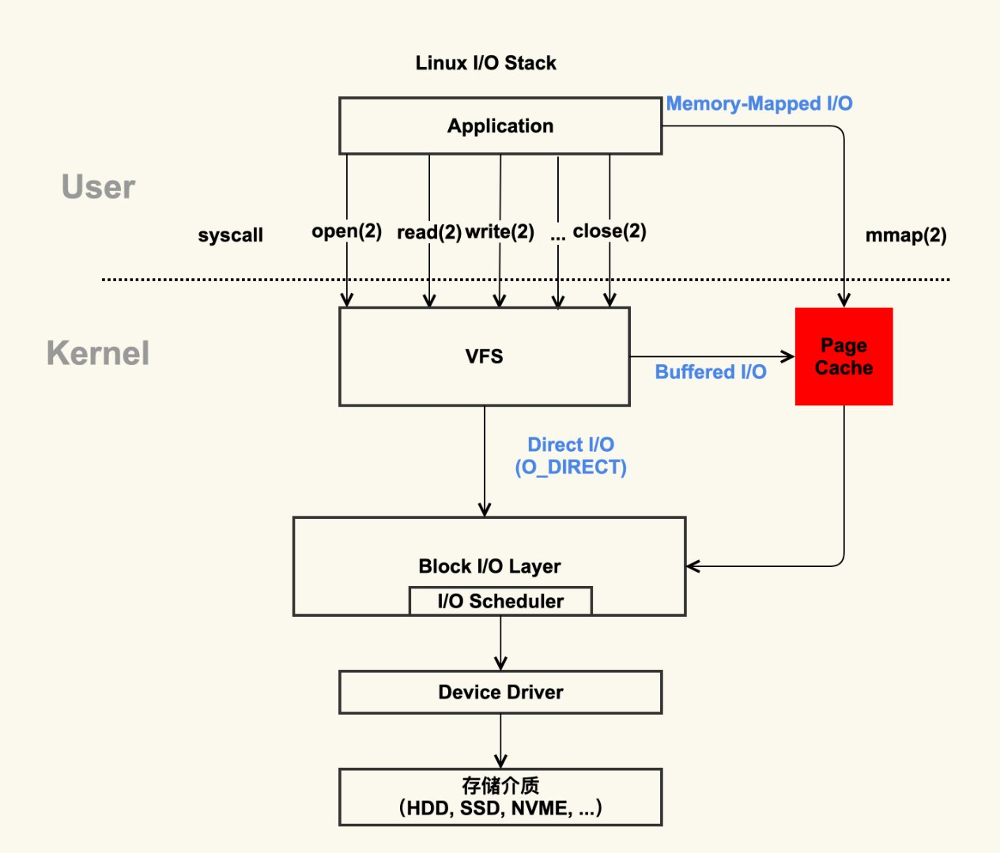

##### 1.虚拟文件系统（VFS）

这个虚拟文件系统，就是一棵目录树，这棵树上不同的节点，可以映射到不同的物理位置。
而这些物理位置，可以是具体的，不同的文件系统，比如FAT，ext4。也可以是网络上的某个节点。也可以是自己虚拟的一个块设备等等。

###### 1.1 为什么需要虚拟文件系统？
​		首先对比下windows，windows就是一个具体的物理文件系统，我们看到的C盘，就是硬盘上的C盘。
​		而linux之所以设计成虚拟文件系统，是为了实现解耦。即上层应用程序，对底层存储硬件的需求不同，不同硬件的驱动和实现方式不一样。如果没有这样一个中间层，则无法很好地满足这个需求。我们可以把这个虚拟文件系统，看成是java的接口层。

​		我们可以把这个虚拟文件系统，看成是linxu提供给我们的一套统一的，对外开放的API接口，它底层具体的接入硬件，可以是不同的，可以是改变的。

###### 1.2 虚拟文件系统的目录

```bash
[root@centos03 /]# ll
total 102432
lrwxrwxrwx.   1 root root         7 Jul 29  2018 bin -> usr/bin
dr-xr-xr-x.   6 root root      4096 Jul 29  2018 boot
drwxr-xr-x   20 root root      3260 Sep 14 08:11 dev
drwxr-xr-x    5 root root       336 Sep 14 08:11 download
-rw-r--r--    1 root root        55 Sep 14 10:46 err.txt
drwxr-xr-x. 103 root root      8192 Sep 15 22:48 etc
drwxr-xr-x.   3 root root        21 Jul 29  2018 home
lrwxrwxrwx.   1 root root         7 Jul 29  2018 lib -> usr/lib
lrwxrwxrwx.   1 root root         9 Jul 29  2018 lib64 -> usr/lib64
drwxr-xr-x.   2 root root         6 Nov  5  2016 media
drwxr-xr-x.   3 root root        20 Sep 14 08:13 mnt
-rw-r--r--    1 root root 104857600 Sep 14 07:34 my.img
drwxr-xr-x.   3 root root        16 Jul 29  2018 opt
-rw-r--r--    1 root root       176 Sep 14 10:54 out.txt
dr-xr-xr-x  131 root root         0 Mar 28 08:59 proc
dr-xr-x---.  10 root root      4096 Aug 23 12:55 root
drwxr-xr-x   32 root root      1080 Aug 23 12:56 run
lrwxrwxrwx.   1 root root         8 Jul 29  2018 sbin -> usr/sbin
drwxr-xr-x.   2 root root        21 Aug  5  2018 srv
dr-xr-xr-x   13 root root         0 Mar 28 08:59 sys
drwxrwxrwt.  10 root root       148 Sep 15 03:34 tmp
drwxr-xr-x.  14 root root       166 Mar 28 09:34 usr
drwxr-xr-x.  21 root root      4096 Aug  9  2018 var
```

```bash
[root@centos03 /]# df
Filesystem              1K-blocks    Used Available Use% Mounted on
/dev/mapper/centos-root  17811456 4379520  13431936  25% /
devtmpfs                   488784       0    488784   0% /dev
tmpfs                      499848       0    499848   0% /dev/shm
tmpfs                      499848   44516    455332   9% /run
tmpfs                      499848       0    499848   0% /sys/fs/cgroup
/dev/sda1                 1038336  133904    904432  13% /boot
tmpfs                       99972       0     99972   0% /run/user/0
/dev/loop0                  99150    4965     89065   6% /mnt/myroot
```


如上面两个图，图1看起来好像所有的目录都在一起。实际上并不然，通过df命令，我们可以看到，/boot这个目录，其对应的位置是/dev/sda1，换个专业点的词来讲，/dev/sda1这块硬盘，挂载在/boot这个目录下。

而根目录/，实际映射的是/dev/mapper/centos-root。

那为什么根目录下，也有/boot呢？
		前面说了，虚拟文件系统的目录，可以视为一个对外开放的API接口，通过这个根目录，则可以看到全部的API接口。
		而根目录本身也是需要一个默认的映射的（一般是硬盘）。即当这些目录，没有指定的挂载目录时，就默认对应根目录的映射。
		所以，我们可以试着，unmont掉 /boot目录挂载的设备。然后，我们发现根目录下，依然是存在/boot目录的，但此时，它映射的是根目录映射下的boot目录，显然这个映射下，是没有任何内容的，所以，此时我们看到/boot目录下，没有任何东西。
		

经过这么多年的发展，linux这个虚拟文件系统的目录，已经趋向于稳定，即我们现在看到的这个目录树的结构和文件名，基本上是已经成型的，不大会改变的。

###### 1.3 文件类型

-：普通文件（可执行，图片，文件）REG
d：目录 DIR
b：块设备 
c：字符设备  CHR
s：socket
p：pipeline
l：链接

还有很多，不一一举例

###### 1.4 硬链接与软链接

​		如果我们从java引用对象的角度来看，这个问题是很容易的。
​		我们把文件，可以看成在物理硬盘上真实存在的一个文件，它存在一个inode号。而文件名，实际是对这个真实文件的一个引用或者链接。

​		硬链接：创建一个硬链接，实际上了为这个文件增加了一个引用。当我们调用state xxx.txt的时候，我们看到这两个文件名指向的是同一个inode，并且该文件的links变成了2。而当我们删除其中某一个硬链接时，links会变成1。所以硬链接而言，不存在所谓的源文件一说，只不过是同一个真实的文件的多个引用，或者多个链接。当且仅当所有的引用都被删除时，真实的文件才算真的被删除。

​		软链接：软链接，实际上就相当于windows下的快捷方式，它是有源文件一说的，如果源文件被删除，则真实的文件就被删除了。创建的软链接也就找不到文件了。可以把软链接看作是对源文件文件名的引用。软链接不会增加真实文件的links。

无论是软链接还是硬链接，对文件的修改，都是真实的修改。

###### 1.5 如何查看某个进程的文件描述符信息？

/proc目录下，存放着所有的进程信息。

```bash
[root@centos03 proc]# ls
1       108175  14     27387  365  399    585  668    92         execdomains  kpageflags    schedstat      version
10      108215  15     27388  376  400    588  669    acpi       fb           loadavg       scsi           vmallocinfo
1046    109000  16     27389  377  41     591  670    asound     filesystems  locks         self           vmstat
1047    109014  17     279    38   467    592  671    buddyinfo  fs           mdstat        slabinfo       zoneinfo
1051    109177  18     28     39   486    594  675    bus        interrupts   meminfo       softirqs
1056    109235  19     280    390  491    597  681    cgroups    iomem        misc          stat
1058    109251  2      283    391  5      60   682    cmdline    ioports      modules       swaps
1060    109253  23403  285    392  510    631  7      consoles   irq          mounts        sys
106095  1157    25     287    393  511    655  701    cpuinfo    kallsyms     mpt           sysrq-trigger
106096  1159    26     289    394  516    656  734    crypto     kcore        mtrr          sysvipc
106097  12      27     292    395  527    664  736    devices    keys         net           timer_list
106101  1235    271    3      396  55593  665  8      diskstats  key-users    pagetypeinfo  timer_stats
106105  1237    272    36     397  579    666  88503  dma        kmsg         partitions    tty
106107  13      273    364    398  582    667  9      driver     kpagecount   sched_debug   uptime
```


这些数字都对应着具体的进程pid号，进入这些pid号文件夹，里面有个fd文件夹，这里面就存放着文件描述符相关信息。
如果需要查看更为详细的信息，可以使用lsof -op pid来查看更具体的信息。

###### 1.6 输入输出重定向

"<" 表示输入

">" 表示输出

+ 输出重定向
  + ls /home  这条命令，其实也是有输出的，只不过ls命令的输出，默认指向屏幕。
  + ls /home  1> /ls.out 这条命令，就是进行重定向，我们解释一下，1表示标准输出，> 表示输出   /ls.out 表示目标文件，所以这条命令是告诉操作系统，ls /home 的标准输出，不要再指向屏幕，而是要指向/ls.out

+ 输入+输出重定向

  + cat  0<  ooxx.txt  1> cat.out
    这条命令的意思，就是cat  标准输入来自于ooxx.txt，标准输出重定向到cat.out

+ 串行

  ```bash
  [root@centos03 /]# ls ./ /ooxx.txt                                                                                       
  ls: cannot access /ooxx.txt: No such file or directory
  ./:
  bin  boot  dev  download  etc  home  lib  lib64  media  mnt  my.img  opt  proc  root  run  sbin  srv  sys  tmp  usr  var
  ```

  ls命令是可以输出多个目录的，当我们输出一个不存在的文件或者目录的时候，就会报错，这就是标准错误。
  默认情况下，ls的标准输出和标准错误，都是指向屏幕的。

  所以我们可以对其进行重定向：

  ```bash
  [root@centos03 /]# ls ./ /ooxx.txt 1> out.txt 2> err.txt                                                                 
  [root@centos03 /]# ls
  bin   dev       err.txt  home  lib64  mnt     opt      proc  run   srv  tmp  var
  boot  download  etc      lib   media  my.img  out.txt  root  sbin  sys  usr
  ```

  我们发现，标准输出和标准错误，分别被写入到了out.txt和err.txt里

  我们还可以将标准错误指向标准输出：

  ```bash
  [root@centos03 /]# ls ./ /ooxx.txt 2>& 1 1>out.txt                                                                       
  ls: cannot access /ooxx.txt: No such file or directory
  ```

  这里需要说明一点，2>& 1，为什么要加&？那是因为，如果不加的话，操作系统会认为标准错误重定向到了1这个文件，而不是标准输出。

  另外，重定向也是有先后顺序的，因为2>& 1先执行，此时标准输出还是指向的屏幕，所以标准错误也指向了屏幕，所以输出到了屏幕。随后标准输出才被重定向到了out.txt

  要让标准错误也重定向到标准输出，只需要改下顺序即可：

  ```bash
  [root@centos03 /]# ls ./ /ooxx.txt 1>out.txt 2>& 1                                                                       
  [root@centos03 /]# cat out.txt
  ls: cannot access /ooxx.txt: No such file or directory
  ./:
  bin
  boot
  dev
  download
  ```

  我们看到，标准错误也被写入到了out.txt里

###### 1.7 父子进程与export

```bash
[root@centos03 /]# echo $$                                                                                               
106107                                                                                                                   
[root@centos03 /]# /bin/bash                                                                                             
[root@centos03 /]# echo $$                                                                                               
109799                                                                                                                   
[root@centos03 /]# ps -ef |grep bash                                                                                     
root        701      1  0 Aug29 ?        00:00:10 /bin/bash /usr/sbin/ksmtuned                                           
root     106107 106105  0 04:38 pts/0    00:00:00 -bash                                                                  
root     109799 106107  0 11:06 pts/0    00:00:00 /bin/bash                                                              
root     109841 109799  0 11:06 pts/0    00:00:00 grep --color=auto bash  
```

我们首先查看当前bash的pid，是106107，然后我们启动了一个子进程，它的pid是109799
通过ps命令，我们可以看到109799的是106107的子进程（第三行）

现在问题来了，我在父进程里定义一个x=100的变量，在子进程里能得到吗？

```bash
[root@centos03 /]# echo $$                                                                                               
106107                                                                                                                   
[root@centos03 /]# x=100                                                                                                 
[root@centos03 /]# echo $x                                                                                               
100                                                                                                                      
[root@centos03 /]# /bin/bash                                                                                           
[root@centos03 /]# echo $x                                                                                               
                                                                                                                         
[root@centos03 /]#   
```

很明显，没有得到，那么怎样才能让子进程得到呢？加上export就可以了

```bash
[root@centos03 /]# echo $$                                                                                           
106107                                                                                                                   
[root@centos03 /]# export x=100                                                                                          
[root@centos03 /]# echo $x                                                                                        
100                                                                                                                      
[root@centos03 /]# /bin/bash                                                                                      
[root@centos03 /]# echo $x
100
```

这也是为什么，我们在/etc/profile里定义环境变量的时候，需要使用export的原因！

###### 1.8 关于管道的坑以及$$符号的坑

```bash
[root@centos03 /]# a=1                                                                                                   
[root@centos03 /]# echo $a
1
[root@centos03 /]# { a=9;echo "box"; } | cat
box
[root@centos03 /]# echo $a
1
```

如上图所示，我们发现执行了a=9的步骤以后，a并没有发生改变，这是什么原因？
原因在于|管道符，bash是一种解释执行的语言，它在看到管道符号以后，在管道符的左边启动了一个子进程，在管道符号的右边启动了一个子进程。然后对接起来。所以，实际上而言a=9是在子进程里执行的。所以父进程并没有被改变

```bash
[root@centos03 /]# echo $$                                                                                               
106107
[root@centos03 /]# echo $$ | cat
106107
```

再看上图，按照管道符号的理解，echo $$是在子进程里执行的，为什么打印的却是父进程的bash进程的id?
原因是，$$的优先级高于管道符。bash在执行的时候，首先发现$$，然后将$$替换成当前bash进程的pid，然后再在子进程里执行的时候，其实等于是执行echo 106107，输出一个固定值了。

如果要输出子进程的bash进程pid，那么应该这有写

```bash
[root@centos03 /]# echo $$                                                                                               
106107
[root@centos03 /]# echo $BASHPID | cat
110158
```


##### 2.关于PageCache

###### 2.1 什么是PageCache



通过这张图，我们可以很清晰地看到PageCache的定位，没错，PageCache属于操作系统内核，属于内核态。

PageCache是内核管理的内存，也就是说，他属于内核，不属于用户。

简单一点来说，我们可以把PageCache看成是一种操控真实物理内存的管理器。

PageCache的粒度默认是4K，即对内存中每个页进行缓存管理。

###### 2.2 为什么要使用PageCache

+ 当你一个程序启动多个进程的时候（比如redis，我们可以启动多个），那么对于这两个进程的某些数据，其实只会加载进内存一次，比如程序本身的代码段，至少这块，两个进程完全是可以共用同一份内存的，因为他们来自同一个程序，所以这一部分，只需加载一次就可以，第二个程序启动的时候，发现PageCache里已经存在了，就不会再加载这部分数据到内存里。如果没有PageCache，那么两个进程就会加载进入内存两次，如果启动100个呢？不可想象。
+ 如果不使用PageCache，那么当程序打开一个文本，向这个文本写数据的时候，每写一次，哪怕一次只有几个字节，都会直接刷向存储介质。而使用了PageCache，则不会直接刷向存储介质，而是达到PageCache的阈值触发点，才会从内存刷向存储介质。这样就减少了IO的次数。

###### 2.3 PageCache有什么弊端？

​		显然，这种方式下，如果操作系统突然断电，则会发生数据的丢失。所以，如何根据自己的业务的需求，合理地设定PageCache的阈值，才是最关键的。即在性能和可靠性之间，做一个合理的折中。

###### 2.4 关于脏页和LRU

​		举个简单的例子：某个程序需要读写一个文本，那么首先这个文本是要被加载到内存里，PageCache管理。如果这个文本被程序改动过了，那么改动部分对应的内存页，就成了脏页。

​		LRU前面介绍过了，就是当内存不够用的时候，PageCache会根据LRU算法进行清理。如果清理的页是一个脏页的话，则首先会将该页刷到存储介质，然后再清理掉。

###### 2.5 PageCache相关阈值参数

参数所在文件：/etc/sysctl.conf

```bash
[root@centos03 test]# vim /etc/sysctl.conf
```

```bash
#百分比数值，表示当PageCache所占内存达到总内存的此百分比时，后台回写脏数组（另起线程，异步，不阻塞）                                 
vm.dirty_background_ratio = 70

#百分比数值，表示当PageCache所占内存达到总内存的此百分比时，直接回写脏数组（阻塞程序，应该设置得比后台回写的阈值大） 
vm.dirty_ratio = 90   
```

```bash
[root@centos03 test]# sysctl -p
vm.dirty_background_ratio = 70
vm.dirty_ratio = 90
```

##### 3.关于BufferedIO

###### 3.1 BufferedIO为什么比非Buffered的IO要快？

对于普通的IO来说，每次调用write，都会触发system call
而对于BufferedIO来说，JVM在进程内维护了一个8KB的数组，每次write的时候，是先保存到这个数组里，等这个数组满了，再调用一次system-call，这样就相当于减少了system call的次数。

调用system-call，会涉及用户态和内核态的切换，调用频率低，效率自然高。

​		