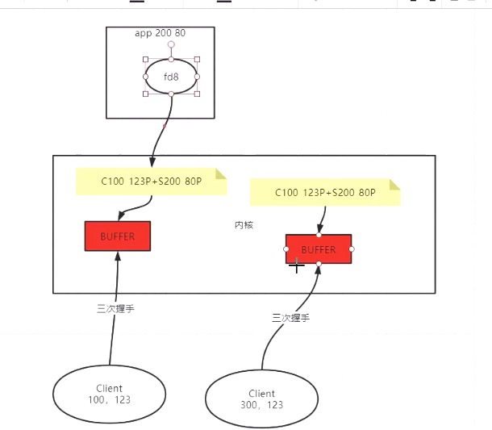
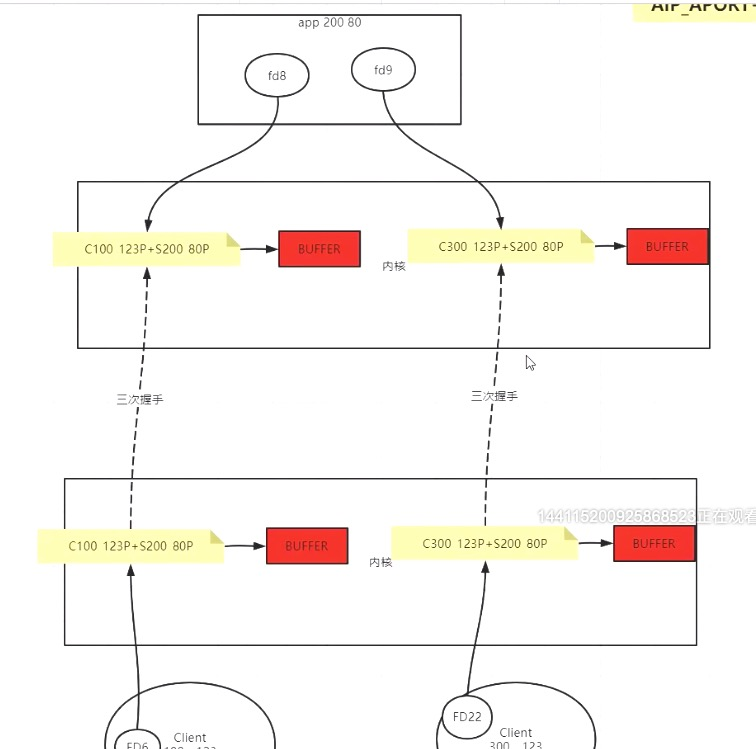

##### 1.TCP连接的一个小实验

###### 1.1 实验的目的

```java
public static void main(String[] args) {

        ServerSocket server = null;
        try {
            server = new ServerSocket();
            server.bind(new InetSocketAddress( 9090), BACK_LOG);
            server.setReceiveBufferSize(RECEIVE_BUFFER);
            server.setReuseAddress(REUSE_ADDR);
            server.setSoTimeout(SO_TIMEOUT);

        } catch (IOException e) {
            e.printStackTrace();
        }
        System.out.println("server up use 9090!");
        while (true) {
            try {
                System.in.read();  //分水岭：

                Socket client = server.accept();
                System.out.println("client port: " + client.getPort());

                client.setKeepAlive(CLI_KEEPALIVE);
                client.setOOBInline(CLI_OOB);
                client.setReceiveBufferSize(CLI_REC_BUF);
                client.setReuseAddress(CLI_REUSE_ADDR);
                client.setSendBufferSize(CLI_SEND_BUF);
                client.setSoLinger(CLI_LINGER, CLI_LINGER_N);
                client.setSoTimeout(CLI_TIMEOUT);
                client.setTcpNoDelay(CLI_NO_DELAY);

                new Thread(
                        () -> {
                            while (true) {
                                try {
                                    InputStream in = client.getInputStream();
                                    BufferedReader reader = new BufferedReader(new InputStreamReader(in));
                                    char[] data = new char[1024];
                                    int num = reader.read(data);

                                    if (num > 0) {
                                        System.out.println("client read some data is :" + num + " val :" + new String(data, 0, num));
                                    } else if (num == 0) {
                                        System.out.println("client readed nothing!");
                                        continue;
                                    } else {
                                        System.out.println("client readed -1...");
                                        client.close();
                                        break;
                                    }

                                } catch (IOException e) {
                                    e.printStackTrace();
                                }
                            }
                        }
                ).start();

            } catch (IOException e) {
                e.printStackTrace();
            }finally {
                try {
                    server.close();
                } catch (IOException e) {
                    e.printStackTrace();
                }
            }
        }
    }
```

上面的代码，是一段非常常见的java关于socket进行tcp连接的代码。
我们注意看分水岭这个地方。我们进行了一个阻塞，我们知道，一旦阻塞，后面的代码都无法继续进行。也就是说Socket client = server.accept();这一句也无法执行。那么，我们抛出这样一个问题：如果此时客户端发起TCP连接，到底能不能连接成功呢？

###### 1.2 启动服务端

```bash
[root@centos03 socket]# netstat -natp
Active Internet connections (servers and established)
Proto Recv-Q Send-Q Local Address           Foreign Address         State       PID/Program name    
tcp        0      0 0.0.0.0:111             0.0.0.0:*               LISTEN      1/systemd           
tcp        0      0 192.168.0.13:6000       0.0.0.0:*               LISTEN      23403/./redis-serve 
tcp        0      0 192.168.122.1:53        0.0.0.0:*               LISTEN      1235/dnsmasq        
tcp        0      0 0.0.0.0:22              0.0.0.0:*               LISTEN      1046/sshd           
tcp        0      0 127.0.0.1:25            0.0.0.0:*               LISTEN      1157/master         
.....  
tcp6       0      0 :::9090                 :::*                    LISTEN      127382/java     
```

我们看最后一行，服务端已经启动，监听9090端口，等待客户端的连接。

接着，我们通过lsof来看下进程文件描述符的分配情况：

```bash
[root@centos03 socket]# lsof -p 127382                                                                                   
COMMAND    PID USER   FD   TYPE             DEVICE  SIZE/OFF     NODE NAME
java    127382 root  cwd    DIR              253,0       156 18168386 /usr/local/test/socket
java    127382 root  rtd    DIR              253,0      4096       64 /
java    127382 root  txt    REG              253,0      7734 33599883 /usr/local/jdk1.8.0_181/bin/java
...
java    127382 root    0u   CHR              136,1       0t0        4 /dev/pts/1
java    127382 root    1u   CHR              136,1       0t0        4 /dev/pts/1
java    127382 root    2u   CHR              136,1       0t0        4 /dev/pts/1
java    127382 root    3r   REG              253,0  66339559 51138227 /usr/local/jdk1.8.0_181/jre/lib/rt.jar
java    127382 root    4u  unix 0xffff880007473400       0t0  2524353 socket
java    127382 root    5u  IPv6            2524355       0t0      TCP *:websm (LISTEN)
```

我们看到，linux内核已经为此进程分配了文件描述符5，它正处于listen状态

我们再通过tcpdump启动抓包程序。用于后续的客户端连接情况的监测（这个窗口要一直开着）

```bash
[root@centos03 ~]# tcpdump -nn -i ens33 port 9090
tcpdump: verbose output suppressed, use -v or -vv for full protocol decode
listening on ens33, link-type EN10MB (Ethernet), capture size 262144 bytes
```

此时因为客户端还未启动，所以抓取不到任何消息


###### 1.3 启动客户端

客户端的代码我就不贴了，启动后，我们先看下网络端口的情况

```bash
[root@centos03 socket]# netstat -natp
Active Internet connections (servers and established)
Proto Recv-Q Send-Q Local Address           Foreign Address         State       PID/Program name    
tcp        0      0 0.0.0.0:111             0.0.0.0:*               LISTEN      1/systemd           
tcp        0      0 192.168.0.13:6000       0.0.0.0:*               LISTEN      23403/./redis-serve 
tcp        0      0 192.168.122.1:53        0.0.0.0:*               LISTEN      1235/dnsmasq        
tcp        0      0 0.0.0.0:22              0.0.0.0:*               LISTEN      1046/sshd           
tcp        0      0 127.0.0.1:25            0.0.0.0:*               LISTEN      1157/master         
...       
tcp6       1      0 :::9090                 :::*                    LISTEN      127382/java         
tcp6       0      0 192.168.0.13:9090       192.168.0.187:50412     ESTABLISHED -        
```

我们看最后一行，我们发现此时已经建立连接，也就是linux内核已经为这个链接开辟一块资源，但尚未分配pid。
也就是说，此时：
1.客户端已经连接到服务器，linux内核已经为这个链接开辟一块资源
2.因为服务器端程序被阻塞，linux内核还没有把这块资源分配给具体某个进程（没有pid）。

关于1，我们通过之前开启的tcpdump监测可以得到印证：

```bash
tcpdump: verbose output suppressed, use -v or -vv for full protocol decode
listening on ens33, link-type EN10MB (Ethernet), capture size 262144 bytes
23:21:59.003804 IP 192.168.0.187.50412 > 192.168.0.13.9090: Flags [SEW], seq 645473966, win 65535, options [mss 1460,nop,wscale 6,nop,nop,TS val 238358198 ecr 0,sackOK,eol], length 0
23:21:59.003851 IP 192.168.0.13.9090 > 192.168.0.187.50412: Flags [S.E], seq 364391771, ack 645473967, win 1152, options [mss 1460,sackOK,TS val 1463597856 ecr 238358198,nop,wscale 0], length 0
23:21:59.003926 IP 192.168.0.187.50412 > 192.168.0.13.9090: Flags [.], ack 1, win 2058, options [nop,nop,TS val 238358198 ecr 1463597856], length 0
```

我们发现，已经发起了三次握手，进行了连接。所以，虽然我们的程序阻塞了accpet()方法，但实际上客户端与服务端已经建立起的TCP连接。

关于2，我们可以通过lsof命令继续来确定：

```bash
[root@centos03 socket]# lsof -p 127382                                                                                   
COMMAND    PID USER   FD   TYPE             DEVICE  SIZE/OFF     NODE NAME
java    127382 root  cwd    DIR              253,0       156 18168386 /usr/local/test/socket
java    127382 root  rtd    DIR              253,0      4096       64 /
java    127382 root  txt    REG              253,0      7734 33599883 /usr/local/jdk1.8.0_181/bin/java
...
java    127382 root    0u   CHR              136,1       0t0        4 /dev/pts/1
java    127382 root    1u   CHR              136,1       0t0        4 /dev/pts/1
java    127382 root    2u   CHR              136,1       0t0        4 /dev/pts/1
java    127382 root    3r   REG              253,0  66339559 51138227 /usr/local/jdk1.8.0_181/jre/lib/rt.jar
java    127382 root    4u  unix 0xffff880007473400       0t0  2524353 socket
java    127382 root    5u  IPv6            2524355       0t0      TCP *:websm (LISTEN)
```

我们发现，此时文件描述符5，依然处于Listen状态。


###### 1.4 客户端发送数据

```java
Connected to the target VM, address: '127.0.0.1:50409', transport: 'socket'
1111

```

此时，我们在客户端的控制台，输入1111，发送数据。再让我们看下服务端网络端口情况

```bash
[root@centos03 socket]# netstat -natp                                                                                    
Active Internet connections (servers and established)
Proto Recv-Q Send-Q Local Address           Foreign Address         State       PID/Program name    
tcp        0      0 0.0.0.0:111             0.0.0.0:*               LISTEN      1/systemd           
tcp        0      0 192.168.0.13:6000       0.0.0.0:*               LISTEN      23403/./redis-serve 
tcp        0      0 192.168.122.1:53        0.0.0.0:*               LISTEN      1235/dnsmasq        
tcp        0      0 0.0.0.0:22              0.0.0.0:*               LISTEN      1046/sshd           
tcp        0      0 127.0.0.1:25            0.0.0.0:*               LISTEN      1157/master         
...
tcp6       0      0 :::111                  :::*                    LISTEN      1/systemd           
tcp6       0      0 :::22                   :::*                    LISTEN      1046/sshd           
tcp6       0      0 ::1:25                  :::*                    LISTEN      1157/master         
tcp6       1      0 :::9090                 :::*                    LISTEN      127382/java         
tcp6       4      0 192.168.0.13:9090       192.168.0.187:50412     ESTABLISHED -       
```

我们发现最后一行，第二列Recv-Q的数值变成了4，也就是说，linux内核为这个客户端开辟的进程，实际上已经接受到了4个字节的数据，现在正堆积在TCP缓冲区中。

所以，服务端程序的阻塞，不仅没有妨碍客户端的连接，甚至没有妨碍客户端发送数据。为了进一步确认，我们切换到检测TCP抓包的窗口看下tcpdump的情况：

```bash
tcpdump: verbose output suppressed, use -v or -vv for full protocol decode
listening on ens33, link-type EN10MB (Ethernet), capture size 262144 bytes
23:21:59.003804 IP 192.168.0.187.50412 > 192.168.0.13.9090: Flags [SEW], seq 645473966, win 65535, options [mss 1460,nop,wscale 6,nop,nop,TS val 238358198 ecr 0,sackOK,eol], length 0
23:21:59.003851 IP 192.168.0.13.9090 > 192.168.0.187.50412: Flags [S.E], seq 364391771, ack 645473967, win 1152, options [mss 1460,sackOK,TS val 1463597856 ecr 238358198,nop,wscale 0], length 0
23:21:59.003926 IP 192.168.0.187.50412 > 192.168.0.13.9090: Flags [.], ack 1, win 2058, options [nop,nop,TS val 238358198 ecr 1463597856], length 0
23:27:00.389227 IP 192.168.0.187.50412 > 192.168.0.13.9090: Flags [P.], seq 1:2, ack 1, win 2058, options [nop,nop,TS val 238653827 ecr 1463597856], length 1
23:27:00.389257 IP 192.168.0.13.9090 > 192.168.0.187.50412: Flags [.], ack 2, win 1151, options [nop,nop,TS val 1463899242 ecr 238653827], length 0
23:27:00.389468 IP 192.168.0.187.50412 > 192.168.0.13.9090: Flags [P.], seq 2:3, ack 1, win 2058, options [nop,nop,TS val 238653827 ecr 1463899242], length 1
23:27:00.430225 IP 192.168.0.13.9090 > 192.168.0.187.50412: Flags [.], ack 3, win 1150, options [nop,nop,TS val 1463899283 ecr 238653827], length 0
23:27:00.430387 IP 192.168.0.187.50412 > 192.168.0.13.9090: Flags [P.], seq 3:4, ack 1, win 2058, options [nop,nop,TS val 238653866 ecr 1463899283], length 1
23:27:00.471607 IP 192.168.0.13.9090 > 192.168.0.187.50412: Flags [.], ack 4, win 1149, options [nop,nop,TS val 1463899324 ecr 238653866], length 0
23:27:00.471827 IP 192.168.0.187.50412 > 192.168.0.13.9090: Flags [P.], seq 4:5, ack 1, win 2058, options [nop,nop,TS val 238653907 ecr 1463899324], length 1
23:27:00.511751 IP 192.168.0.13.9090 > 192.168.0.187.50412: Flags [.], ack 5, win 1148, options [nop,nop,TS val 1463899364 ecr 238653907], length 0
```

我们可以明显看到，有数据发送过来，服务器端已经接受到这个数据。

###### 1.5 服务端解除阻塞

```bash
[root@centos03 socket]# ./server.sh 
server up use 9090!

client port: 50412
client read some data is :4 val :1111
```

我们直接输入一个回车，让服务器端解除阻塞，accept方法被执行，我们看到屏幕上输出了client port等一些信息，这些是服务端程序执行时输出的。

此时，我们再来看下网络端口情况

```bash
[root@centos03 socket]# netstat -natp
Active Internet connections (servers and established)
Proto Recv-Q Send-Q Local Address           Foreign Address         State       PID/Program name    
tcp        0      0 0.0.0.0:111             0.0.0.0:*               LISTEN      1/systemd           
tcp        0      0 192.168.0.13:6000       0.0.0.0:*               LISTEN      23403/./redis-serve 
tcp        0      0 192.168.122.1:53        0.0.0.0:*               LISTEN      1235/dnsmasq        
tcp        0      0 0.0.0.0:22              0.0.0.0:*               LISTEN      1046/sshd           
tcp        0      0 127.0.0.1:25            0.0.0.0:*               LISTEN      1157/master         
...      
tcp6       0      0 192.168.0.13:9090       192.168.0.187:50412     ESTABLISHED 127382/java
```

此时我们可以看到，linux内核已经为这个客户端连接进程，分配了文件描述符，pid已经显示。
为了进一步确认，我们用lsof确认一下：

```bash
[root@centos03 socket]# lsof -p 127382
COMMAND    PID USER   FD   TYPE             DEVICE  SIZE/OFF     NODE NAME
java    127382 root  cwd    DIR              253,0       156 18168386 /usr/local/test/socket
java    127382 root  rtd    DIR              253,0      4096       64 /
java    127382 root  txt    REG              253,0      7734 33599883 /usr/local/jdk1.8.0_181/bin/java
...
java    127382 root    0u   CHR              136,1       0t0        4 /dev/pts/1
java    127382 root    1u   CHR              136,1       0t0        4 /dev/pts/1
java    127382 root    2u   CHR              136,1       0t0        4 /dev/pts/1
java    127382 root    3r   REG              253,0  66339559 51138227 /usr/local/jdk1.8.0_181/jre/lib/rt.jar
java    127382 root    4u  unix 0xffff880007473400       0t0  2524353 socket
java    127382 root    6u  IPv6            2527901       0t0      TCP centos03:websm->192.168.0.187:50412 (ESTABLISHED)
```

我们看到最后一行，linux系统分配了新的文件描述6。

###### 1.6 小结

通过上述一系列的实验，我们得出结论：即使服务端程序还没有接受客户端连接，只要客户端连接上来了，linux内核就会为该客户端开辟资源，只不过没有分配给具体某个进程，没有具体的pid，也没有分配相应的文件描述符。

只有当服务端程序accept以后，才会为这个tcp连接分配相应的进程和对应的pid号，以及文件描述符。



当然客户端主机也有自己的内核，如果想看完整版，则是这样：



##### 2.TCP 四元组

c=client，s=server

一个元组 = c_ip + c_port + s_ip + s_port

一个元组决定了TCP连接的唯一性。

问题：假设服务器端开启了两个程序，一个监听8080端口，一个监听9090端口。我们知道客户端连接服务器的时候，也会随机启动一个端口的。而一台主机，最多拥有65536个端口。若客户端主机启动了65536个连接，连接到服务器端8080端口，请问是否还能启动新的连接，连接到9090端口？

答：当然可以！记住，元组决定了TCP连接的唯一性。

##### 3.TCP参数相关含义

###### 3.1 参数总览

```java
private static final int RECEIVE_BUFFER = 10;
private static final int SO_TIMEOUT = 0;
private static final boolean REUSE_ADDR = false;
private static final int BACK_LOG = 2;
private static final boolean CLI_KEEPALIVE = false;
private static final boolean CLI_OOB = false;
private static final int CLI_REC_BUF = 20;
private static final boolean CLI_REUSE_ADDR = false;
private static final int CLI_SEND_BUF = 20;
private static final boolean CLI_LINGER = true;
private static final int CLI_LINGER_N = 0;
private static final int CLI_TIMEOUT = 0;
private static final boolean CLI_NO_DELAY = false;
```

###### 3.2 BACK_LOG

这是服务器端参数。

通过tcp连接的小实验，我们已经明白，即使socket服务端程序没有accept，客户端也是可以建立tcp连接的。
那如果大量的tcp连接连入，而socket服务端程序没有accept，即不使用，那就会造成了服务端资源的大量浪费。
所以BACK_LOG正是限制这种情况的发生。

当BACK_LOG = 2，表示后补最多就2个，加上非后补的一个，总共是3个，如果有第4个连接连入，服务器内核就不会理他了。

```bash
[root@centos03 socket]# netstat -natp
Active Internet connections (servers and established)
Proto Recv-Q Send-Q Local Address           Foreign Address         State       PID/Program name    
tcp        0      0 0.0.0.0:111             0.0.0.0:*               LISTEN      1/systemd           
tcp        0      0 192.168.0.13:6000       0.0.0.0:*               LISTEN      23403/./redis-serve 
tcp        0      0 192.168.122.1:53        0.0.0.0:*               LISTEN      1235/dnsmasq        
tcp        0      0 0.0.0.0:22              0.0.0.0:*               LISTEN      1046/sshd           
tcp        0      0 127.0.0.1:25            0.0.0.0:*               LISTEN      1157/master         
tcp        0      0 192.168.0.13:9090       192.168.0.187:58068     SYN_RECV    -                   
tcp6       0      0 :::111                  :::*                    LISTEN      1/systemd           
tcp6       0      0 :::22                   :::*                    LISTEN      1046/sshd           
tcp6       0      0 ::1:25                  :::*                    LISTEN      1157/master         
tcp6       3      0 :::9090                 :::*                    LISTEN      1567/java           
tcp6       0      0 192.168.0.13:9090       192.168.0.187:58055     ESTABLISHED -                   
tcp6       0      0 192.168.0.13:9090       192.168.0.187:58063     ESTABLISHED -                   
tcp6       0      0 192.168.0.13:9090       192.168.0.187:58059     ESTABLISHED - 
```

我们看到中间有一行的状态是SYN_RECV，而不是ESTABLISHED。如果我们再过一会，就会发现，这个记录已经没有了。

###### 3.3 SO_TIMEOUT

这是服务器端参数。

这个将设置一个超时的时间，默认单位为毫秒。这个超时时间，指的就是server.accept()这个方法的超时时间，如果不设置，默认是一直阻塞。设置以后，就是等待多少时间后，抛出一个异常。

当然，这个异常并非致命异常，所以while循环是还可以继续，也就是说不影响服务端主程序继续接入客户端连接。

###### 3.4 CLI_NO_DELAY

这是客户端参数

默认情况下是false，即delay发送。这是什么意思？举个极端的例子，客户端在发数据的时候，一个字节一个字节的发，默认情况下，delay发送的话，那么实际上，客户端是会聚合到一定的字节数才会发送的。可能你的程序一个字节一个字节write了20次，而实际上tcp只发送了一次，发送了一个20字节大小的包，服务器端也只接受了一次。

如果设置成true，即不delay发送，那么客户端可能很快就发送了，当然不是说很严格的就一个字节发送一次，但往往一般都是2-3，3-6个字节就发送了一次。

我们看下默认情况下，即delay发送的结果：

客户端：

```bash
[root@centos03 socket]# ./client.sh 
11dadgdadgdagagdgag
```

服务端：

```bash
[root@centos03 socket]# ./server.sh 
server up use 9090!

client port: 38160
client read some data is :19 val :11dadgdadgdagagdgag
```


然后我们再看下设置为true，即不delay发送的结果：

客户端：

```bash
[root@centos03 socket]# ./client.sh                                                                                      
123gadgdagag
```

服务端：

```bash
[root@centos03 socket]# ./server.sh 
server up use 9090!

client port: 38194
client read some data is :3 val :123
client read some data is :2 val :ga
client read some data is :2 val :dg
client read some data is :2 val :da
client read some data is :2 val :ga
client read some data is :1 val :g
```

很清晰的效果。于是问题又来了，什么情况下需要关闭这个优化？

我们知道关闭这个优化后，基本上每次写都会马上发送，而不需要延时等聚合。有时候有些场景就是需要马上发送的。不要小看这个延时，每次延时一点，次数多了以后，这个体验就会改变。

###### 3.5 CLI_SEND_BUF

这是客户端参数

上面提到，在delay发送时，即使一个字节一个字节地发，TCP实际上会给你优化，会聚合到一定大小才会给你发，这个大小的设置，就是这个CLI_SEND_BUF参数。但实际上而言，并不是严格的说设置成了20个字节，TCP就只能按照每次20个字节发。实际上是可以超过的。

###### 3.6 CLI_KEEPALIVE

这是客户端参数

首先，TCP有一个KEEPALIVE，HTTP也有一个KEEPALIVE。我们千万不要把他们搞混了。
这个TCP下的KEEPALIVE，其实就是TCP设计的一个心跳包机制。设置为true以后，当达到一定时间的时候，就会发心跳包，超过多少次以后，就会断开TCP连接。这样就能为服务器端节省资源


##### 4. 一些TCP的概念

###### 4.1 MTU 和 MSS

MTU是指数据包的大小。

MSS是指出去包头，你实际包的内容的大小。

###### 4.2 TPC窗口与网络拥塞

客户端和服务器都有TCP窗口。我们可以把窗口想象成一个接收队列。当这个队列满的时候，回ack消息给客户端时，会告诉客户端窗口已经满了，此时客户端会自己阻塞住，当服务器端队列空出来的时候，会补一个包给客户端，告诉客户端窗口又空了，然后客户端才继续发。这就是网络拥塞。

当窗口满了以后，如果继续发，数据包会被服务器端丢弃。。。

如何做一个实验，来验证当窗口满了以后，数据包会被服务器端丢弃？
很简单，就是在上面那个小实验的基础上，不断地发数据。因为服务端一直阻塞住，所以接受不到，然后打开服务端阻塞，我们会发现有一部分数据，服务器端没接受到。