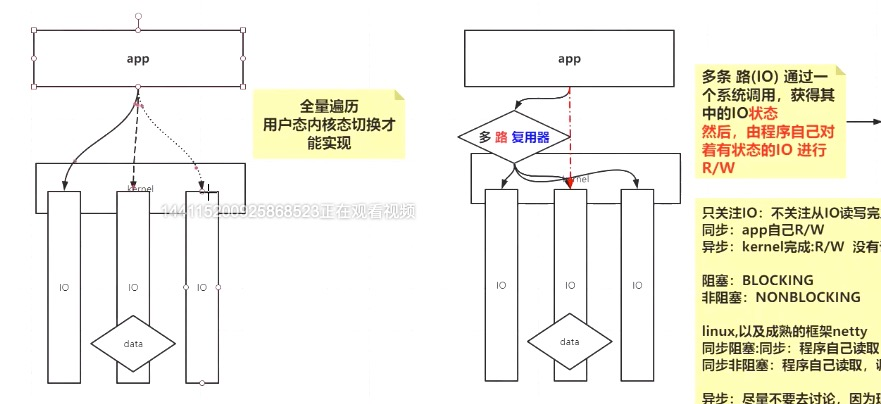

# 客户端TCP路由存在的一个问题

## 问题描述

我们有一台主机，是mac系统，默认的ip=192.168.0.187。然后用Vmware创建了一个虚拟机，用的NAT模式。所以mac系统上多了一个vmnet3，IP = 192.168.7.1。同时分配给虚拟机的ip = 192.168.7.10。

然后我们在虚拟机（IP = 192.168.7.10）上部署了一个服务端程序，端口号为9090

接着，我再mac系统的idea上，启动了一个客户端，绑定192.168.0.187，端口号为10000，去连虚拟机上的服务端程序（IP = 192.168.7.10，端口9090）。

然后再启动了一个客户端，绑定192.168.7.1，端口号1000，去连虚拟机上的服务端程序（IP = 192.168.7.10，端口9090）。

简单来说就是：
192.168.0.187:10000  -> 192.168.7.10:9090
192.168.7.1:10000  -> 192.168.7.10:9090

我们在虚拟机上使用tcpdump -nn -i ens33 port 9090进行抓包监控。
结果我们发现：
1.对于192.168.7.1:10000  -> 192.168.7.10:9090，这个一切正常，3次握手后建立连接
2.对于192.168.0.187:10000  -> 192.168.7.10:9090，虚拟机能收到主机客户端发来的连接包请求，虚拟机也能回发一个ack包，但是我们发现虚拟机无法收到主机发来的确认ack的包，即3次握手的最后一个包，虚拟机服务端程序没有收到。

## 网络拓补图

比较模糊，直接点文件夹看详情

## 原因分析

问题的原因很简单，虚拟机的服务端程序在给客户端回消息的时候。是根据路由表来发包的。我们来看下虚拟机linux系统的路由表

```bash
[root@centos05 ~]# route -n                                                               
Kernel IP routing table
Destination     Gateway         Genmask         Flags Metric Ref    Use Iface
0.0.0.0         192.168.7.2     0.0.0.0         UG    100    0        0 ens33
192.168.7.0     0.0.0.0         255.255.255.0   U     100    0        0 ens33
```

对于192.168.7.1:10000  -> 192.168.7.10:9090，这个元组，返回消息时，变成  192.168.7.10:9090 ->  192.168.7.1:10000
这时，目标地址，192.168.7.1，能够匹配到路由网段192.168.7.0，所以直接发送过去了。

而对于，192.168.0.187:10000  -> 192.168.7.10:9090，这个元组，返回消息时，变成  192.168.7.10:9090 ->  192.168.0.187:10000
这是，目标地址，192.168.0.187，无法匹配到任何网段，只能匹配0.0.0.0这个网段，于是，它要走的网关变成了192.168.7.2，经过这个网关以后，元组变成了192.168.7.2:9090 ->  192.168.0.187:10000，此时主机无法匹配到这个四元组，选择丢弃这个包，客户端没有收到服务器发来的ack包，自然也就无法发送确认ack的包了。

## 问题解决

很简单，增加路由条目：

```bash
[root@centos05 ~]# route add -host 192.168.0.187 gw 192.168.7.1    
[root@centos05 ~]# route -n                                                               
Kernel IP routing table
Destination     Gateway         Genmask           Flags Metric Ref    Use Iface
192.168.0.187   192.168.7.1     255.255.255.255   UGH   100    0        0 ens33
0.0.0.0         192.168.7.2     0.0.0.0           UG    100    0        0 ens33
192.168.7.0     0.0.0.0         255.255.255.0     U     100    0        0 ens33
```

# 大量客户端连接导致too many open files的异常

```bash
[root@centos05 socket]# ulimit -a
core file size          (blocks, -c) 0
data seg size           (kbytes, -d) unlimited
scheduling priority             (-e) 0
file size               (blocks, -f) unlimited
pending signals                 (-i) 3818
max locked memory       (kbytes, -l) 64
max memory size         (kbytes, -m) unlimited
open files                      (-n) 1024
pipe size            (512 bytes, -p) 8
POSIX message queues     (bytes, -q) 819200
real-time priority              (-r) 0
stack size              (kbytes, -s) 8192
cpu time               (seconds, -t) unlimited
max user processes              (-u) 3818
virtual memory          (kbytes, -v) unlimited
file locks                      (-x) unlimited
```

通过ulimit -a，我们看到，默认情况下，open files 的数量为1024，这是什么意思呢？
这个表示，1个进程可以打开多少个文件描述符。1个连接对应一个文件描述符。所以一个进程在默认情况下，可以连1024个客户端。

但实际我们用root用户在启动进程的时候，我们发现实际的客户端连接数可以达到4000+。实际上，linux的很多设置限制，对root用户并不具备强制效果。这些设置限制，是针对非root用户而言的。

我们可以通过ulimt -n来临时修改这个数值：

```bash
[root@centos05 ~]# ulimit -n 100000                                                       
[root@centos05 ~]# ulimit -a
core file size          (blocks, -c) 0
data seg size           (kbytes, -d) unlimited
scheduling priority             (-e) 0
file size               (blocks, -f) unlimited
pending signals                 (-i) 3818
max locked memory       (kbytes, -l) 64
max memory size         (kbytes, -m) unlimited
open files                      (-n) 100000
pipe size            (512 bytes, -p) 8
POSIX message queues     (bytes, -q) 819200
real-time priority              (-r) 0
stack size              (kbytes, -s) 8192
cpu time               (seconds, -t) unlimited
max user processes              (-u) 3818
virtual memory          (kbytes, -v) unlimited
file locks                      (-x) unlimited
```

注意：这种方式只能针对当前用户，也就是说对别的用户不生效，而且重启后会还原

不过还需要注意的是，这个设置不是你设置多少就能给多少的，它本质上受到内存大小的限制

```bash
[root@centos05 ~]# cat /proc/sys/fs/file-max
95855
```

1个G的物理内存，实际上也就10W个连接。

# NIO 非selector模型

## 模型基本代码

```java
public class SocketNIO {

    public static void main(String[] args) throws Exception {

        LinkedList<SocketChannel> clients = new LinkedList<>();

        ServerSocketChannel ss = ServerSocketChannel.open();
        ss.bind(new InetSocketAddress(9090));
        ss.configureBlocking(false); //重点  OS  NONBLOCKING!!!

        while (true) {
            Thread.sleep(1000);
            SocketChannel client = ss.accept(); //不会阻塞？  -1NULL

            if (client == null) {
                System.out.println("null.....");
            } else {
                client.configureBlocking(false);
                int port = client.socket().getPort();
                System.out.println("client...port: " + port);
                clients.add(client);
            }

            ByteBuffer buffer = ByteBuffer.allocateDirect(4096);  //可以在堆里   堆外

            for (SocketChannel c : clients) {   //串行化！！！！  多线程！！
                int num = c.read(buffer);  // >0  -1  0   //不会阻塞
                if (num > 0) {
                    buffer.flip();
                    byte[] aaa = new byte[buffer.limit()];
                    buffer.get(aaa);

                    String b = new String(aaa);
                    System.out.println(c.socket().getPort() + " : " + b);
                    buffer.clear();
                }
            }
        }
    }


```

## 模型比起BIO的优势

如代码所示，设置Blocking =false，这样的话accept就不会阻塞，然后对获取的客户端连接SocketChannel设置Blocking =false，这样客户端的读写就不会阻塞。

显然比起BIO，这种效率提升了很多，1个线程就能处理大量的连接和读写。但比起多路复用而言，处理的速度还是慢了些。

BIO需要为每个连接搞一个线程（如果不起线程的话，就要一个连接处理完读写才能继续处理新的连接，所以BIO必须在获取一个连接后，为其分配一个线程）

而这种模式下，我们可能只需要搞5-10个线程。
一个简单的思路，主线程收到连接以后，分别按顺序放到4个List里，然后启动4个线程，每个线程去循环遍历对应list的连接，查看有没有数据到来。这样比起BIO，只需要几个线程就搞定了。

但显然循环遍历一组客户端有没有数据，这个行为明显还是有问题的，这就是下面说的C10K的问题

## C10K的问题

上面NIO的非selector模型，存在一个问题，即存在一个O(n)的循环遍历的复杂度。比如当有1W个连接的时候，每循环一次，我们就要遍历这1W个链接，询问他有数据来了没有，也就是说每个连接，都要被调用一次read，哪怕没有数据。

实际而言，很多时候，这种询问都是多余的。可能1W个连接，只有1K个连接是有数据的。

即使有分组，还是存在这种浪费行为。

注意：read本身并没有问题，问题在于这种模型，存在大量无效的read。

# 多路复用器

## 多路复用器模型



如图所示：

1.NIO非多路复用器的情况下，需要app在代码层面去循环每个client的channel，然后去read。全部的IO都需要遍历一遍状态
2.在使用多路复用器的情况下，app在代码层面上，只需要调用selector.select()

## 多路复用器的实现

+ select()、poll()

  select()方法遵守posix协议，所有遵守此协议的操作系统均有select()方法，但此方法有一个问题：即文件描述符的数量，被限制在1024个。所以linux里增加了一个poll方法，这个方法和select方法基本一样，只不过没有数量限制。

  但是即使是select，poll方法，也都是要遍历所有的IO，询问状态。那么它和NIO非多路复用器的方式有什么区别呢？

  区别在于用户态和内核态的切换：

  ​		NIO非多路复用器的方式：每次询问，也就是每次read，都是要从用户态切换到内核态，遍历N次，切换N次
  ​		多路复用器（select、poll）的方式：整个遍历过程，只触发一次系统调用，即用户态和内核态的切换只触发一次。这个过程中，把fds传递给内核，内核重新根据用户这次调用传过来的fds，遍历，修改状态。
  
  
  
  select和poll存在的问题：
  
  1. 需要全量遍历IO。
  
      		2. 每次全量遍历IO状态时，都要重新传递fds
  
+ epoll()

  epoll的出现，就是为了解决select和poll存在的问题。

  1. epoll_create：在操作系统内核开辟一块空间，用于保存客户端fds
  2. epoll_ctl：把客户端fds保存到epoll_create开辟的空间内。
  3. epoll_wait：等待一个list，这个list只包含有IO状态的fds

  所以我们很快就发现，问题的关键点在于，什么情况下，会把有状态的fds复制一份放入到这个list中？

  实际上，当客户端有数据发送过来的时候，就会触发IO中断，IO中断会触发相应的回调时间。而epoll除了触发相应的回调事件，还会额外做一件事：即，把有状态的fds复制一份放入到这个list。

  通过后面的代码，我们得知，selector.select()方法，对于select和poll模式，其实就是调用select()和poll()方法，从而触发全量IO遍历。而对于epoll模式，实际上是调用epoll_wait，等待list的结果集，所以这样就没有了全量IO的遍历。

## 三者比较

​		1.NIO非多路复用器：需要app在代码层面去循环每个client的channel，然后去read。全部的IO都需要遍历，并且每次遍历都伴随着用户态和内核态的切换。在app层面而言，这个遍历是全量IO遍历。

​		2.使用select、poll多路复用器：app自己不做全量IO遍历，通过封装的API，交由多路复用器，进行全量的IO遍历，然后获取IO的状态结果集，交还给app，然后app只需要对有状态的IO进行读写操作。在app层面而言，这个遍历，只涉及了状态结果集IO的遍历。虽然底层多路复用器依然做了全量的IO查询，但减少了用户态和内核态的切换。

​		3.使用epoll多路复用器：在app层面和传统多路复用器一样，看不出什么。但在多路复用器方面，有所改变。首先，在创建多路复用器的时候，就调用epoll_create，在内核开辟一块空间用于保存fds。当有客户端接入的时候，会调用epoll_ctl，把客户端对应的fd添加到一棵红黑树中，这棵红黑树就存在于之前开辟的内核空间中。然后当有客户端有数据发送过来的时候，会触发IO中断，然后调用回调函数，然后epoll会根据这个客户端在红黑树中找到对应的fd，然后把这个fd复制一份到一个专门的list中。epoll_wait则很早就调用了，一直在等这个专门的list，当这个list里有数据的时候，epoll_wait就会被唤醒，然后去这个list获取数据，此时就没有全量遍历了。

## 代码层面的说明

```java
public class SocketMultiplexingSingleThreadv1 {

    private ServerSocketChannel server = null;
    private Selector selector = null;
    int port = 9090;

    public void initServer() {
        try {
            /**server 约等于listen 状态下的fd4  */
            server = ServerSocketChannel.open();
            server.configureBlocking(false);
            server.bind(new InetSocketAddress(port));

            /** 如果在epoll 模型下，open 会触发 epoll_create，并返回一个fd3 */
            selector = Selector.open();

            /**
             * 1.select、poll模式：在 jvm 中开辟了一块空间，用于保存fds
             * 2.epoll模式：调用epoll_ctl(fd3,ADD,fd4,EPOLLIN)
             */
            server.register(selector, SelectionKey.OP_ACCEPT);
        } catch (IOException e) {
            e.printStackTrace();
        }
    }

    public void start() {
        initServer();
        System.out.println("服务器启动了。。。。。");
        try {
            while (true) {
                Set<SelectionKey> keys = selector.keys();
                System.out.println(keys.size()+"   size");


                while (true) {

                    /**
                     * 1.select、poll模式：调用select(fd4)或者poll(fd4)，全量IO遍历就发生在这。
                     * 2.epoll模式：调用epoll_wait()
                     */
                    selector.select(500);

                    /**
                     * 拿到一个有状态的fd集合
                     */
                    Set<SelectionKey> selectionKeys = selector.selectedKeys();
                    Iterator<SelectionKey> iter = selectionKeys.iterator();

                    /**
                     * 不管是哪一种多路复用器，都只能拿到状态结果集，关于具体的读写，只能挨个去处理。
                     * 这就是同步！！！
                     */
                    while (iter.hasNext()) {
                        SelectionKey key = iter.next();
                        iter.remove();
                        if (key.isAcceptable()) {
                            acceptHandler(key);
                        } else if (key.isReadable()) {
                            readHandler(key);
                        }
                    }
                }
            }
        } catch (IOException e) {
            e.printStackTrace();
        }
    }

  	public void acceptHandler(SelectionKey key) {
        try {
            ServerSocketChannel ssc = (ServerSocketChannel) key.channel();
            SocketChannel client = ssc.accept();
            client.configureBlocking(false);
            ByteBuffer buffer = ByteBuffer.allocate(8192);

            /**
             * 1.select、poll模式：之前已经在jvm中开辟了一块空间，把fd7放进去
             * 2.epoll模式：调用epoll_ctl(fd3,ADD,fd7,EPOLLIN)
             */
            client.register(selector, SelectionKey.OP_READ, buffer);
            System.out.println("-------------------------------------------");
            System.out.println("新客户端：" + client.getRemoteAddress());
            System.out.println("-------------------------------------------");

        } catch (IOException e) {
            e.printStackTrace();
        }
    }

    public void readHandler(SelectionKey key) {
        SocketChannel client = (SocketChannel) key.channel();
        ByteBuffer buffer = (ByteBuffer) key.attachment();
        buffer.clear();
        int read = 0;
        try {
            while (true) {
                read = client.read(buffer);
                if (read > 0) {
                    buffer.flip();
                    while (buffer.hasRemaining()) {
                        client.write(buffer);
                    }
                    buffer.clear();
                } else if (read == 0) {
                    break;
                } else {
                    client.close();
                    break;
                }
            }
        } catch (IOException e) {
            e.printStackTrace();
        }
    }
    
}

```

# 阻塞、非阻塞，同步、异步

此时我们再回过头来看这几个概念。

这四个维度，我们两两分组来看。要注意，这四个维度，我们只针对IO读写。
阻塞与非阻塞：调用read方法的时候，读不到数据是否立刻返回？立刻返回——非阻塞。不返回——阻塞

同步与异步：是否需用通过程序手动调用read方法，来把数据读到buffer里？需要——同步。不需要——异步

目前，windows和linux都支持同步IO，即手动调用read方法，来把数据读到Buffer里。但异步IO，只有windows实现了。

所以目前主要是两种模型：
同步阻塞：程序调用read方法去读取，调用以后一直等待，直到有结果返回
同步非阻塞：程序调用read方法去读取，调用一瞬间，给出是否读到（需要自己解决下一次啥时候再去读的问题，通常放在一个循环里）

异步：不调用read方法，所以不存在阻塞，不阻塞的问题。我们尽量不讨论这个模型，因为现在linux没有通用的异步内核处理方案。

如果真的想了解，相比于同步而言，异步在代码层面的区别，可以这样来说：
你创建一个buffer以后，这个buffer可能是注册到某个系统的监听器上，你在代码里不曾写过read之类的方法，来把数据写到buffer里，系统内核在读取到客户端的数据以后，直接把数据写到你创建的这个buffer里，所以当你代码运行了一阵以后，你会发现你的buffer里已经存在数据了，你可以直接从这个buffer里读数据。


