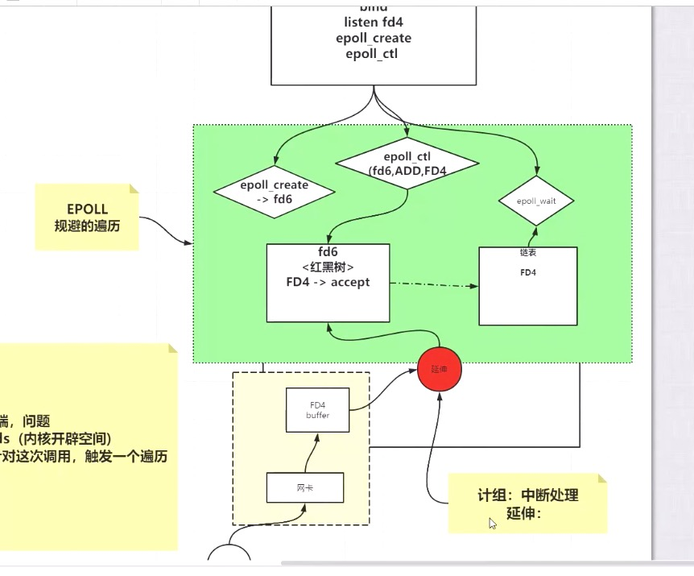

##### 1. 多线程下未使用key.cancel()导致重复读写的问题

###### 1.1 相关代码

```java
public class NIOServerSlow {

    private ServerSocketChannel server = null;
    private Selector selector = null;
    int port = 9090;

    public void initServer() {
        try {
            server = ServerSocketChannel.open();
            server.configureBlocking(false);
            server.bind(new InetSocketAddress(port));
            selector = Selector.open();
            server.register(selector, SelectionKey.OP_ACCEPT);
        } catch (IOException e) {
            e.printStackTrace();
        }
    }

    public void start() {
        initServer();
        System.out.println("服务器启动了。。。。。");
        try {
            while (true) {
                Set<SelectionKey> keys = selector.keys();
                System.out.println(keys.size()+"   size");


                while (true) {

                    selector.select(500);

                    Set<SelectionKey> selectionKeys = selector.selectedKeys();
                    Iterator<SelectionKey> iter = selectionKeys.iterator();

                    while (iter.hasNext()) {
                        SelectionKey key = iter.next();
                        iter.remove();
                        if (key.isAcceptable()) {
                            acceptHandler(key);
                        } else if (key.isReadable()) {
                            /**
                             * 问题所在！！！！
                             * 当启动线程去处理的时候，我们发现程序会重复读
                             * 解决方式一：在线程创建前，加上key.cancel();
                             */
                            new Thread(()->{
                                readHandler(key);
                            }).start();
                        }
                    }
                }
            }
        } catch (IOException e) {
            e.printStackTrace();
        }
    }

    public void acceptHandler(SelectionKey key) {
        try {
            ServerSocketChannel ssc = (ServerSocketChannel) key.channel();
            SocketChannel client = ssc.accept();
            client.configureBlocking(false);
            ByteBuffer buffer = ByteBuffer.allocate(8192);

            client.register(selector, SelectionKey.OP_READ, buffer);
            System.out.println("-------------------------------------------");
            System.out.println("新客户端：" + client.getRemoteAddress());
            System.out.println("-------------------------------------------");

        } catch (IOException e) {
            e.printStackTrace();
        }
    }

    public void readHandler(SelectionKey key) {
        SocketChannel client = (SocketChannel) key.channel();
        ByteBuffer buffer = (ByteBuffer) key.attachment();
        buffer.clear();
        int read = 0;
        try {
            while (true) {
                read = client.read(buffer);
                if (read > 0) {
                    buffer.flip();
                    while (buffer.hasRemaining()) {
                        client.write(buffer);
                    }
                    buffer.clear();
                } else if (read == 0) {
                    break;
                } else {
                    client.close();
                    break;
                }
            }
        } catch (IOException e) {
            e.printStackTrace();
        }
    }
```

###### 1.2 原因分析

之前演示的代码，是单线程处理的，那为了提高效率，我们显然需要使用多线程。

比如这个read这里，我们在获取到channel以后，是否可以考虑启动一个线程去处理呢？
当我们实际发现，这样做以后会出现重复读取的情况。为什么呢？

因为当我们开启线程去read的时候，主线程不再阻塞，很可能第二次循环马上就走完了，再次回到第一重循环，而第一重循环会获取selectionKeys，由于read是在另外一个线程里，可能还没有读完，所以这个key还能重新被selected到。于是出现重复读的情况。

###### 1.3 解决方式一

如注释里写的那样，在new Thread(()->{readHandler(key);}).start();这一行前面加上key.cancel()
key.cancel() = epoll_ctl(fd, del,..)，对，相当于执行epoll_ctl，删除文件描述符这个方法。删除哪里的文件描述符？删除在epoll_create开辟的空间里的文件描述符，即通过epoll_ctl（xxx,add）加入到空间里，也就是红黑树里的文件描述符。



弊端：频繁地进行用户态和内核态的切换

这样做的弊端很明显，每次启动线程前都要删除文件描述符的话，就是在大量地进行用户态和内核态的切换。

###### 1.4 解决方式二

开启多个selector，每个seletor用一个线程去做select循环。当有客户端接入时，选择其中一个seletor绑定注册。而每个seletor都是单线程线性处理。

这样如果一个seletor绑定了N个客户端，那么这N个客户端只能是线性顺序读取。这样就不存在这个问题了。

