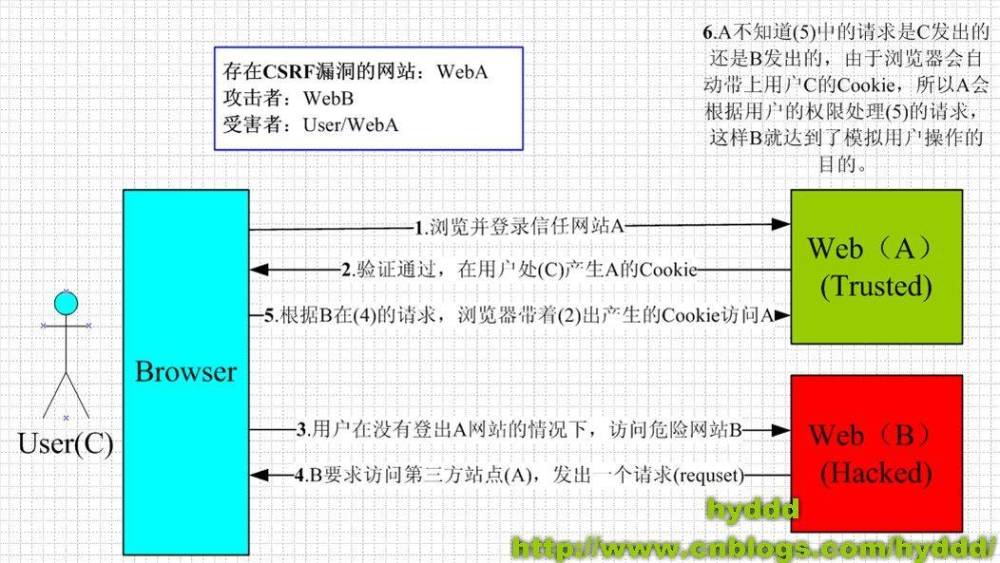

# 会话机制的概念

## 为什么需要会话机制

大部分系统，都是存在用户的，大部分的数据都是以用户为核心的，根据用户来区分的。
所以这类系统，需要用户登录进行认证，认证以后，才能操作属于该用户的数据。

而用户的操作行为，事实上都是在调用后台的一个个接口。这些接口本身，是无状态的，并不能感知用户是否已经认证过。但显然，如果不经过认证，这些接口就直接被调用，是不允许的，否则一旦接口暴露，用户信息就会被随意篡改了。

所以，需要在调用这些接口前，进行一个判断，即，判断用户是否已经登录认证过。
基于此，我们需要一个会话，能够对用户的操作请求进行认证。

## 用户会话信息包括哪些

正常来说，用户会话信息，包括用户的部分**基础信息**，通常情况下，还会包含用户的**权限信息**。但**不包括用户密码**。

## session + cookie

session + cookie是我们最常见的一种会话机制。目前仍然在广泛使用

大致流程

1. 用户在客户端输入用户名和密码，点击登录，客户端向服务器发送一个登录的request请求，这个请求带有用户的用户名和密码。
2. 服务器端接收到登录请求，校验用户名和密码。校验成功后，获取用户的权限。然后在产生一个Session对象，将用户信息、用户权限保存在这个Session中，每一个用户对应一个Session，每个Session产生时，会生成一个SessionId
3. 用户登录成功后，服务器响应登录请求时，返回的Response中带有这个SessionId
4. 客户端收到Response后，将SessionId存放于Cookie中，同时用户进入登录后的页面
5. 用户在其它页面进行操作，客户端再次向服务器端发起请求，此时，该请求带有SessionId
6. 服务器端收到客户端的请求，根据SessionId寻找对应的Session，若存在，则视为该用户已认证，可继续放行让请求调用对应接口。若不存在，则视该用户尚未认证，需要拒绝此次请求。

特点：

1. 服务器端将用户会话信息保存在程序内存中。
2. 通过下发sessionId作为客户端和服务器端会话交互的凭证

优点：

1. 通过sessionId进行交互，轻量，对流量的消耗比较小
2. 会话信息存放于服务器端，后续请求，如果需要使用用户相关信息，可以直接从会话中获取。减少了与数据库的频繁交互。
3. 通常来说，权限信息也存放于会话中，所以可以基于会话，进行用户访问的权限控制。
4. 服务器端可以控制会话，比如进行登出操作时，直接删除Session即可，之后用户需要重新登陆才能进行操作。同时还能控制Session的过期时间。
5. 客户端为浏览器时，默认实现了Session + Cookie机制，客户端开发非常便捷。

缺点：

1. 集群环境下，无法正确提供服务。
2. 客户端不是浏览器时，若要使用Session + Cookie机制，需要额外的开发。

# SSO单点登陆

## 几种常见的解决方案

SSO常见的解决方案有三种

1. Session共享
2. JWT
3. Oauth2.0

Session共享适合系统少，规模不大的项目
JWT适合系统多，模块多，规模比较大的项目
Oauth2.0，适用于个性化权限认证的场景。

通常而言，多系统单点登陆，对于用户的认证，一般的放在业务网关的，不大会在每个集群的机器上去做认证。

## session 共享

Session共享指的是，把Session单独保存到缓存中，而不再保存在每个程序的内存。

目前比较常见的Session共享框架，就是spring-session

spring-session的原理是使用了SessionRepositoryFilter，它使用SessionRepositoryRequestWrapper、SessionRepositoryResponseWrapper、HttpSessionWrapper来包裹对应的HttpServletRequest、HttpServletResponse和HttpSession。通过这种代理模式，来实现自定义的session存储和持久化到redis的过程。所以本质上，开发者在使用session对象时，和web容器的session相比，感觉不到任何区别。

优点：

1. 继承了单机Session的特点与优点，非常适用于单一业务的集群化，解耦了会话与程序，同时也避免了session同步带来的开销与一致性问题。
2. 可以用于普通多系统下的单点登录（非跨域）。

缺点：

1. 客户端不是浏览器的问题依旧存在
2. 多系统单点登陆，存在跨域问题。
3. 分布式系统下，大量的微服务共用一个redis，redis难以承受。

## JWT

### 设计起源

用户信息保存在服务器端的Session中，不管是程序内存中，还是redis中，都需要在服务器端保存。

这种保存带来的好处和优点，在Session机制中已经讲得比较明白。它的缺点也很明显，在Session分离里，已经明确罗列出了3个缺点。为了解决这些痛点，提出了JWT。

### 什么是JWT?

什么是JWT？或者说JWT做了什么？
JWT，简称Json Web Token，它将用户信息的保存，从服务器端转移到了客户端。也就是说，JWT机制，服务器端不再使用Session保存用户信息。服务器端将用户信息做成一个Token，下发给客户端，由客户端保存。

下发Token以后，客户端每次发送请求，都会带上这个Token，服务器端用一种方式来检验Token的真伪。

我们这里不妨和Session机制做一下对比：

Session机制：其实SessionId，就相当于一个token，只不过这个token没有具体的含义，只有传到服务器端，找到对应的Session，才有真正的意义。同时，它的验证也很简单，Session存在，就放行。Session不存在就拒绝。

JWT机制：把用户信息做成一个Token，下发给客户端，此时这个token就是有具体含义的，这样一来，服务器端是不需要通过Session保存用户信息了，因为这个token传过来，解开以后，就能得到用户信息。

所以JWT有两点很关键：

1. 如何把用户信息做成Token?
2. 服务器端收到Token后，怎么校验Token的真伪？即怎么确定这个Token就是服务器端下发的Token？

### 具体实现

1.如何生成Token?
jwt提供了一种标准化的设计思路：token由3部分组成

1. head——内容为hash算法的名称
2. body——用户身份信息的相关内容。可以是一个json字符串，里面包含用户id，age，gender、过期时间等一些信息。能够唯一标识此用户，加入时间，确保token在失效后能发生变化。
3. sign——签名，hash（base64（head）+base64（body）+secret）

所以最终的token = base64（head）. base64（body）.sign

这个secret，是保存在服务器端的一个字符串。这个很关键，后面还会讲到。

2.如何校验token
校验Token，其实相当于生成Token的反向操作

1. 将token的三部分拆开，得到base64（head）、 base64（body）、sign
2. base64解码head，得到head，head存的是hash算法的名字
3. 根据head得到的hash算法，进行签名：hash（base64（head）+base64（body）+secret），得到sign
4. 对比token的sign和刚才算出来的sign，相同就通过认证。
5. base64解码body，得到用户基础信息，用于后续操作

这种方式，如果客户端收到token之后，如果篡改了里面的信息，肯定将无法通过校验。

3.再回看这个secret至关重要，它遵照以下几点

1. 唯一性：后台所有微服务统一使用同一个secret
2. 不变性：一旦确定secret，它将不可变。
3. 保密性：只在后台使用，不能外泄。

关于secret的安全，需要做到以下几个方面

1. 采用配置中心，开发环境一套，正式环境一套。程序正式运行以后，才会从配置中心下发配置。平时开发是看不到的。而正式生产环境的权限，一般程序员是没有的，所以无法直接看到正式环境配置的secret
2. 禁止程序员使用日志输出secret，通过严厉的制度规范，保证secret的保密性。

### 安全问题

首先，我们需要搞明白，jwt生成并下发给客户端token以后

客户端之后发送请求，是如何携带token的？

1. http header
2. http Cookie
3. get请求的url上
4. localstorage（目前主流的浏览器都实现了这个）

XSS攻击，本质上是在当前页面里，嵌入了一段js，那么这段js：

1. 能不能获取到当前页面的一些请求的url？能！
2. 能不能获取当前页面请求后，从服务器下发下来的token？能，无论上述4种中的哪一种，都能！

所以XSS攻击很容易盗取你的token，然后向后台服务器发送请求，通过验证。然后就可以进行各种操作了

如何防范XSS攻击盗取Token导致验证被绕过？
答：一种比较有效的方式，就是人机交互，图片验证码或者拖动滚动条或者短信验证码。对于管理后台的一些操作，我们不可能说总是用短信验证码，对于一些敏感操作，可以加一些confirm框，然后加个图形验证码。

当然最根本的方式，就是修复XSS漏洞，对用户提交上来的数据进行转义。

不管如何，都要做日志。

注意：XSS攻击只存在于js，对于ios和安卓开发的app，是不存在XSS攻击的 

### 过期 & 续期问题

token有效期：服务器端生成token时，在用户信息里设置一个过期时间。校验token时，校验通过后，解开body的内容，比对过期时间和当前时间。如果过期了，就拒绝访问。

token续期：有几种解决方案

1. 参照Session的续期：服务器端每次检验token的过期时间时，如果发现token快要过期（可以设置一个阈值），则生成一个新的有效期的token，下发给客户端。客户端每次收到token都要比对，如果发现token不一致，则用新的token取代旧的token
2. 每次请求都更新token：这种方式开销过大，一般不建议
3. token有效期设置到半夜：这种方案是一种折衷的方案，保证了大部分用户白天可以正常登录，适用于对安全性要求不高的系统
4. 双Token机制：一个acessToken，一个refreshToken。用户登录以后，服务器下发两个token，其中refreshToken的过期时间设置得比acessToken长（比如多一天），客户端保存好两个token，平时都用acessToken进行交互，当acessToken过期以后，就将refreshToken传给服务器端，服务器端校验通过后，再次下发两个token。如果refreshToken校验不通过，或者refreshToken也过期的话，就让用户重新登陆。

方案点评

1. 方案一参照Session机制，问题在于如何合理设置token的有效期和续期的阈值。app和在电脑上打开浏览器登陆不同。在电脑上打开浏览器登陆网站，30分钟后过期，这种行为很正常，因为通常用户对电脑的使用是连续的，如果出现间隔，也是比较大的。比如用户下午使用了几个小时电脑，晚上出去high了。那出去了就不再使用电脑。所以过期时间30分钟比较合理。而app不同，用户使用app往往是碎片化的，时不时拿出来用一下，比如微信。如果30分钟就过期，那对用户太不好友了。另外，session是每次操作都会更新过期时间。因为token无法像session那样频发下发（否则跟方案二没区别），所以token是快要过期的时候才会更新，你很难保证用户能够在快要过期时进行了操作。而一旦没有续期，下次就要登陆，频繁地登陆，对用户体验极不友好
2. 方案二的问题就在于开销比较大，token通常要比sessionId来得大
3. 方案三是一种折中方案，这种方式，对某些场景的app比较适合
4. 方案四就是针对方案一的缺点所设计出来的。这种方案，使用了双重保障，只有当用户连续超长时间不登录时，才需要登陆。该方案的不足是：1⃣需要客户端来配合；2⃣用户注销的时候需要同时保证两个 token 都无效；3⃣重新请求获取 token 的过程中会有短暂 token 不可用的情况（可以通过在客户端设置定时器，当accessToken 快过期的时候，提前去通过 refreshToken 获取新的accessToken）。

### 优点

1. 无状态：服务端不需要再通过Session保存用户信息，大大减轻了服务端的压力，同时增加了系统的可用性和伸缩性。
2. 有效避免CSRF攻击：一般情况下我们使用 JWT 的话，在我们登录成功获得 **token** 之后，一般会选择存放在 `local storage` 中。而不是Cookie中，这样就能有效避免CSRF攻击。
3. 适合移动应用开发：之前讲过，ios和安卓开发，不使用浏览器作为客户端，没有默认的Cookie+Session机制。

### 缺点

JWT，作为替换Session的一种方式。虽然解决了Session的一些痛点，但同时，原本Session机制中不存在的问题，或者说Session机制的一些优势，却反而成了JWT的一个痛点

痛点一：退出登陆问题：与此场景相关的还有：修改密码、权限与角色变更、帐户被删除/禁用。这个问题，在Session机制下完全不是问题，Session机制下，一旦有上述操作，直接删除Session就可以了。后续的操作必然要求用户再次登陆。但对于token来说，唯一不通过数据库来进行比对的，只有时间。只要token没过期，就没法让token作废。即便你下发了新的token，实际上客户端拿旧的token依然可以用。

痛点一解决方案：

1. 保存token，这种做法和Session几乎没差别了，等于舍弃了JWT的无状态特点。但他不是没有使用场景，比如app开发，Session+Cookie机制不好使的场景。
2. 黑名单机制，如果黑名单存在于Redis里，这种做法和保存token又没什么区别了。
3. 保持令牌的有效期限短并经常轮换。这种会导致用户体验急速下降。

## 权限问题

在Session机制下，用户登录系统以后，获取用户的基础信息和权限信息，一并存于Session中。

JWT机制也是一样的，用户认证后，用户的基础信息和权限信息，也会一并写入token中。

之所以把权限信息写入到Session，或者JWT中，是为了避免，每次请求，都要从数据库中获取权限，那样无疑会增加数据库的负担。

但是。如果出现以下几种情况，就要考虑设计一个权限认证中心了

1. 一个系统多个模块，每个模块的权限不同，且权限很多。如果吃大锅饭，一次用户认证以后，把该用户对应所有模块的权限全部拿出来写入到共享Session或者JWT中，显然不合适。此时，设计一个权限认证中心，操作不同模块时，去权限中心获取对应的权限。
2. 多个系统，共用一个用户中心系统。每个系统都有自己的权限库。这个时候，如果用户认证以后，去所有系统对应的权限库把权限拿出来，显然不合适。同样，通过权限认证中心，在操作不同系统的功能时，去权限中心获取对应的权限
3. 第三方系统接入。此时，其实存在两个完全不同的系统，A系统和B系统，彼此实际上都有自己的用户，但B系统实际上使用A系统的用户作为自己的用户，并且B系统使用A系统的用户认证。但B系统有自己的权限系统。

## Oauth2.0

### 应用场景

+ 单点登陆
+ 第三方应用

### 角色

**Resource Owner**

资源拥有者，对应微信的每个用户微信上设置的个人信息是属于每个用户的，不属于腾讯。

**Resource Server**

资源服务器，一般就是用户数据的一些操作（增删改查）的REST API，比如微信的获取用户基本信息的接口。

**Client Application**

第三方客户端，对比微信中就是各种微信公众号开发的应用，第三方应用经过`认证服务器`授权后即可访问`资源服务器`的REST API来获取用户的头像、性别、地区等基本信息。

**Authorization Server**

认证服务器，验证第三方客户端是否合法。如果合法就给客户端颁布token，第三方通过token来调用资源服务器的API。

### 授权认证流程

**anthorization_code**

授权码类型，适用于Web Server Application。模式为：客户端先调用`/oauth/authorize/`进到用户授权界面，用户授权后返回`code`，客户端然后根据code和`appSecret`获取`access token`。

**implicit** 简化类型，相对于授权码类型少了授权码获取的步骤。客户端应用授权后认证服务器会直接将access token放在客户端的url。客户端解析url获取token。这种方式其实是不太安全的，可以通过**https安全通道**和**缩短access token的有效时间**来较少风险。

**password**

密码类型，客户端应用通过用户的username和password获access token。适用于资源服务器、认证服务器与客户端具有完全的信任关系，因为要将用户要将用户的用户名密码直接发送给客户端应用，客户端应用通过用户发送过来的用户名密码获取token，然后访问资源服务器资源。比如支付宝就可以直接用淘宝用户名和密码登录，因为它们属于同一家公司，彼此**充分信任**。

**client_credentials**

客户端类型，是不需要用户参与的一种方式，用于不同服务之间的对接。比如自己开发的应用程序要调用短信验证码服务商的服务，调用地图服务商的服务、调用手机消息推送服务商的服务。当需要调用服务是可以直接使用服务商给的`appID`和`appSecret`来获取token，得到token之后就可以直接调用服务。

## 总结

通常来说，后台微服务单点登陆，用JWT就可以了。Oauth2.0不是一个很好的选择，确切地说，微服务之间做一个权限认证中心，会增加业务的复杂度，性能也会大幅下降。那意味着你每次操作，都要去权限认证中心获取权限。

# 跨域问题

## 什么是跨域？

我们在浏览器输入http://www.test.com:8080/index.html，然后获取了一个网页。那么这个网页的源就是输入的这个网址，它包括以下几部分：

源—协议：http
源—域名：www.test.com
源—端口：8080

而在这个网页里，有一段js代码，它需要发送一个请求。如果这个请求的目标地址与这个网页的源不一致，即协议，域名、端口，三者，有一个不一致，就形成了跨域。

## 跨域会带来什么问题？

【1】无法读取非同源网页的 Cookie、LocalStorage 和 IndexedDB

【2】无法接触非同源网页的 DOM

【3】无法向非同源地址发送 AJAX 请求

## 为什么会存在跨域机制

主要是为了安全。如果在当前网页里，能够随意地访问非同源的资源，极有可能给用户带来安全隐患。

##  跨域的几种解决方式

# 网络安全

## XSS

漏洞描述：一些网络论坛发帖，往往使用的富文本编辑器，用户可以插入图片，这个图片可以是网络上的图片，其实就是输入图片所在的网络url。如果没有对这个地址做一些验证或者校验，那么用户完全可以把这个地址定位到一个网站。比如www.baidu.com。那么当其他用户在访问这个帖子的时候，实际上就在无形中，额外访问了百度这个网址。如果这个帖子很火爆，那就会把大量的流量引向百度，而且这种流量，是一种无效但又正常的访问。

危害：流量攻击使得目标网站的服务器增加额外的负担。且因为这又是一种正常的访问，目标网站无法防御。

修复方式：对用户设定的图片地址进行校验或者验证。

##  CSRF

漏洞描述：我们的浏览器，默认情况下，是多个tab页标签，共享session的。假设你可以会打开两个标签，tab1和tab2。tab1你是登陆一个正常的网站的登陆页面，比如淘宝网站的登陆页面。tab2你访问的是一个钓鱼网站，这个钓鱼网站有个标签，它的src指向淘宝网站的登陆接口。如果你先打开tab1，并且输入用户名和密码登陆了淘宝网，此时你再打开钓鱼网站，那么，实际上，钓鱼网站的这个标签的src也能成功登陆。

危害：钓鱼网站绕过登陆，再进行其他接口操作，从而造成用户损失。

修复方式：CSRF攻击主要是针对get请求。所以，可以考虑全站POST。如果不方便，那么可以考虑下发一个hashcode到页面。页面请求时需要带上这个hashcode，因为是下发到页面，所以其他tab页无法获取此hashcode，tab页之前共享的是cookie

## DDOS

DDOS攻击称为拒绝服务攻击，具体而言具有以下几种特征：

1. 需要大量肉鸡（被控制的机器）
2. 方式一：控制肉鸡发起tcp连接，完成3次握手。
3. 方式二：控制肉鸡发起tcp连接，只完成2次握手。

现在的DDOS攻击，一般采用方式一，因为方式二可以被拦截。
对于DDOS攻击，并没有特别好的防御方式，目前唯一有效的方式就是加机器。

