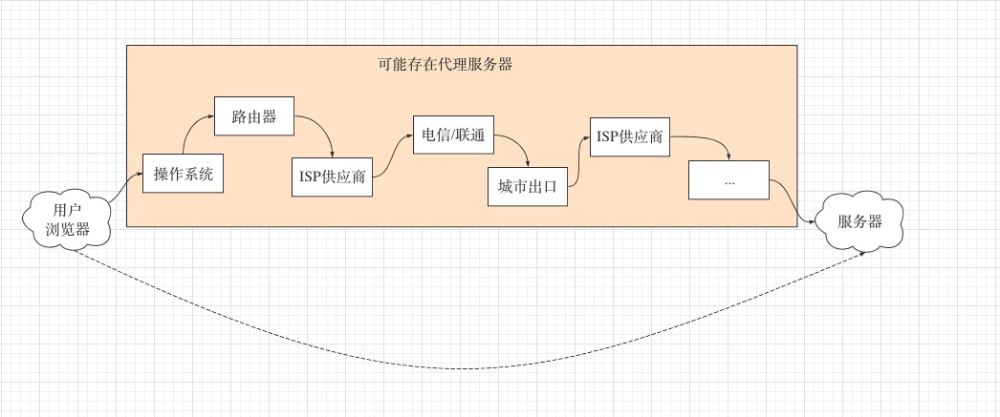
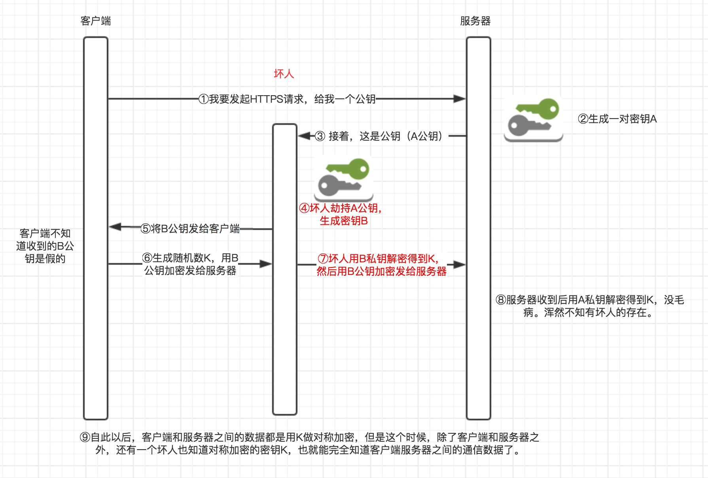
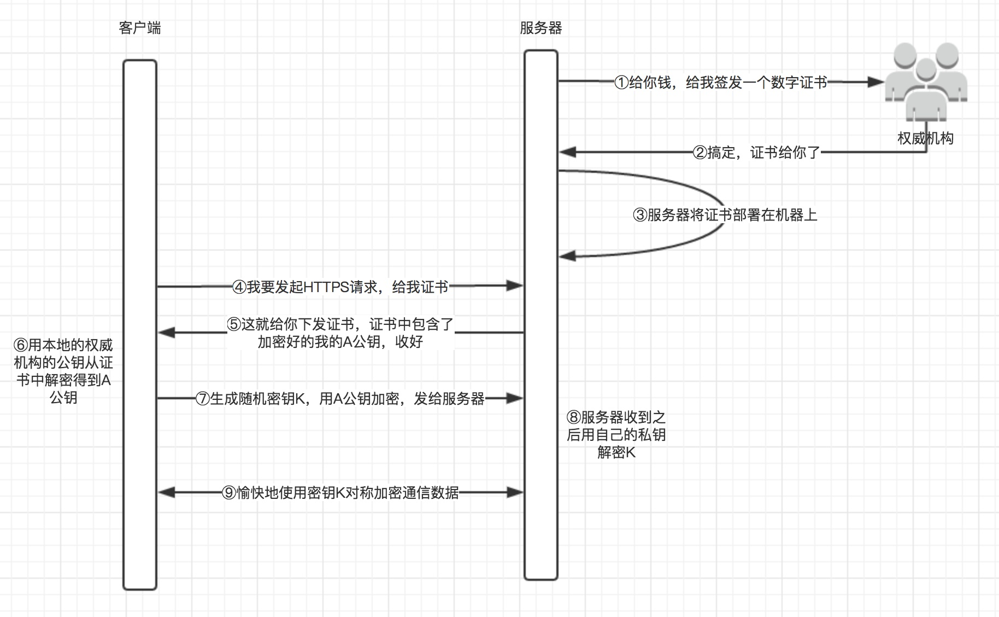

#### 1 HTTP的不安全性

从客户端到服务器端，传输数据，其实并不是直连的。而是要经过很多节点的。

如上图所示，网络中存在很多节点，这些节点都有可能成为一个个的“中间人”。

而HTTP是明文传输，任何一个中间人，拿到这些数据，都能极为轻易地查看，篡改。

所以，该如何安全传输HTTP协议的数据，成了我们要解决的问题

#### 2.第一层：安全传输（HTTP数据）

要想做到消息不被中间人查看和篡改，我们首先想到的方式就是加密 + 解密。这种方式需要用到密钥。所以这里需要考虑几点：

1. 使用什么加密方式？
2. 密钥怎么告知对方？

第一个问题：加密算法分为两类，对称加密和非对称加密，这里我们选择对称加密。原因也有两点：

1. 对称加密速度快，加密时CPU资源消耗少；
2. 非对称加密对待加密的数据的长度有比较严格的要求，不能太长。

关于对称加密，我们有很多种：DES、3DES、TDEA、Blowfish、RC2、RC4、RC5、IDEA、SKIPJACK等
具体不多做解释，我们只需要知道有对称加密，双方都使用同一个密钥来加解密就可以了。

第二个问题：我们想到的有两种方式：

1. 预置
2. 通过网络传输

把密钥预置，显然是无法满足绝大对数场景的。我们的浏览器访问成千上百个网站，总不能在手机或者电脑出厂的时候，就把全世界网站的密钥预置在手机或者电脑里。

所以，我们只能选择网络传输，而通过网络传输，是造成HTTPS比较复杂的根本原因。一旦这个密钥被中间人劫持，那一切等同于虚设。
而只要解决了这个问题，那安全传输HTTP数据就变得非常简单了。

#### 3 第二层：安全传输（对称加密算法的密钥）

需求：如何安全地传递加密算法的密钥?
如果我们依然使用对称加密算法，则出现了先有鸡还是先有蛋的悖论。所以，此时，非对称加密算法就派上用场了。

关于非对称加密，它有以下几个特点：

1. 非对称加密有两把钥匙，一个公钥，一个私钥
2. 公钥加密的数据，公钥无法解开，只能用私钥解开
3. 私钥加密的数据，私钥无法解开，只能用公钥解开
4. 公钥是公开的，私钥是不公开的

那么，具体，如何应用非对称加密来加密那把密钥呢？可以考虑如下方式：

.jpg)

这样设计的初衷：

1. 私钥只在服务器端有，不在网络中传输。
2. 对称加密的密钥，用非对称加密的公钥加密后，中间人即使有公钥，也无法破解。

但关键在于第二步，服务器端把公钥下发给客户端的过程。这个过程又会出现问题（只要下发，就会存在问题）。

#### 4.第三层：安全传输（非对称加密的公钥）

从上一层可以知道，要保证数据的安全，就必须得保证**服务器给客户端下发的公钥是真正的公钥，而不是中间人伪造的公钥**。那怎么保证呢？

而通过上面二层，你可以发现，问题的根源在于，无论是对称加密的密钥，还是非对称加密的公钥，都是要传输的。正因为是传输的，所以才会出现问题，如果要解决这个问题，就必须要一个东西是不用传输的，预置在客户端，让客户端相信，这个东西没有被人掉包过。

所以，这就需要第三方权威机构的介入了。
第三方权威机构，每个权威机构，都会生成一对公钥和私钥，简称CA公钥和CA私钥。CA公钥存在于第三方权威机构处，不会外泄。而CA公钥则是预置在客户端操作系统里的，这点非常关键，它可以让客户端相信，这是绝对安全可靠的，不是什么中间人伪造出来的公钥。

那么，第三方权威机构是如何用自己的CA公钥和CA私钥，来保证用户的公钥，安全地从服务器端传递给客户端，确保在这个过程中没有被掉包，没有被篡改。

大致的流程图如下：

来解释一下：

第一步：服务器方向CA权威机构申请一个数字证书。大致的流程如下

1. 服务器首先生成公钥和私钥对，然后确认申请信息（hash算法、域名、申请者信息、公钥等），最后封装为一个.csr文件（文件内不包含私钥，私钥只在服务端存在）
2. 服务端将申请信息发送到CA，CA通过线上、线下多种手段验证申请者提供信息的真实性，如组织是否存在、企业是否合法、该组织是否拥有本域名的所有权等。
3. 如果信息审核通过，CA会向申请者签发认证文件——证书。证书内容包含两部分：信息明文+数字签名。
   1. 信息明文包括：申请者公钥、申请者组织信息、签发机构CA信息、有效时间、证书序列号等信息。
   2. 数字签名：CA机构使用hash算法对信息明文进行摘要计算，得到摘要内容，然后采用CA的私钥对信息摘要进行加密，密文即为签名。

第二步：服务器将证书部署在相关机器上。（比如部署在网关或者直接部署在web容器上）

第三步：客户端与服务器通信时，服务器下发证书给客户端。

第四步：客户端对证书进行校验。这里的校验需要做到两点：

1. 证书的内容有无被篡改
2. 证书是否是目标服务器下发的

整个流程，其实只要第四步的这两点做到了，就能确保服务器端的非对称加密公钥，安全无误地传递给了客户端。

第一点：证书的内容有无被篡改？客户端预置了CA的公钥，通过CA公钥解密数字签名，就能得到数字证书中信息明文的hash值。然后通过数字证书中的hash算法，对信息明文进行hash计算，然后比对两个hash值，是否一致，一致则说明证书内容没被篡改过

第二点：证书是否是目标服务器下发的？证书的内容没有被篡改，并不一定说明该证书是目标服务器下发的证书。中间人也可能向CA申请了证书，如果中间人拦截了目标服务器的数字证书，然后把自己的数字证书下发给客户端，岂不是又出现了第二层出现的问题了？所以，**实际客户端还会检查证书中的域名和当前访问的域名是否一致**。中间人如果篡改证书的域名，那么相当于证书的内容被篡改。因为这个证书是CA下发的，中间人可以篡改证书内容，却无法篡改内容的hash值（也就是数字签名），因为中间人没有CA的私钥！！！

#### 5.其它问题

##### 5.1 中间人能否以目标服务器域名来向CA申请证书？

上面提到了，客户端在最终校验证书的时候，会检查证书中的域名和当前访问的域名是否一致，从而判定，证书是否是目标服务器下发的。中间人可以拿自己的域名来申请CA证书，却无法篡改证书。

那中间人能不能以目标服务器域名来向CA申请证书？换句话说，一个域名能不能签申请两个乃至多个CA证书？如果可以的话，那么中间人在第二步，服务器端下发数字证书的过程中，就可以进行掉包。
答：付费证书决不允许。

##### 5.2 中间人能否篡改或者掉包客户端发送的对称加密的密钥？

这个事情发生在HTTPS握手的第三步：客户端用服务器端的公钥来加密自己生成的随机串（即对称加密的密钥）。

中间人拦截获取到这个密文，能否篡改或者掉包？
答：篡改是没法篡改的，中间人没有服务器端的私钥，无法解密，篡改也就无从谈起。但中间人是可以掉包的。为什么？我们注意，第二步，服务器端下发数字证书，这一步服务器端的公钥，是在数字证书内，明文下发的。而且CA公钥是公开的，实际上中间人还能解开数字签名，得到hash值，但因为没有CA私钥和服务器端的私钥，中间人没法篡改。

所以，中间人其实能获取到服务器端的公钥，以及hash算法。客户端发送过来的这个对称加密的密钥，他看不到，但他可以伪造一份自己的，发送给服务器端。

但这样做毫无意义！

原因有两点：

1. HTTPS还有第四步，服务器端会使用这个对称加密的密钥，来进行加密，然后发一个加密包给客户端，客户端会进行解密验证。如果中间人掉包了这个密钥，客户端进行解密验证的时候，发现解密不了。就不会认为HTTPS已经建立完成。而如果中间人把服务器端的加密包拦截，不发给客户端的话，过一段时间客户端就认为超时了，同样不会认为HTTPS已经建立完成。
2. 就算客户端认为HTTPS已经建立完成，然后用对称加密算法发送加密数据，服务器端因为收到的是错误的密钥，解不开数据就会报错。而中间人因为得不到这个密钥，除了造成双方通信出现问题之外，实际上无法窃取任何信息。

#### 6.小结

##### 6.1 HTTPS 最终流程

由此可知。HTTPS实际上分为两个大的步骤：

1. 客户端和服务器端通过443端口安全传输对称加密的密钥
2. 客户端和服务器端通过80端口传输正式的数据，这个数据使用对称加密的密钥来加密

而第一个大的步骤，实际上又分为4个步骤，简称HTTPS是4次握手

1. 客户端向服务器端发送消息，告知自己支持的对称加密算法，非对称加密算法，摘要算法
2. 服务器端根据客户端的消息，下发数字证书（其中最关键的是服务器端的公钥）
3. 客户端校验数字证书，生成一个随机串，用服务器端公钥进行加密，发送给服务器端
4. 服务器端根据这个随机串生成对称加密的密钥（实际通信过程中交互了3个随机串），然后随机产生一个握手消息，用密钥进行加密，发送给客户端。客户端同时也生成加密的密钥，对消息解密，并校验其有无被篡改。若一切OK，4次握手成功。

##### 6.2 CA证书的实际申请

CA证书实际上大致分为三种：DV、OV、EV

DV SSL证书是只验证网站域名所有权的简易型（Class 1级）SSL证书，可10分钟快速颁发，能起到加密传输的作用，但无法向用户证明网站的真实身份

OV SSL，提供加密功能,对申请者做严格的身份审核验证,提供可信×××明。和DV SSL的区别在于，OV SSL 提供了对个人或者机构的审核，能确认对方的身份，安全性更高

EV SSL，最安全、最严格，EV SSL证书遵循全球统一的严格身份验证标准，是目前业界安全级别最高的顶级 (Class 4级)SSL证书。金融证券、银行、第三方支付、网上商城等，重点强调网站安全、企业可信形象的网站，涉及交易支付、客户隐私信息和账号密码的传输。

另外，其实国内很多申请的CA证书，是双证书，即服务器端的公钥不是用户上传的，而是CA生成的，同时CA还会生成服务器端的私钥，下发给用户，这种事情通常会下发两个文件，一个是xxx.pem，一个是xxx.key。这个xxx.pem就是证书，里面包含了服务器端的公钥，xxx.key就是下发的服务端私钥。

